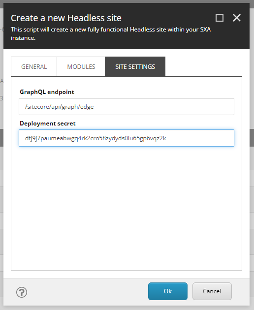

In the post [Local XM Cloud development]() I explain how to get XM Cloud running on your local machine using docker containers.

We now want to get started with Sitecore Headless Services and JSS.

We first install the JSS cli tool `jss` with the following command:

```
npm install -g @sitecore-jss/sitecore-jss-cli
```

Check the version with  `jss --version`. In my case this results in:


Normally we should now create a new Sitecore JSS app using the command:

```
npx create-sitecore-jss
```

This will ask us the template we would like to use to create our "head" application against XM Cloud:


We will use **Next.js**, we go to the next questions where we select `https://xmcloudxm.localhost` for the Sitecore hostname, GraphQL, SSG, and last but not least: **nextjs-sxa**, which includes example components and setup for SXA Headless (NOTA BENE: press **space** to select this option, otherwise the command `jss deploy items -c -d` which we will use will throw the error `Error: Unable to load manifest require C:\p\xmcloud-foundation\src\acmeweb\sitecore\definitions\config.js` because the `sitecore\definitions\config.js` file is not generated). Note that this option is only compatible with XM Cloud:


This will scaffold the nextjs-sxa starter application, and kick of an `npm install`. When all is done we are greeted with a "ready" screen:


The JSS app is now created, so we can navigate to the folder:

```
cd acmeweb
```
As stated in the welcome screen we can now execute `jss setup` to configure our JSS app.

Because we use a Docker container to simulate that we are talking to XM Cloud in the cloud, we answer the first question `Is your Sitecore instance on this machine or accessible via network share? [y/n]` with `n`.

For the Sitecore hostname we use the `https://xmcloudxm.localhost` hostname.

We use the proposed Sitecore import service URL https://xmcloudxm.localhost/sitecore/api/jss/import.

For the Sitecore API Key we can head over to the Content Editor, where we can see that there is already an API key created named `xmcloudpreview`. We copy the GUID of the item, and use this as the API key.


We let the deployment secret be autogenerated.

These steps generate a file `acmeweb\scjssconfig.json`, which will look something like:

```json
{
  "sitecore": {
    "instancePath": "",
    "apiKey": "{1C8CF303-D973-4D40-811B-D3297D4643F2}",
    "deploySecret": "dfj9j7paumeabwgq4rk2cro58zydyds0lu65gp6vqz2k",
    "deployUrl": "https://xmcloudxm.localhost/sitecore/api/jss/import",
    "layoutServiceHost": "https://xmcloudxm.localhost"
  }
}
```

We now want to deploy our new created JSS app to our XM Cloud container, but the **NEXT STEPS** proposed by the JSS CLI will not directly work:


We have a remote Sitecore, so we first need to do some configuration within Sitecore. We need to create a headless tenant, a headless site, and a headless app in the Sitecore content tree using the Content Editor.

Right-click on the `Content` item, and select `Insert > Headless Tenant`. We will name the tenant `Acme`:


On the `Acme` tenant, right-click, and select `Insert > Headless Site`:


We will name the headless site the same as the JSS app that we created: `acmeweb-jss-app` (see `acmeweb\sitecore\config\acmeweb-jss-app.deploysecret.config` ):


The modules we leave as is:


And in the site settings tab we will fill in the auto-generated deployment secret that we can find in the file `acmeweb\scjssconfig.json` (and the file `acmeweb\sitecore\config\acmeweb-jss-app.deploysecret.config`)



When we look at the settings or the new created site, we will see that the import user is set to `sitecore\JssImport`. When creating items in the new headless site, this user will be used to create the items, but it will not have the rights to create new items there. For now we will set the user to the admin user `sitecore\admin`, but this should be configured appropriately.


Another set of important settings on the site are:
- Server side rendering engine: `http` (already set correctly on XM Cloud, on XM this was set to nodejs by default)
- Server side rendering engine endpoint URL: 
- ServerSideRenderingEngineApplicationUrl 
- Deployment secret: already set


Is we go to user management [TODO what to do with it]

============================================================================


## GraphQL endpoint

In the file `acmeweb\sitecore\config\acmeweb-jss-app.config` we can find the app configuration, including the GraphQL endpoint:

```xml

<app name="acmeweb-jss-app"
    layoutServiceConfiguration="default"
    sitecorePath="/sitecore/content/acmeweb-jss-app"
    useLanguageSpecificLayout="true"
    graphQLEndpoint="/sitecore/api/graph/edge"
    inherits="defaults"
    serverSideRenderingEngine="http"
    serverSideRenderingEngineEndpointUrl="http://localhost:3000/api/editing/render"
    serverSideRenderingEngineApplicationUrl="http://localhost:3000"
/>
```


## Deployment of the "head" to Vercel

Before we are going to deploy the "head" application to Vercel, check if the code good to go. Execute `npm run build`.
In my case I got two perttier linting errors, it wanted me to add a "," at the end of the `rootItemId: '{B6C7CAE3-965D-4B59-9212-AEB72B5C1E40}',` line that we added at two places in a previous step.

After fixing these two "issues" and running a build again, I'm sure the build will succeed at Vercel as well.

Push the changes to the GitHub repo, and we are ready for Vercel... 

First install the `vercel` cli:

```
npm install -g vercel
```

Now run the `vercel` command:


The `vercel` command uploads the project, does a build, and a deployment. In this process it provides a URL to the build.

I was actually suprised that Vercel did not connect to the GitHub repository yet, so I had to do that manually in the Web UI on https://vercel.com:


After pressing the button **Connect Git Repository** and selecting GitHub, I am presented with repositories on my GitHub:


I select the xmcloud-foundation repository containing my code, and everything is wired up:


I can now press the "Save" button.

Because the source of the acmeweb project is not located in the root but in the folder `src\acmeweb` I have to configure this.
In the Vercel UI, under **Project Settings** configure the **Root Directory**:


Now everything is configured a "push" to the **main** branch is enough to trigger the build. Under deployments we can see if the build is started:


