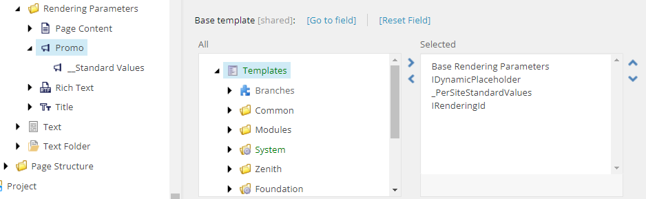

As described in the Sitecore SXA documentation [Walkthrough: Building a simple rendering](https://doc.sitecore.com/xmc/en/developers/xm-cloud/walkthrough--building-a-simple-rendering.html) there is a set of base templates to inherit from for the rendering parameters. This set is described in the section **Add grid and styling support**.

To investigate this, have a look at the Rendering Parameters for the Headless SXA rendering **Promo**, which can be found at `/sitecore/templates/Feature/JSS Experience Accelerator/Page Content/Rendering Parameters/Promo`:

We see here the following selected base templates (with deeper base templates):

- Base Rendering Parameters `/sitecore/templates/Foundation/JSS Experience Accelerator/Presentation/Rendering Parameters/BaseRenderingParameters`
  - IStyling - `/sitecore/templates/Foundation/Experience Accelerator/Presentation/Rendering Parameters/IStyling`
    For styles support. This template adds a new field in the control properties for that rendering and an additional button on the edit frame of the rendering. Inherits from the Base Rendering Parameters template.
  - IComponentVariant - `/sitecore/templates/Foundation/Experience Accelerator/Variants/Rendering Parameters/IComponentVariant`
    For rendering variant support. This template adds a rendering variant drop-down in the control properties and Variant Selector drop-down on the edit frame. Inherits from the Base Rendering Parameters template.
  - GridParameters - `/sitecore/templates/Foundation/Experience Accelerator/Grid/Rendering Parameters/Grid Parameters`
    For grid support. This template adds a grid field in the control properties and an additional button on the edit frame of the rendering. Inherits from the Base Rendering Parameters template.
- IDynamicPlaceholder - `/sitecore/templates/Foundation/Experience Accelerator/Dynamic Placeholders/Rendering Parameters/IDynamicPlaceholder`
  For dynamic placeholder keys support. This template adds a placeholder in addition to, for example, a title or some text.
- _PerSiteStandardValues - `/sitecore/templates/Foundation/Experience Accelerator/StandardValues/_PerSiteStandardValues`
  No Clue.
- IRenderingId - `/sitecore/templates/Foundation/Experience Accelerator/Markup Decorator/Rendering Parameters/IRenderingId`
  For HTML identifier support. This template adds an ID field to the rendering configuration, which renders an attribute to an element in the HTML code. NOT RELEVANT FOR HEADLESS SXA.

These base templates influence different parts of functionality in both the Experience Editor and Pages, which we want to configure per rendering. So add to your rendering parameters the following base templates where appropriate:

- IStyling - if you define SXA Styles and want to be able to access them in Experience Editor with the paint bucket button on the edit frame of the rendering.
- IComponantVariant - if the rendering will have rendering variants. Question is: should you use rendering variants, or have variations through one or more rendering parameters.
- GridParameters - if the component will do something with the fact that grid information is specified. This is mostly only relevant on *Page Structure* renderings like the out-of-the-box renderings **Container**, **Column Splitter**, and **Row Splitter**.
- IDynamicPlaceholder - if the rendering supports dynamic placeholders.
- _PerSiteStandardValues - no clue.
- IRenderingId - not relevant in Headless SXA.

New module `HH Module`

	/sitecore/templates/Foundation/JavaScript Services/Json Rendering

  Templates/System/Layout/Rendering Parameters/Standard Rendering Parameters copy to 
/sitecore/templates/Feature/HH Module/Rendering Parameters/Standard Rendering Parameters
- Delete `Caching`
- Delete `Styling`

Create a new SXA component:

View: ~/Views/Promo/Promo.cshtml
Rendering template: Templates/Foundation/JavaScript Services/Json Rendering
Base rendering parameters template: Templates/Feature/HH Module/Rendering Parameters/Standard Rendering Parameters
Base data source template: Templates/System/Templates/Standard template (default)

  