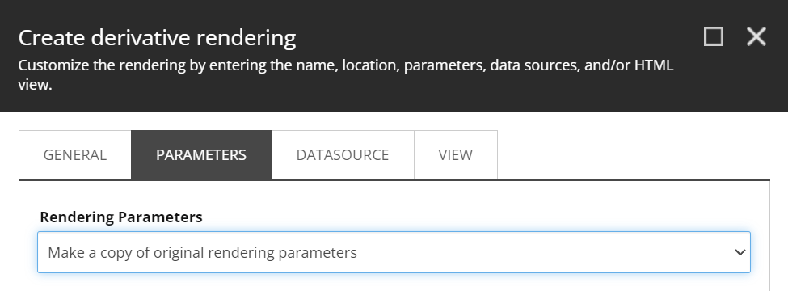
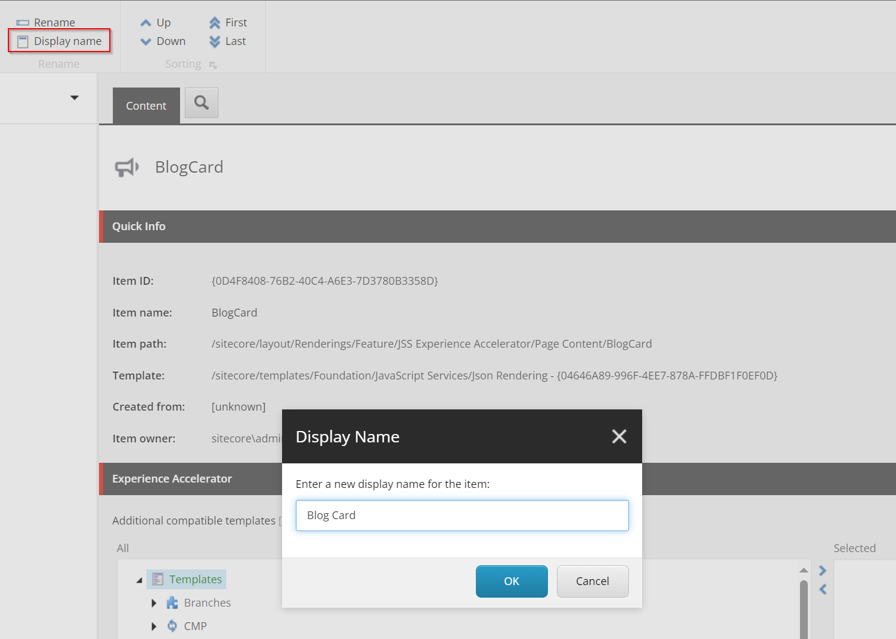
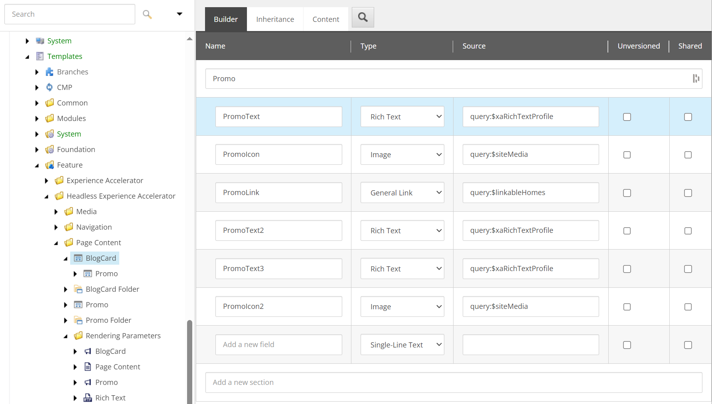

Clone Promo


Wizard to create a derivative rendering
:




.


As display name we want to use **Blog Card** instead of the item name **BlogCard**, so click on **Display name** at the top and change it:



Note that on the BlogCard rendering the Component Name is still **Promo**, change this to **BlogCard**, the name of the head front-end component that wil correspond with this rendering.

The Parameters Template field is set to:

```
Templates/Feature/Headless Experience Accelerator/Page Content/Rendering Parameters/BlogCard
```
Here we can find the parameters to modify.

The Datasource Location field is set to:

```
/sitecore/templates/Feature/JSS Experience Accelerator/Page Content/BlogCard
```

Here we can find the datasource to modifiy.

The Datasource Location field is set to:
```
query:$site/*[@@name='Data']/*[@@templatename='BlogCard Folder']|query:$sharedSites/*[@@name='Data']/*[@@templatename='BlogCard Folder']
```

This means that the Sitecore UI (Experience Editor / Pages / Content Editor) will search in the following folders:

```
$site/*[@@name='Data']/*[@@templatename='BlogCard Folder']
```
or
```
$sharedSites/*[@@name='Data']/*[@@templatename='BlogCard Folder']
```

So either in the `Data/BlogCard Folder` folder in the site where you add a **Blog Card** variant to the page, or in the `Data/BlogCard Folder` folder of the shared site connected to a site.

>You could argue if you want to move the rendering, parameters template and datasource template to the **Project** level, and place it in the tenant or root folder. I think this would be the nicer approach, as it would provide a more organized and centralized structure for managing these custom elements.

The next step is cleaning up the BlogCard datasource template:



We now need to create a Variant with its Variant Definitions. Make sure to use **BlogCard** as item name, and change the display name to **Blog Card**:


We now have our Blog Card rendering in the Experience Editor Toolbox:


But also when using the **Add here** functionality where we can select a rendering from there:


When there is no implementation yet for the component used in the rendering we get the following "missing" visualization of the component:


## The BlogCard component
The Blog Card component is inspired by the Blog Card from [Tailwind CSS Blog Card Components | HyperUI](https://www.hyperui.dev/components/marketing/blog-cards). This is a free open source Tailwind CSS Components collection that looks great. The first version odf the component we are going to implement is:


The JSX code provided by the component creator is:

```jsx
<article className="overflow-hidden rounded-lg shadow transition hover:shadow-lg">
  

  <div className="bg-white p-4 sm:p-6">
    <time datetime="2022-10-10" className="block text-xs text-gray-500"> 10th Oct 2022 </time>

    <a href="#">
      <h3 className="mt-0.5 text-lg text-gray-900">How to position your furniture for positivity</h3>
    </a>

    <p className="mt-2 line-clamp-3 text-sm/relaxed text-gray-500">
      Lorem ipsum dolor sit amet, consectetur adipisicing elit. Recusandae dolores, possimus
      pariatur animi temporibus nesciunt praesentium dolore sed nulla ipsum eveniet corporis quidem,
      mollitia itaque minus soluta, voluptates neque explicabo tempora nisi culpa eius atque
      dignissimos. Molestias explicabo corporis voluptatem?
    </p>
  </div>
</article>
```

Lazy as I am I asked ChatGTP to create a TypeScript version of the component named `BlogCardSimple`. The result is:

```tsx
import React from 'react';

interface BlogCardSimpleProps {
    imgSrc: string;
    imgAlt: string;
    articleDate?: string;
    title?: string;
    summary?: string;
    link?: string;
}

export const BlogCardSimple: React.FC<BlogCardSimpleProps> = ({ imgSrc, imgAlt, articleDate, title, summary, link }) => {
    const titleJsx = <h3 className="mt-0.5 text-lg text-gray-900">{title}</h3>;

    return (
        <article className="overflow-hidden rounded-lg shadow transition hover:shadow-lg" onClick={() => (window.location.href = link)}>
            

            <div className="bg-white p-4 sm:p-6">
                {articleDate && (
                    <time dateTime={articleDate} className="block text-xs text-gray-500">
                        {new Date(articleDate).toLocaleDateString(undefined, { day: 'numeric', month: 'long', year: 'numeric' })}
                    </time>
                )}

                {link ? <a href={link}>{titleJsx}</a> : <>{titleJsx}</>}
                {summary && <p className="mt-2 line-clamp-3 text-sm/relaxed text-gray-500">{summary}</p>}
            </div>
        </article>
    );
};
```

This is the display component, which we could add to Storybook for preview and testing.

Looking at the properties required for the component, we can map those to the Sitecore properties:

imgSrc: string;
imgAlt: string;
articleDate: string;
title: string;
summary: string;
link: string;