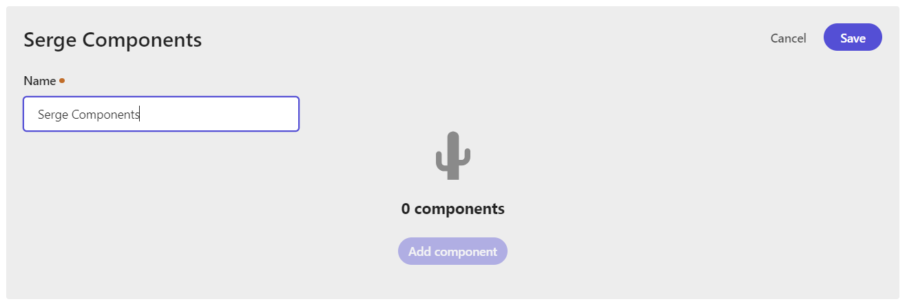

In this post I will give an overview of XM Cloud Components, and go through the different parts of this low code component creation platform.

## What is XM Cloud Components?

In my post [XM Cloud Components - what is it?](https://www.sergevandenoever.nl/XM_Cloud_Components_What_is_it/) I described what XM Cloud Components is. In this post I will go a level deeper to show the capabilities of XM Cloud Components. 

Note that XM Cloud Components is currently (2023-08-21) only available in early access.

The three main parts of XM Cloud Components are:

- **Component Builder** - a WYSIWYG component builder to assemble your components
- **Styles** - build your custom design system
- **Data Sources** - how to retrieve data from external sources like REST or GraphQL APIs

## Component publication states

Components have a publication workflow from **draft** to **staged** (for review) to **published**. Publication of components is managed through the publication menu item.
But there is more to publishing than the **draft**, **staged** and **published** states.  For more information see:

- [Staging and publishing components](https://doc.sitecore.com/xmc/en/users/xm-cloud/staging-and-publishing-components.html)
- [Stage and publish a component](https://doc.sitecore.com/xmc/en/users/xm-cloud/stage-and-publish-a-component.html).

Components must be staged or published to appear in the Pages editor.

## Creating Components

XM Cloud Components has the concept of component collections. Out-of-the-box, there are three initial component collections: **Commerce**, **Content**, and **Default collection**

The tooling is prepared for many component collections with many components, given the provided search and filtering options.

It is also possible to create additional component collections, so I created my own "Serge Components" collection.

In this collection, I want to start creating components. I don't focus on the styling part yet, so I will use the default styles. As an example for creating components, I looked at https://tailwindui.com/, a great collection of components that can be used in any web application. I will create a component like the "Simple Centered" component from the components collection [Hero Sections](https://tailwindui.com/components/marketing/sections/heroes) from Tailwind UI. This component looks like:

In the "Serge Components" collection I create a component called "Simple Centered". This component has a name, a description, and a collection it belongs to.

Components can be assembled using the Component Builder. Within the Component Builder, it is possible to create containers on a (12-column) grid and add block elements, text elements, and inline elements to the containers. With some fiddling, I managed to create the following component:

I did not do any styling yet, so the fonts, button styles, and spacing do not match. I also used static content. 

### Element groups

The available building blocks are divided into three groups:
block elements, text elements, and inline elements.

Example building blocks are:

- Sections and Cards
- Badges and Buttons
- Paragraphs and Headlines
- Variables
- Links
- Images
- Components
- HTML Blocks

Components have support for versions. Versions are different visual component layouts but build on the same data. These versions can be used to differentiate for different breakpoints (small, medium, large, ...), or to create different component "variants", as we know them from SXA. In XM Cloud Components, styles has support for themes. A theme can be applied to a component version.

## Styles

The Styles library is used to manage the core of your design system:

- **Fonts** - define font collections
- **Colors** - define color collections
- **Graphics** - create graphics collections
- **Breakpoints** - define breakpoints that are relevant to the web experience
  
Based on the core elements of the design system we can create:

- **Typographies** - create Typography Collections by selecting from preselected fonts, adding sizes, and breakpoint settings
- **Decorations** - define decorations for web elements like cards and buttons with radius, shadows and borders
- **Fills** - define fills from preselected colors using transparency, gradients, and blur effects
- **Spacings** - define spacings like paddings and margins 

Using all the above building blocks we can define elements:

- **Text elements** - headings and paragraphs, using the typography and color settings
- **Inline elements** - like buttons, badges, links
- **Block elements** - like sections and cards

There is also support for themes to create design variations. A theme combines elements like text, inline and block elements to build a theme that can be assigned to a component.

## Components and component collections

Components are organized into collections. A new component collection can be created, or a component can be added to an existing collection. A collection is used to organize and group multiple components. A collection is also reflected in Pages.

A component had a name, a description, and a collection where the component belongs to.

## Components in Pages

The components we create with the Component Builder are Front End as a Service (FEaaS) components. Only staged and published FEaaS components are visible within Pages. These components are shown next to the regular components. All components can be dragged on the page design surface.

Note that the FEaaS components can not be edited from within Pages, but only in the Component Builder.

## Removing failing components

A few times I got the following error when dragging a created component on the page:

This cannot be fixed from within the Pages application. We have to remove a component from a page in the Sitecore Content Editor, using the steps:

1. **Open the XM Cloud environment**: Open your Sitecore XM Cloud environment.

2. **Navigate to the Content Editor**: from the tools tab, click on the "Content Editor" link.

3. **Locate the Page**: In the Content Editor's content tree (usually on the left side), navigate to the page where the component you want to remove is located.

4. **Select the Page**: Click on the page item to select it. This will display the page's details and fields in the main content area.

5. **Go to the Presentation Tab**: At the top of the Content Editor, you'll see several tabs. Click on the "Presentation" tab.

6. **Details Button**: Within the Presentation tab, you'll find a button labeled "Details." Click on it.

7. **Edit the Final Layout**: In the "Layout Details" dialog that appears, you'll see two tabs: "Shared Layout" and "Final Layout." The "Shared Layout" is the default layout for all versions and languages of the item, while the "Final Layout" represents changes made to the layout for specific versions or languages. Click on the "Final Layout" tab.

8. **Locate the Component**: In the "Final Layout" section, you'll see a list of renderings (components) that have been added to the page. Find the component you want to remove.

9. **Remove the Component**: Once you've located the component, select it and click the "Remove" button.

10. **Save and Close**: After removing the component, click the "OK" button to close the "Layout Details" dialog. Don't forget to save your changes by clicking the "Save" button in the Content Editor.

11. **Publish the Page**: To make sure your changes are reflected on the live site, you'll need to publish the page. Navigate to the "Publish" tab and click "Publish."

That's it! You've successfully removed a component from a page in the Sitecore Content Editor. Remember to always double-check your changes in a preview or on the live site to ensure everything looks as expected.

## External Data Sources

FEaaS components can be connected to a data source. A data source can be static JSON, a REST, or a GraphQL content provider.
In Component Builder there is a one-time fetch for data to do the mapping.

## Who does what?

And the big question is: who is going to do what when we are going to work with XM Cloud Components?

My take on it is the following:

- **Styles**: designer/ frontend developer
- **Custom components** with interaction and custom logic, front-end developer
- **Data Sources**: frontend or backend developer

And the marketeer? Lets see...

## Summary

- FrontEnd as a Service (FEaaS) components are supported by a WYSIWYG Component Builder
- Components is Part of XM Cloud, but produces stand-alone components
- Components are centrally managed on Azure storage
- Components can be used anywhere where HTML is used
- Components have support for configurable data sources