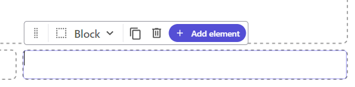

Every software system has its terminology, its own "ubiquitous language". It is important to have a common understanding of what we mean with certain terms, so we know that we speak about the same thing when we discuss a certain topic. This post is my take on the XM Cloud Components terminology, but because XM Cloud Components is part of the XM Cloud ecosystem, there are some shared terms.

## XM Cloud

I want to start with the picture below:

This picture can be found in the Sitecore documentation in the section [XM Cloud Introduction](https://developers.sitecore.com/learn/getting-started/xm-cloud-introduction).

There are some important concepts in this picture:

- **organization** - the client/company that has a contract with Sitecore for the XM Cloud service.
  An organization has an id (e.g. `org_DtGBkLvCEzULwvWi`), and a name (e.g. `macaw`).
- **project** - a project is the grouping of all the Sitecore instances that are part of the same project. A project can have multiple environments, like Development, Test, Acceptance, Production, etc.
  A project had an id (e.g. `53bppZ8omyLAI7QAORnVi7`), and a name (e.g. `XMCloud-Serge`).
- **environment** - an environment is a Sitecore Content Management (CM) instance that is part of a project.
  An environment has an id (e.g. `6JZSsQ0DLkbvYOAVPxHIX8`), and a name (e.g. `dev-serge`).

- **tenant name** - based on the organization name, project name, and environment name, Sitecore constructs a unique tenant name (e.g. `macaw-xmcloudserge-devserge`). The names have special characters removed (e.g. `-`), and are lowercased.

## XM Cloud Components

- **component** - a component is a reusable piece of functionality that can be used in multiple places like Pages or a website.

- **component canvas** - the component "screen real-estate" consisting of one or more sections. Sections are block elements and will appear below each other.
  
- **section** - a section is the top-most element of a component, where the grid system is located. By default, the grid of a section has 12 columns, and 5 rows. The number of columns and rows of the grid can be configured. Additional sections can be added to a component. See [Create the layout of a component](https://doc.sitecore.com/xmc/en/users/xm-cloud/create-the-layout-of-a-component.html) for more information.

- **grid** - a section has a grid, a grid that can be used to create the layout of the component using containers, rectangular areas within the grid.

- **container** - a container is a part of the grid (one or multiple columns and rows) that can contain building blocks. A container can be resized and moved within the grid.
  

  
  
- **Element** - an element is a piece of functionality that can be used in a container. Examples of elements are: text, image, button, etc. The elements are divided into three groups: **block elements**, **text elements**, and **inline elements**.
  

- The grid can have multiple rows and columns, and the columns can have different widths. The grid can be used to position the building blocks.

  A component has an id (e.g. `5f3b2b4a-0b7c-4b9a-8b0a-9b5b2b4a0b7c`), and a name (e.g. `Hero Section`).
If we navigate to the Components tool from the tools page of the XM Cloud environment, we end up on the following URL:

https://components.sitecorecloud.io/libraries/53bppZ8omyLAI7QAORnVi7?organization=org_DtGBkLvCEzULwvWi&systemId=5907637c-cddf-48e9-acef-bd06f1a6bab8&tenantName=macaw-xmcloudserge-devserge

The base URL is https://components.sitecorecloud.io/libraries/53bppZ8omyLAI7QAORnVi7, the other parameters are optional, and will be added to the URL automatically.

Important observation: the id in the URL, after `libraries`, is the project id, not the environment id. This is because the components are shared between all environments of a project.

The other parameters are:

| querystring parameter | value | description |
| --- | --- | --- |
| organization | org_DtGBkLvCEzULwvWi | the organization id |
| systemId | 5907637c-cddf-48e9-acef-bd06f1a6bab8 | no clue..., the id of the system that is used to store the components |
| tenantName | macaw-xmcloudserge-devserge | the tenant name |

https://portal.sitecorecloud.io/?organization=org_DtGBkLvCEzULwvWi
https://xmapps.sitecorecloud.io/tools?tenantName=macaw-xmcloudserge-devserge&organization=org_DtGBkLvCEzULwvWi
