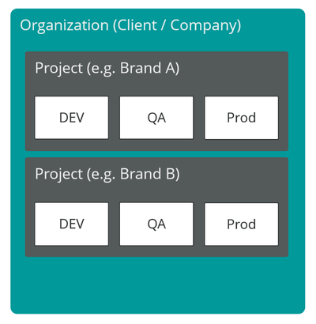
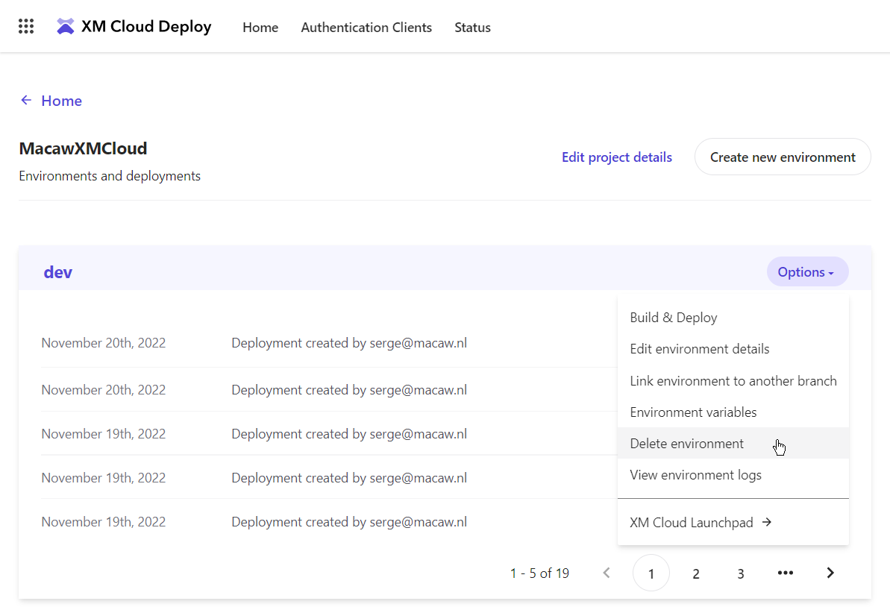
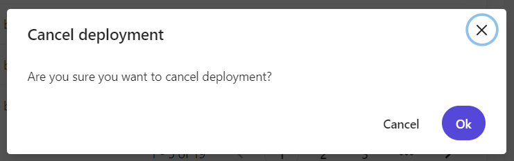
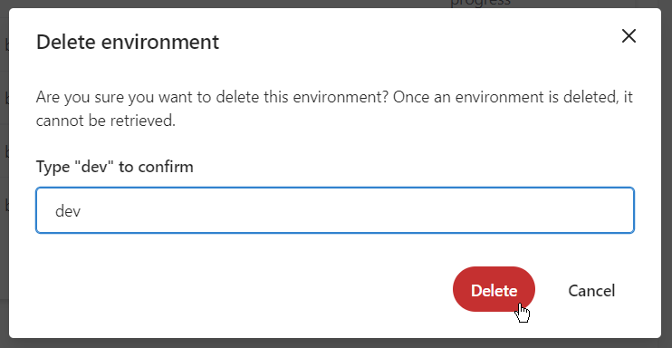
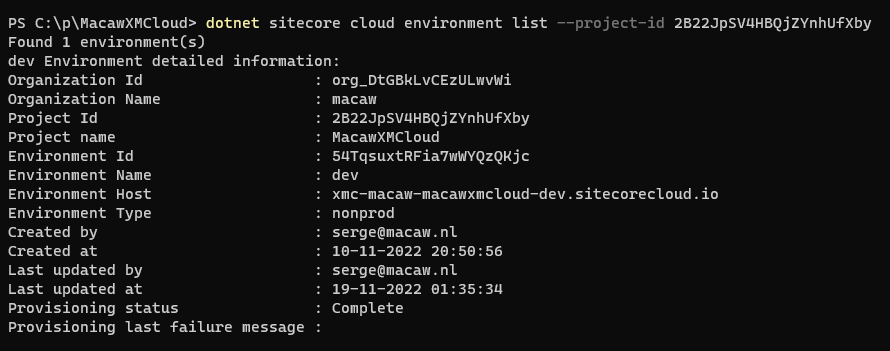
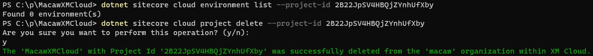

Within Sitecore XM Cloud you can create a limited set of projects (we have 2), so if you need to create a new project, you have to get rid of an old project first. I messed up the configuration of one of my projects so I wanted to delete the project. But Within XM Cloud Portal I could not find any UI function to delete a project. But we also have the Sitecore CLI to perform tasks like these. In this post, I will explain how - together with some background information on XM Cloud.

## The structure of XM Cloud: Organization - Project - Environment

Within XM Cloud you have access to one or more organizations. Within your organization, you create a project. A project is an empty thing - no servers involved, but with some important configurations attached to it. One of these configurations is the Git repository wURL here the code for the project resides. But more on that later.

First a picture from the Sitecore XM Cloud documentation:



As you can see there are two projects, and each project can have a limited set of environments (e.g. dev, qa, prod). In my case, I messed up the configuration of one of my projects because I moved the Git repository location from a GitHub organization location to a personal GitHub location. This means that the URL of the Git repository changed, and I see no way to change this URL within XM Cloud (not in the XM Cloud Portal UI, and not through the Sitecore CLI).


Within XM Cloud Portal I could not find any function to delete a project, but we also have the Sitecore CLI to perform tasks like these. But first remove all environments, this can be done in the UI:



If you have any running deployments, cancel them first:



And then deledte the environment:



Or it can be done with the Sitecore CLI. If you open a terminal window and navigate to the root folder of your project, you first need to login to XM Cloud:

```
dotnet sitecore cloud login
```

When logged in into XM Cloud, the Project Id of the project to delete can be retrieved using the command:

```
dotnet sitecore cloud project list
```

And based on the project id retrieve the list of environments:



And to delete the environment itself execute:

```
dotnet sitecore cloud environment delete --environment-id 54TqsuxtRFia7wWYQzQKjc
```

And when the complete project is "empty" (no more environments left) I can finally delete the project itself, so I can recreate one with the correct Git repository connected to it...

```
dotnet sitecore cloud project delete --project-id 2B22JpSV4HBQjZYnhUfXby
```




Note that on Sitecore Learning there is a whole section on [XM Cloud Command Line Interface](https://learning.sitecore.com/learn/course/1037/xm-cloud-command-line-interface-cli;lp=36).