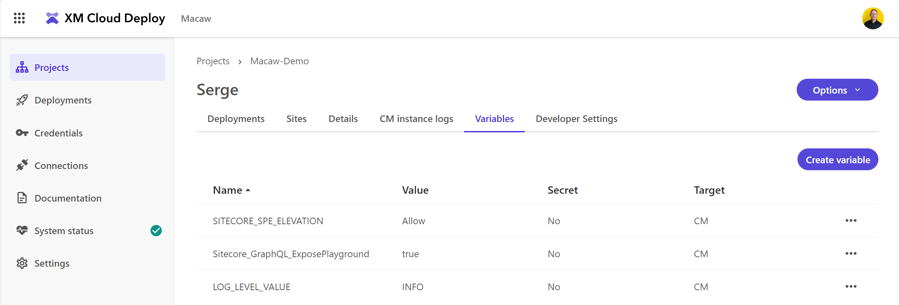

XM Cloud is a SaaS product. Yes, its heritage comes from Sitecore XM - a product that you host on premise, in the cloud, or  with Sitecore managed services. A SaaS product should, in my opinion, not be actively deployed by the developer of the solution running on the SaaS platform. Instead, it should be continuously updated and maintained by the service provider, ensuring optimal performance and security without burdening the end-user with technical tasks. Sitecore makes the deployment and maintenance as optimized as possible, but one wrong piece of configuration or code can bring down the whole dedicated SaaS instance.

I assume that the future of XM Cloud is without code deployments. But for now: it can be a decision to not do code deployments in a project. Lets see if that is possible.

## Some first thought on how to get started 
In the XM Cloud documentation we have the section [Getting started with XM Cloud | Sitecore Documentation](https://doc.sitecore.com/xmc/en/developers/xm-cloud/getting-started-with-xm-cloud.html) where the options are described to start a new XM Cloud project.

Because I want to use a single XM Cloud environment to do my experimentation (per XM Cloud project you have two non-prod, and one prod environment), I will not connect the XM Cloud environment to a GitHub repository. But also because I do not want to do deployments to the XM Cloud SaaS environment at all, nothing should be able to trigger a deployment.

To go even further, I don't want to run the full-stack development environment using Windows and Docker on my local machine, I only want to have the code for the head, serialization items for content and configuration, and scripts to automate the head and serialization items deployment.

Sitecore provides a template repository [XM Cloud SXA-based foundation template repository](https://github.com/sitecorelabs/xmcloud-foundation-head). This repository is full with stuff that I don't want to have in, like A Visual Studio solution, Docker configuration files, and some scripts. I'm still doubting if I can do without the `xmcloud.build.json` file, but that is actually the whole thing, I don't want to build and deploy anything to XM Cloud!

Another thing is the strange name of the head project: `sxastarter`. I would like to get rid of that name as well. I would prefer a more descriptive and relevant name that aligns with the project's purpose.

Everything arround the Sitecore CLI is important, because we still need to be able to use CLI command to do things like serialization.

## The development environment
I do a lot of front-end development, and I prefer to do all development on a Unix/Linux environment. Windows has never been the best citizen in this space, although it came a long end.

Because I don't have a Mac but a Windows machine, I do all my development on ([WSL2](https://learn.microsoft.com/en-us/windows/wsl/install), the Windows Subsystem for Linux. This is a good test to see if my approach would work on a Mac as well, because with respect to development WLS2 and a Mac don't differ that much.
## Cloning and cleanup
Time to get started and clone the repository to a repository that I nickname `xmcloud-acme-nocode`:

```bash
git clone https://github.com/sitecorelabs/xmcloud-foundation-head.git xmcloud-acme-nocode
```

And the next step is a big cleanup:


My next step is renaming the head project `src/sxastarter` to `src/acme-sxastarter` so I can see where things might break.

A quick search in VSCode reveals some references and names that I update from `sxastarter` to `acme-sxastarter`. 


## The node version
Always important in a front-end project, the version of Node.js that is used. The `xmcloud.build.json` file reveals us that it expects version 20.10.0. When I don't use DevContainers (a topic for another post) I use [Node Version Manager](https://github.com/nvm-sh/nvm) (nvm) to use the correct version of Node.js when developing on a project.


```bash
nvm install 20.10.0
```

And the next time to just use it:

```bash
nvm use 20.10.0
```

We can now prepare the front-end project `acme-sxastarter`:

```bash
cd src/acme-sxastarter
npm install
```

## The Sitecore CLI
The Sitecore CLI is a great tool to manage all thing XM Cloud, and mandatory to do our content synchronization.

See [Install Sitecore Command Line Interface | Sitecore Documentation](https://doc.sitecore.com/xmc/en/developers/xm-cloud/install-sitecore-command-line-interface.html) for detailed instruction on installation of the CLI. One of the steps is the installation of the .NET 6 SDK. Because I prefer to do my development on WSL2 (I'm running Ubunt 20.04) I had to follow the instructions on [Install .NET on Ubuntu 20.04 - .NET | Microsoft Learn](https://learn.microsoft.com/en-us/dotnet/core/install/linux-ubuntu-2004). Note that Microsoft Learn describes the installtion of all other systems as well. Start from  [Install .NET on Windows, Linux, and macOS | Microsoft Learn](https://learn.microsoft.com/en-us/dotnet/core/install/) to get detailed instructions for your system.

Because we cloned the sxa starter project, we can directly install the Sitecore CLI using the command:

```bash
dotnet tool install Sitecore.CLI 
```


### Sitecore CLI and Experience Edge

See [Experience Edge plugin | Sitecore Documentation](https://doc.sitecore.com/xmc/en/developers/xm-cloud/experience-edge-plugin.html) on how to install the Experience Edge plugin for Sitecore CLI.

To login, use the command:

```bash
dotnet sitecore edge login
```

When logged in we need the `tenantId` to execute commands. You can retrieve the list of `tenantId`'s using the command:

```bash
dotnet sitecore edge tenant list
```

I got back a whole list, but the ones I was interested in started with `macaw-macawdemo-serge`. You can set the current tenant to use in your commands using:

```bash
dotnet sitecore edge tenant use --tenantId <GUID>
```

There is actually only one command to execute on edge:

```bash
dotnet sitecore edge apikey
```

But that command fails with the following message:

```text
You are not authenticated. This can happen for several reasons
* You may need to be assigned additional permissions to have rights to perform this action
* Your existing access token has expired and cannot be refreshed (to fix, login again)
* The Sitecore server does not trust tokens from the authority
```
## The XM Cloud side
It is now time to head over to https://portal.sitecorecloud.io/ and create a new XM Cloud environment within a project. In my case I created an environment named `Serge` within the project `Macaw-Demo`:


We first create a new site. Select the **Basic Site** so we already have some pages and content.


Let's name the site **SkatePark**:


The site is created, and, and we get a message that if we want to activate analytics, we have to add a site identifier. But that is something for later... 


When the site is created, we can can select the three dots on the site:


When we select **Settings** in the menu, we see the settings of our new created site:


At the top we see a tab **Developer settings**. Select this tab, and you will see:


At the bottom it is possible to generate a SITECORE_API_KEY, do this and copy its value to somewhere safe.

## Configuring the front-end project
We now need to configure the front-end project. We want it to communicate with the Sitecore environment and the website we created.

Make a copy of `.env` to `.env.local`. Note the the `.env.local` file is part of `.gitignore`, so we can safely include secret settings in here.

Set the following environment variables in `.env.local`:

```bash
JSS_EDITING_SECRET=thisismyjssseditingsecret
SITECORE_API_KEY=<the generated API key>
SITECORE_EDGE_CONTEXT_ID=2tCDhM4f5rynE4VPPRS1vQ

```

Note that that last settings, `SITECORE_EDGE_CONTEXT_ID` can be found in XM Cloud Deploy:


Now it is time to start the front-end project:

```bash
npm run start:connected
```

But sadly enough, if we visit `http://localhot:3000` we get an error:


## Let's publish our repository to GitHub source control

We cloned the code from Sitecore, cleaned-up everything we did not needed, and now it is time to push the code to a repository. This will allow us to publish our site to Vercel.

Because we don't need the connection to the Sitecore repository anymore, we can remove all git-related stuff and start fresh:

```bash
rm -rf .git
```

On GitHub I create a repository `xmcloud-acme-nocode`, and we can now push our codebase to the repository as follows:

```bash
git init
git add -A
git commit -m "first commit"
git branch -M main
git remote add origin https://github.com/svdoever/xmcloud-acme-nocode.git
git push -u origin main
```
## Publishing our site on Vercel
Out site is now running on http://localhost:3000, but in order for Pages to work, it must be able to access and render the website on an externally accessible site.

One of the publishing options is to use Vercel, and normally we could use XM Cloud Deploy which contains functionality to setup this deployment:


Problem is that we did not connect a GitHub repository, because that must be done on project level, while we want to be able to have an environment stand-alone to experiment with. 

But connecting a Vercel site by hand to a GitHub repository is really easy, and the only thing we need to do after that is configure the Vercel website to connect to XM Cloud.

With an XM Cloud environment we have preview and live, so lets get started on Vercel with a site to deploy our SkatePark site on. We will name the Vercel project `xmcloud-acme-nocode-skatepark-preview`.

For the deployment to Vercel see the XM CLoud documentation [Walkthrough: Deploying your front-end application to Vercel | Sitecore Documentation](https://doc.sitecore.com/xmc/en/developers/xm-cloud/walkthrough--deploying-your-front-end-application-to-vercel.html)


With minimal configuration the site can be deployed:


## GraphQL
Time to see if we can use the Sitecore GraphQL playgrounds. When you navigate to you project in XM Cloud Deploy, there are three links to GraphQL environments:

- 


The Authoring GraphQL IDE link does not work, but when you hover over the information icon, it is stated that we need to set the `Sitecore_GraphQL_ExposePlayground` environment variable to true.

To do this, go to the **Variables** tab and set the variable to true. When we are at that screen, we also set the `SITECORE_SPE_ELEVATION` variable to `Allow`, so we can use the built-in PowerShell IDE in XM Cloud:



In the past we needed to do a new deployment to trigger a restart of the CM server, and that is exactly what we want to prevent, deployments.

But luckily enough the **Options** menu now contains a **Restart environment** option. Still something you prefer not to do on a SaaS environment, but there is no way around it to get out environment variables set! 


I hoped to stay away from the Content Editor as much as possible, but for the Preview GraphQL IDE the functionality to generate a Preview API token did not work:


In the documentation is described:


