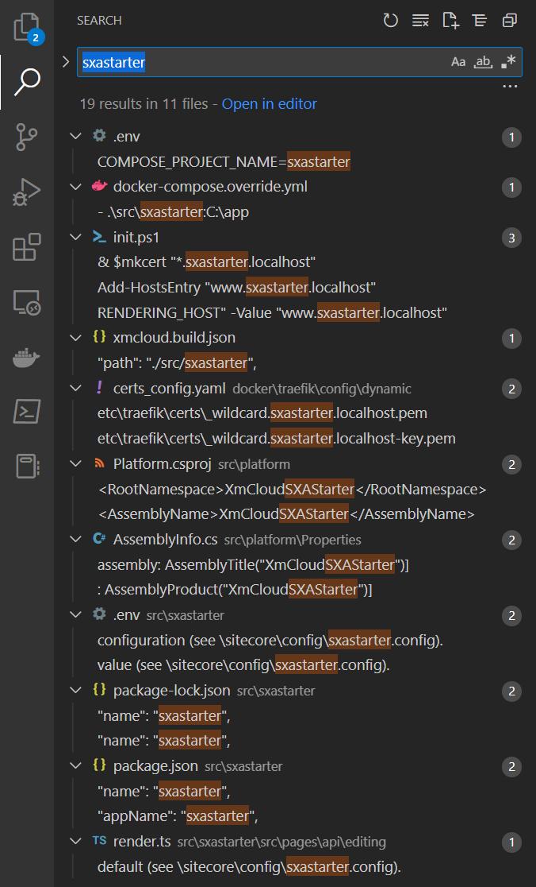
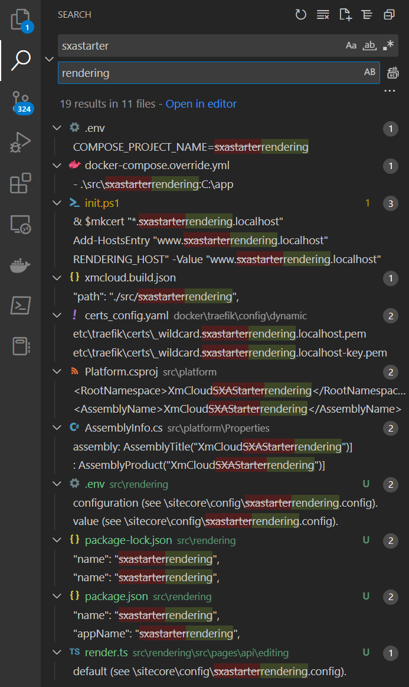

Ok, you got access to XM Cloud, create a project, and have you project code scaffolded into a repository on GitHub. What now?

I propose you will take the next steps:

1. Clone the GitHub repository on your local machine
2. Determine the base URL of your dev environment, it is the base URL of the Content Editor. In my case this is https://xmc-macaw-acmexmcloud-dev.sitecorecloud.io
3. In a browser open the URL https://xmc-macaw-acmexmcloud-dev.sitecorecloud.io/sitecore/admin/showconfig.aspx, do view-source on the page, and copy the content in a file in the root of your project with the name `web.config.xml`
4. By default the XM Cloud scaffolder creates a project name in all generated code with the name `sxastarter`. This is not the name you want to stay in your source code, and it is also not the name as expected by the `.gitignore` file, where we see that the folder `rendering` is used. Rename the folder `src/sxastarter` to the name `rendering`. This is also the name used in for example the `Sitecore.Demo.XmCloud.PlaySummit` example project by Sitecore. If you open your complete repository in VSCode and search for `sxastarter` you will see all occurrences:
  
6. After the rename of the folder `src/sxastarter` to `rendering` the following 12 results remain that you can now replace with a global search-and-replace to your tenant name:
  
7. 