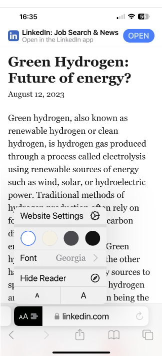

LinkedIn has always amazed me regarding usability. I never bookmark an article, because I don't know how. So I can never find something back. This same thing drove my wife crazy, so what she does: share articles with me that she wants to bookmark, so she can find them back. All kinds of posts I'm absolutely NOT interested in, so time for action. 

The action consists of two things:

1. how to "bookmark" a post (not that hard)
2. how to find the bookmarked articles back (almost impossible)

## Bookmark a LinkedIn post

Given an article is is easy to bookmark (or in their terminology "save") a post: click on the three dots and select "Save". Not the most logical place because it is out of sight, while **link**, **comment**, **repost** and **send** button are available under the article. But if you know it, you know it.

## Find back bookmarked posts

Finding back your bookmarked, or saved, posts is a completely different story. I couldn't. After some searching I found a linkedIn article [The quest to find saved LinkedIn posts](https://www.linkedin.com/pulse/quest-find-saved-linkedin-posts-scott-stockwell/), I happened to be not alone in this quest. Scott describes the 7 steps needed to be done on my iPhone to find back the saved posts. Not a case of "if you know it, you know it" for me. Luckely enough he also mentions the direct URL to the saved articles: [https://www.linkedin.com/my-items/saved-posts/](https://www.linkedin.com/my-items/saved-posts/). So what would be nice: an icon on my iOS home screen that I can place next to the LinkedIn icon that brings me directly to the saved posts. Sounds like an easy tasks... but it isn't...

### A iOS home screen icon pointing to saved posts

When you paste the above link in Safari, it directly opens the LinkedIn app, so no chance to use the "Add to Home Screen" functionality to create a nice icon pointing to the saved posts. After a lot of tinkering I found a work-around to make it happen. And this workaround has an added benefit: reader mode! Lets get started.

1. Open Safari on iOS
2. open any website, e.g. https://spacex.com
3. press the box-with-arrow at the bottom, scroll down and select "Add Bookmark", and select "Save". Note that although you can change the text of the bookmark, you can't change the URL. A new bookmark is added.
4. Select the bookmark icon at the bottom of Safari, in the bookmarks window drag down and search for **SpaceX**. Hold your finger on the **SpaceX** bookmark until a menu appears, and select **Edit**.
5. Now change the text to **Saved LinkedIn**, and the URL to https://www.linkedin.com/my-items/saved-posts/ and select **done** on the keyboard.
6. Open again the bookmarks in Safari, and search for **Saved LinkedIn**. Click this bookmark, which opens a web page to the saved articles in the Safari browser, instead of directly opening the LinkedIn app.
7. press the box-with-arrow at the bottom, scroll down and select "Add to Home Screen", and select "Add". You will now have a icon on your homescreen that opens the browser version of LinkedIn with your saved posts.

The good thing of having the saved posts in the browser, instead of in the LinkedIn app: some (why not all?!) articles can be opened in the Safari reader mode by selecting **Show Reader** which provides an optimal reading experience.
