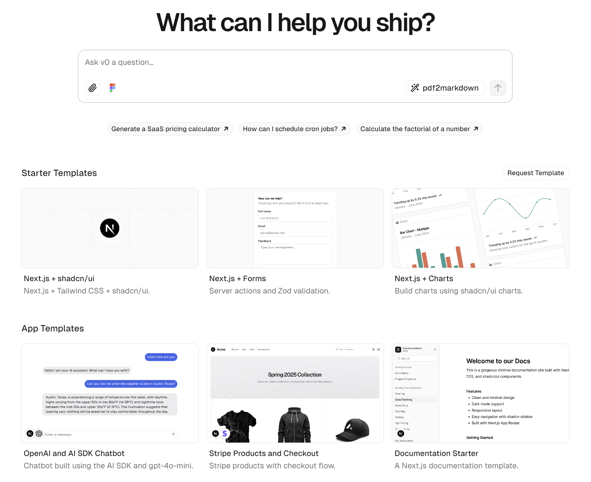
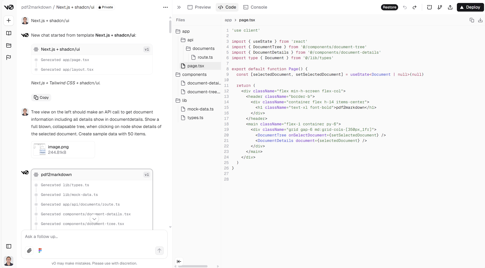
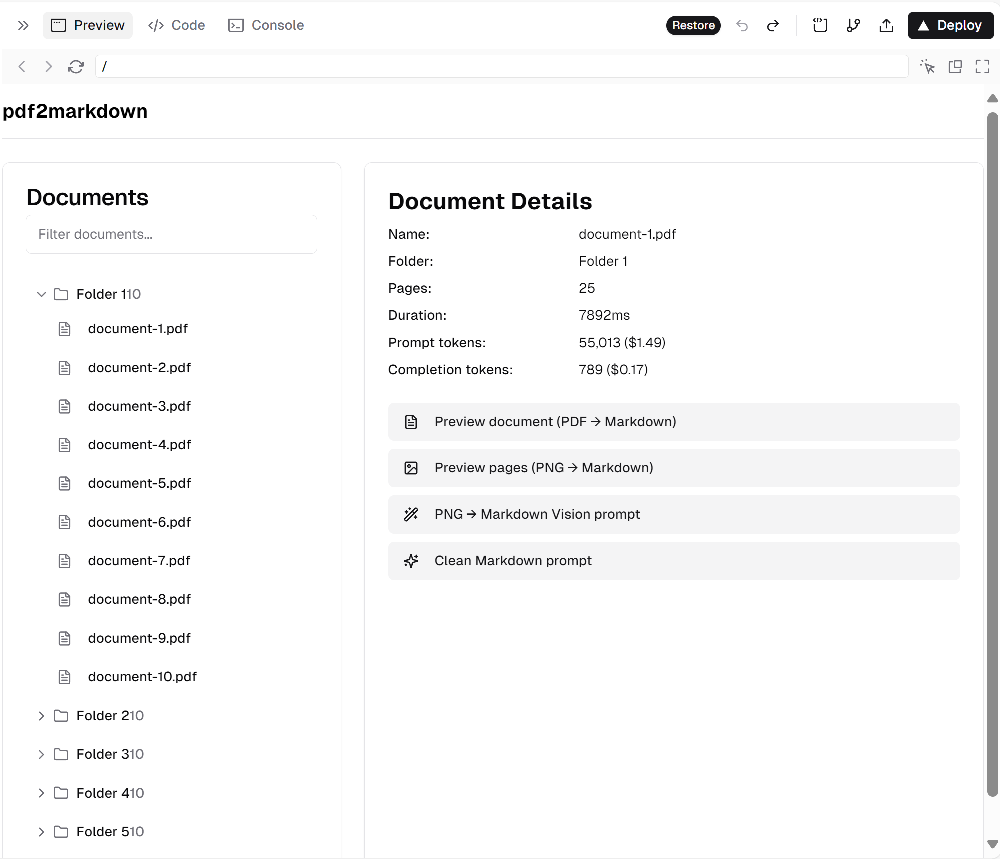
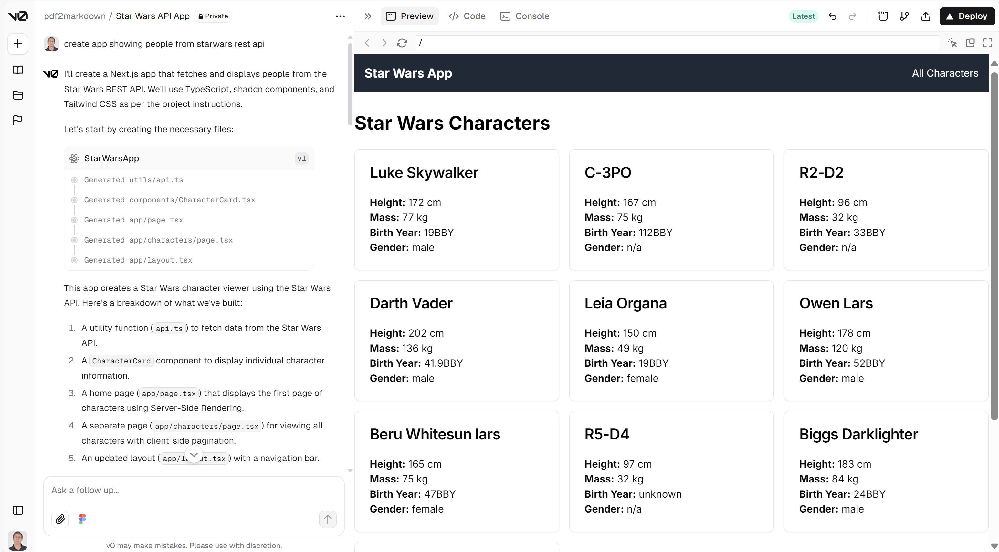

For the last months I have been working on a project to convert PDFs to Markdown, and now I want to create a Web App to show the conversion results. The app will not be very complex so I could easily build it myself, but it is also a nice showcase to see how this can be done and how different AI tools approach the job.

I use GitHub Copilot already for more than a year, and I am quite happy with it. I use it for its smart code suggestions, executing repeating jobs, fix errors in my code, and write pieces of code based on a comment in my code, or through the GitHub Copilot Chat functionality. It is also great at writing a function here and there, and providing the required unit testing code. It really makes me more productive, but because I often work on larger codebases, I miss the "overview" the LLM should have. I try to provide context by keeping the related files open, but the new preview capability "Edit with Copilot" which provides multi-file editing did not really work for me yet. I think especially because explicitly defining the set of files for multi-file editing goes a bit too far for me.

## My first use of web-based AI tools with preview mode
I played with https://v0.dev from Vercel and https://claude.ai from Enthropic in the past where it was possible to let AI write the code for a complete Web App, and get a direct preview of the results. At that moment in time it generated a single file using React and JavaScript and it was not possible to edit the code, only to preview the result, and to export the code.

## A lot happened lately
A lot has happened since then. The rise of the AI code editors like [Cursor](https://www.cursor.com/), and [Windsurf](https://codeium.com/windsurf), both building on the foundation of Visual Studio Code - YouTube overflows with video's praising one or the other. But one way or the other I don't dare to leave my well-trusted Visual Studio code environment. The editors provide an "agentic" way of coding. I have a feeling that I know what an Agent is in AI terms, but I asked ChatGPT for a description in the context of AI code editors:

> In the context of AI code editors, "agentic" refers to the integration of autonomous AI agents capable of independently performing coding tasks, making decisions, and adapting to new information, thereby enhancing developer productivity and efficiency.

ChatGPT even pointed out this nice write-up on Agentic AI: https://kodexolabs.com/what-is-agentic-ai.

Another trend are the web-based AI-powered web development platforms like https://bolt.new (by Stackblitz), its open-source version https://bolt.diy where you can bring your own LLM, and the new and improved https://v0.dev by Vercel. All these platforms support multiple files and TypeScript and allow you to build, run, edit (in most cases), and deploy full-stack web applications directly from the browser.

## Impressed by bolt
I started playing with https://bolt.new to build some simple prototypes and a space invaders clone with great results. But everytime I was nearly there I was out of tokens, and needed to buy a monthly billed Pro plan in order to be able to continue. Also for my PDF to Markdown Web App, based on an uploaded Excalidraw sketch of my main screen and a few smart prompts, it created a nice and working result - but again: out of tokens. After some Googling (yes sometimes - but not often - I still use Google) I stumbled upon the open-source version of bolt.new called https://bolt.diy. With this version it is possible to connect your own LLM, a big plus for me because I have access to the gpt-4o and gpt-4o-mini LLMs through Azure OpenAI. My results with bolt.diy powered by gpt-4o were not so impressive as the result I got with the Enthropic Clause 3.5 Sonnet powered bolt.new, but with some extra prompting the result was nice, and I did not run out of tokens.

> Because bolt.diy does not have Azure OpenAI support at the time of writing, I used litellm to proxy Azure OpenAI to http://localhost:4000, and in bolt.diy I used the **Open AI Like** API integration.

## Dissapointed by bolt
Working with bolt is cool. It generates a complete codebase with package.json and all the configuration and code files, it does an `npm install`, and even starts the Web App using `npm run dev`. The power behind this is the Stackblitz webcontainer, a  WebAssembly-based operating system which enables Node.js to run entirely inside the browser. I soon wanted to do some manual changes to the code, but this currently not supported (see discussion [here](https://thinktank.ottomator.ai/t/edits-in-files-dont-get-reflected-in-preview/3228)). All changes must be made through prompting, which makes it almost impossible to build what you want. On the other hand: when you can edit the code, do you want to do this in a simple web-based (CodeMirror) editor. When I still hoped I could edit the code and let bolt continue on my code, I looked into a project called [boltops](https://www.npmjs.com/package/boltops), but I could never got it working with bolt.diy.

## Back to https://v0.dev
At Vercel things move fast. Same for https://v0.dev. What I like about the approach of v0.dev is that you first select a starter template, instead of the Agent/LMM deciding for you:

A bit like the "old days" where you used **Created React App** or one of the zillion other starter kits to do the havy lifting of setting up a new project.

I went for the **Next.js + Tailwind CSS + shadcn/ui** template, a nice stack to build a web app, uploaded my Excalidraw image, gave a first prompt and v0.dev started its magic:

And the preview window showed exactly what I envisioned:

My next step was to integrate my pdf2markdown API I had running on http://localhost:8001. Because https://v0.dev is running in the cloud I had to provide my API on https over a public URL. I used both localtunnel (`npx localtunnel --port 8001`) and cloudflared (`C:\bin\cloudflared.exe tunnel --url http://localhost:8001`) but could not get it working.

I directly tried a new project against the Start Wars API, and that worked flawlessly, so work to do on my API:

I'm impressed with the new https://v0.dev but also here I will run into the token limit, and I don't want to have another subscription on an AI service next to GitHub Copilot, Office365 Copilot, Azure OpenAI, and SimTheory.ai. I now also know I want AI tooling infused within my preferred editor and daily work horse: Visual Studio Code.

## This made me think
I'm a developer. I write code. Yes I want AI to help me, especially with the UI stuff. But I decided that I want to work in my "own" code editor: Visual Studio Code. From there it is east enough to do an `npm install` and `npm run dev`. I want to be able to have the extensions I am used to, to be able to refactor my code, to debug my code. To write unit tests, and run these unit tests. To have my code under source control.

I like the "Agentic" approach, but I am not willing to go to another editor like Cursor or Windsurf, backed by Venture capital, there to let me pay for tokens as their source of income. I know: I didn't even try them. I don't want to.

## Clide
In a discussion I read about [Cline](https://github.com/cline/cline), an *Autonomous coding agent right in your IDE, capable of creating/editing files, executing commands, using the browser, and more with your permission every step of the way.*

It is open-source, it is an extension in Visual Studio Code, you can bring your own model, and yes it directly worked with my still running litelmm proxied Azure OpenAI gpt-4o model using the **Open AI Like** API integration.

I will go into more details of my Clide adventures in a next post, but be careful: don't be too permissive... before I knew it Clide burned 1.9 ilion token after a single simple prompt. It kept on rewriting the code and executing commands. But the ideas in Clide sound promising...

## Some final words
I want to end this post with some final words, not from me, but from people in a discussion thread I found on https://www.threads.net/@jakenuts/post/DBfh6jdJSTb. Happy (AI) coding!