In my article on LinkedIn called [What do we know about XM Cloud?](https://www.linkedin.com/pulse/what-do-we-know-xm-cloud-serge-van-den-oever/) I show screenshots on what happens when you create an XM Cloud project using the Next.js based starter template. One of the steps creates a GitHub repository where it stores the XM Cloud code repository belonging to the created XM Cloud project, used for deployment. In the code base there are also all the scripts (`up.ps1`, `down.ps1`) to spin up a local development environment using Docker Compose and Docker containers.

Because I don't have access to an "organization" in the real XM Cloud, I can't create such a starter project to play with. But because the code repository shown in the screenshots of my presentation can be found on GitHub, we can take another approach. In that codebase we can identify a "fingerprint" to find the newest version of this starter project on GitHub. This way it is easy to find a recent repository so we can play with the newest stuff. 

The fingerprint I selected in the codebase is `SITECORE_API_KEY_xmcloudpreview`. I tried with `SITECORE_API_KEY_xmcloud` but that is in no GitHub repository yet (probably will be after the Sitecore Symposium:-))

On GitHub it is easy to search for all repositories containing code with this string, just use the following [URL](https://github.com/search?o=desc&q=SITECORE_API_KEY_xmcloudpreview&s=indexed&type=Code):

```
https://github.com/search?o=desc&q=SITECORE_API_KEY_xmcloudpreview&s=indexed&type=Code
```

I already ordered it so the newest repository is on top, check if it is trustworthy for you, fork it, clone it on your local machine, read the README for instructions and have fun! Oh and by the way, nice those secrets in the `.env` file:-)

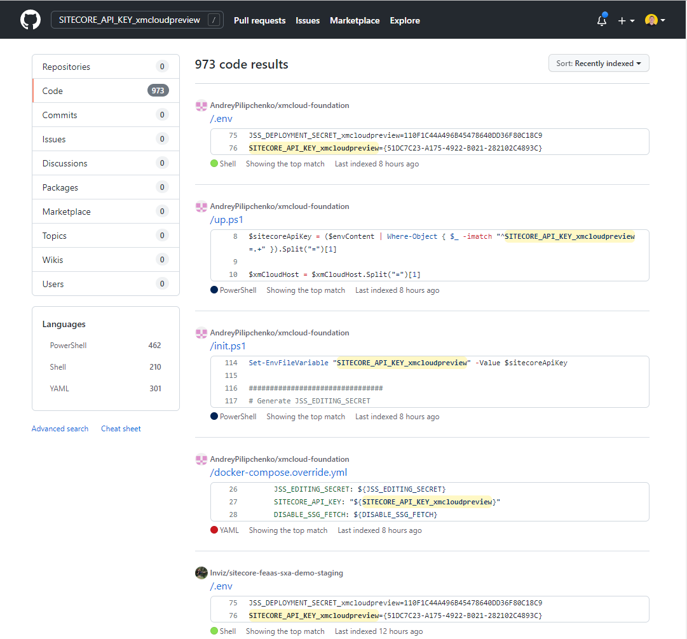

First all docker images are pulled to your machine (this can take a while, depending on the speed of your network connection) which results in the following images - given the naming conventions (`sxastarter` - can be configured in ) in the repository I selected:

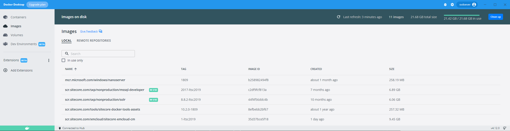

And after that all the containers are spinned-up, resulting in:

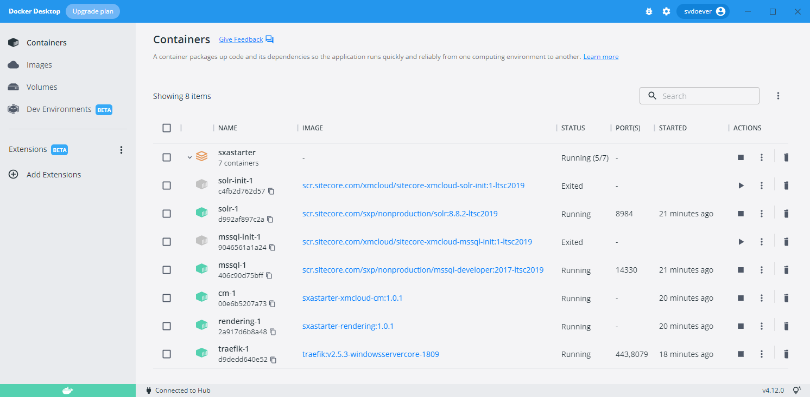

Note that the images `solr-init-1` and `mssql-init-1` are stopped, those images are only used for initialization of the Solr search engine and the Microsoft SQL Server database.

In the console window you will see:

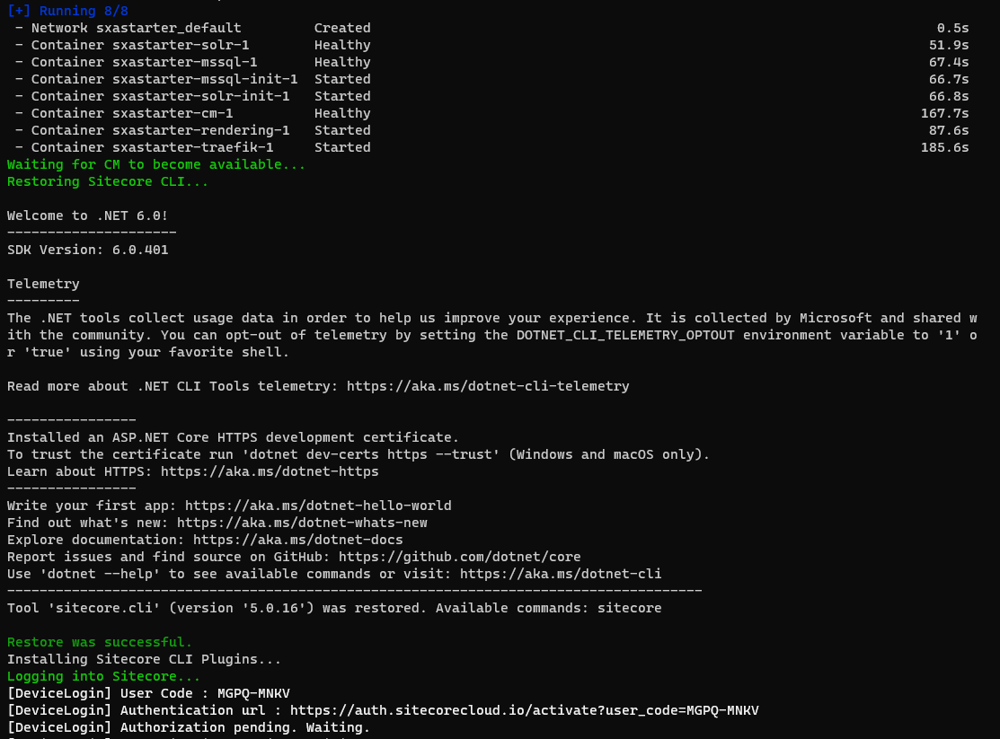

Interesting are the lines 

```
[DeviceLogin] User Code : QQFH-NXKM
[DeviceLogin] Authentication url : https://auth.sitecorecloud.io/activate?user_code=QQFH-NXKM
```

The local environment wants to connect to the Sitecore XM Cloud environment running on `https://sitecorecloud.io` to do "Device Confirmation":

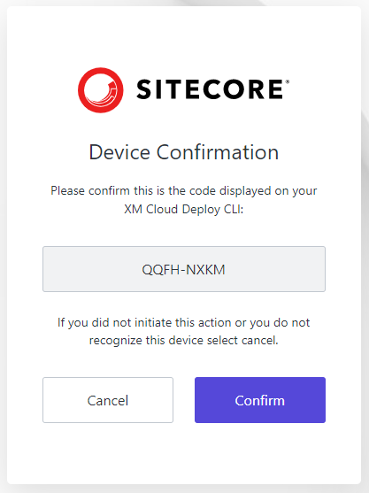

En when the confirm button is pressed you get:

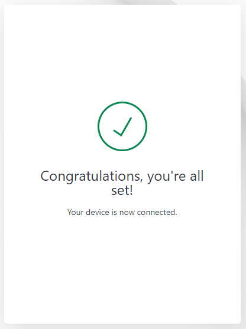

Sitecore now has "confirmed" and "connected" your device (whatever that may mean), and the last steps for spinning up your local environment, the population of the Solr schema and the indexing, are executed:

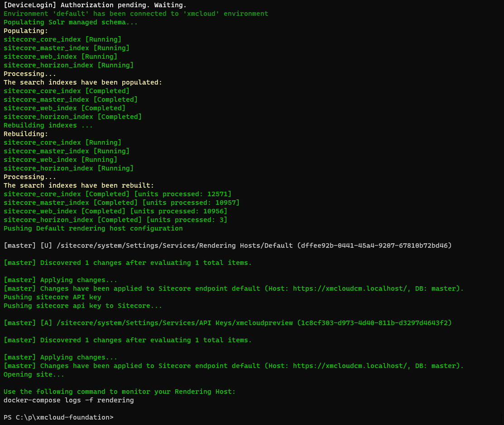

What is also interesting is that a preconfigured API key `xmcloudpreview` is also "pushed" to Sitecore. I wonder if they mean that is is connected to your device registered in the XM Cloud portal.

When all the setup is completed, it starts a local XM Cloud on the URL [https://xmcloudcm.localhost/sitecore/client/Applications/Launchpad?sc_lang=en](https://xmcloudcm.localhost/sitecore/client/Applications/Launchpad?sc_lang=en]) and we are in business!

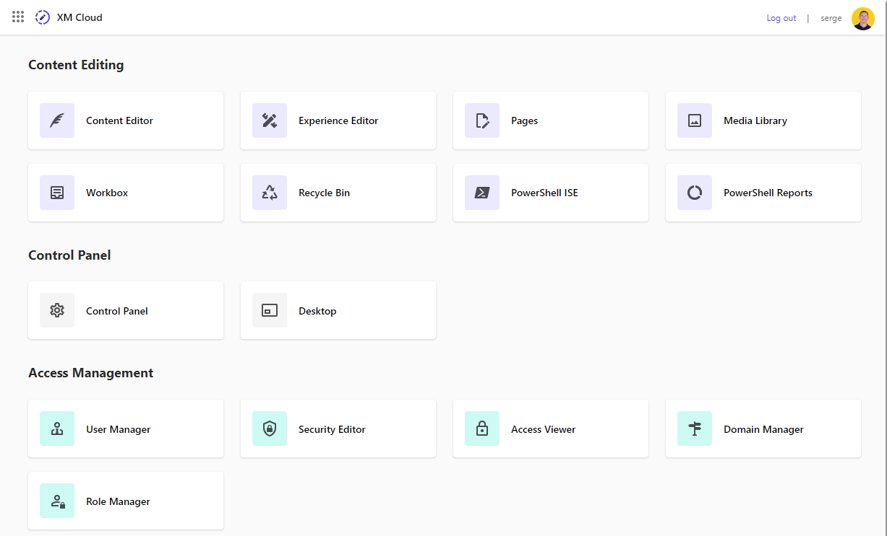

When you want to login to the XM Cloud environment (I opened the URL in an incognito window) you will see that it does this through the XM Cloud portal at `https://sitecorecloud.io`. Login in with your portal account. When you don't have a portal account yet, you can sign up and create a login on this environment without actually having an "organization". This organization is needed to create XM Cloud projects on the portal.

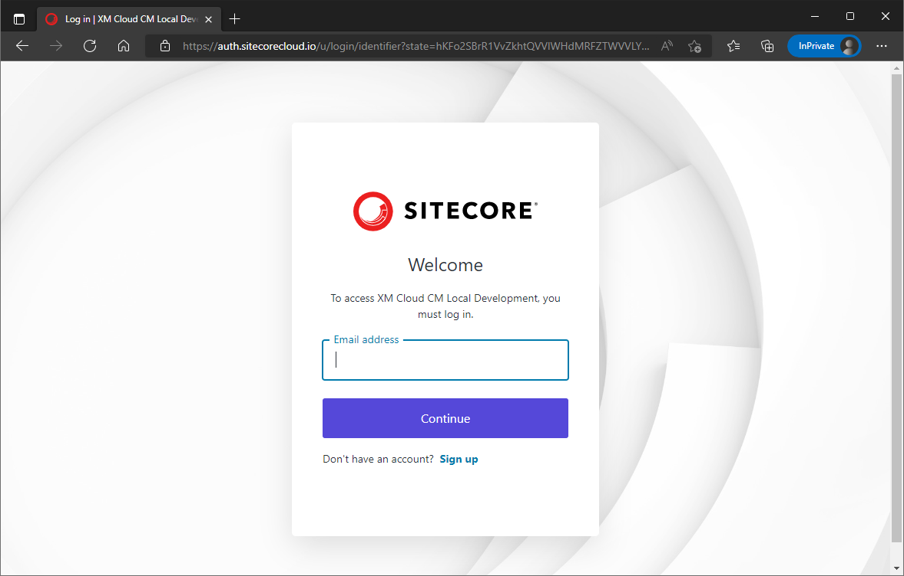

The first thing you will want to try out is the new **Pages** editor. Bad luck. The Pages editor (a reincarnation of the Horizon/Symphony/... editor) is a SaaS product that requires you to have an organization with in that organization a created XM Cloud project, as you can see in the following screenshot:

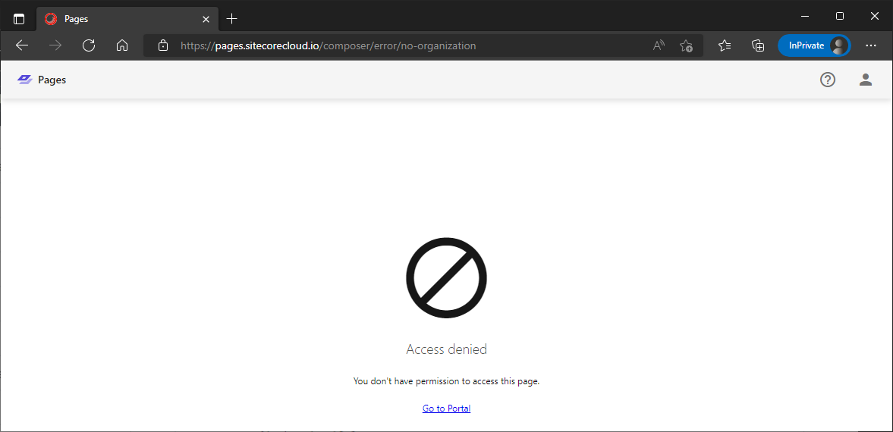

It has `no-organization` in the URL, a fact you can see as well if you click the **Go to Portal** link:

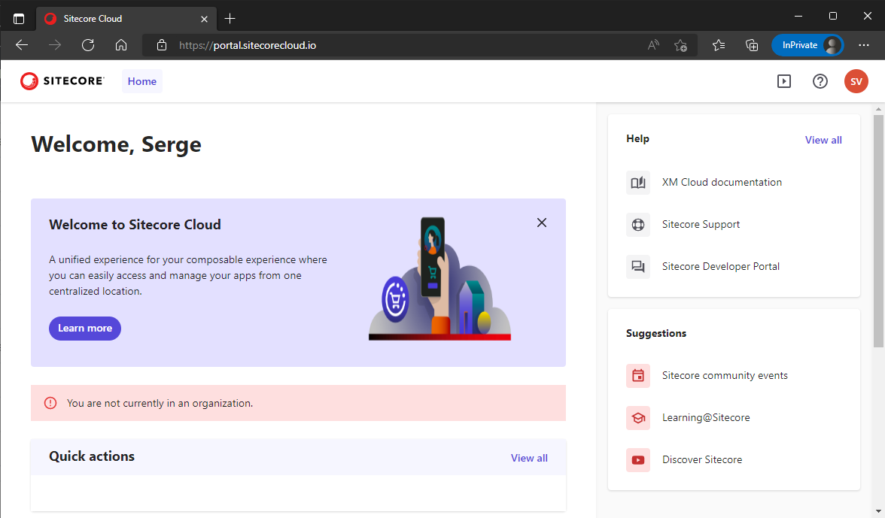

I initially had the hope that if you do it the right way, and create the repository based on the starter template when you have access to an organization, that the Pages editor will actually work with your local development instance of XM Cloud. But after some further research I found out that the CM URL https://xmcloudcm.localhost can not be changed, because the authentication done at https://auth.sitecorecloud.io has whitelisted https://xmcloudcm.localhost for their OAUTH authentication (implemented with Auth0 by Okta), so you can't tunnel the XM Cloud environment (I tried it with `localtunnel`) to the outside world. Accessibility from the outside world to you locally running container is mandatory for the SaaS Pages editor (running on https://pages.sitecorecloud.io) to access your data. 

A fun fact: if you clicked the **Go to Portal** button, and from the portal press the back button in your browser twice you **do** end up in the Pages editor, but there is not much there to see:

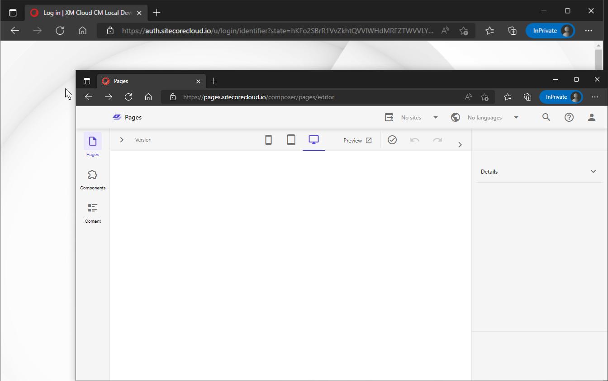

The Experience Editor and Content Editor do work as expected however.