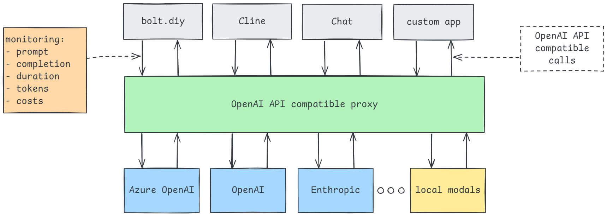
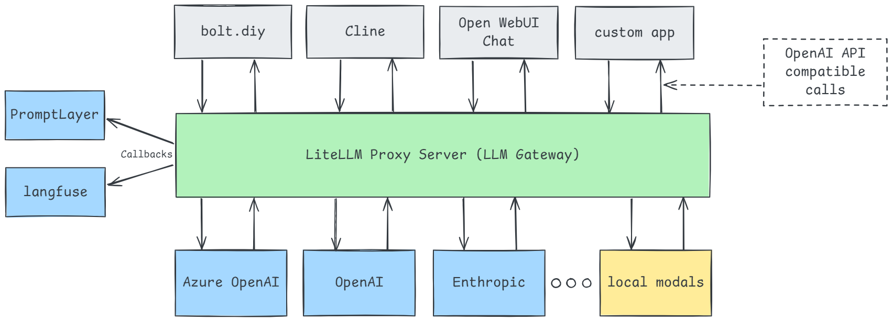

In this post I will describe how I use Docker Compose to set up an LLM experimentation environment where I can connect tools and chat to cloud-based and local LLM models, and monitor exactly the executed prompts, its completions, the amount of tokens used and the costs.

## Introduction
I have done quite some experimental projects with AI and LLMs, from chatbots with RAG to generative AI, from AI focused apps to infusion of AI capabilities in applications. I work at a Microsoft house, so the obvious choice has been the Azure OpenAI LLM models, and therefore using the OpenAI API. And I must say, the OpenAI APIs work for me and I see no reasons to learn other APIs, or support other APIs in the software I build. But on the other hand: I want to experiment with other models as well, and I see a big future for SLM (Small Language Models) and models running local on your machine.

## Support for Azure OpenAI in "bring your own model" AI tools
As it is easy for me to get access to an Azure OpenAI model deployment, I always want to connect tools to Azure OpenAI. Most tools support OpenAI APIs itself where just filling in an API key is enough, but not the Azure OpenAI variation whch needs some additional configuration parameters. And this is understandable. Azure OpenAI is a Microsoft thing, nice for bigger companies, but not for "normal" use-cases.

## OpenAI Like
A new trend in AI tools is support for "OpenAI Like" APIs, where the OpenAI API calls are supported, but on a given URL with a given API key. Good examples are https://bolt.diy and https://github.com/cline/cline. 


For me direct support for Azure OpenAI is not a must, there are actually good reasons to use the "OpenAI Like" route instead. Why? Because on Azure I can create multiple model deployments like below:


But:
- I can't see the prompt sent by a tool or see the completion returned by the model
- I have no clue about the amount of tokens in the prompt or the completion, an the amount of time the request took
- I have no clue abou the related costs

## LiteLLM to the rescue
"LiteLLM is an open-source gateway that provides a unified interface for interacting with over 100 large language models (LLMs) from various providers, streamlining authentication, load balancing, and spend tracking, all within the OpenAI API format."

The cool thing with LiteLLM is that it can proxy both cloud based LLMs like from Azure OpenAI, Gemini and Enthropic, but also local modals running through, fir example, [Ollama](https://ollama.com/) or [LM Studio](https://lmstudio.ai/). And the best thing is: you can talk to all these models using the OpenAI API and do all the things I mentioned above.

There are a zillion posts and YouTube videos on how to install and run LiteLMM, configure it to proxy LLM models, and how to combine it with Ollama to run your own models. Have a look at for example:

- [The LiteLLM docs](https://docs.litellm.ai/docs/)
- [Local LLMs with LiteLLM & Ollama](https://microsoft.github.io/autogen/dev//user-guide/core-user-guide/cookbook/local-llms-ollama-litellm.html)

But I will tell you how I want use it.

## OpenAI API Like and observability
When working with chat, tools like bolt.diy or Cline, or my custom code, I want to be able to configure these tools with an OpenAI API Like connection that can connect to cloud models and local models:



We can use the [LiteLLM OpenAI Proxy Server](https://docs.litellm.ai/docs/simple_proxy) as an LLM gateway to cloud-based models like Azure OpenAI, OpenAI, and Enthropic. But when we spin up Ollama with local models, we can also talk to these local models using the OpenAI API. LiteLLM has a feature called "callbacks" that can be used for sending output data to external tools. I currently use two SaaS tools to connect callbacks to: [PromptLayer](https://www.promptlayer.com/) and [Langfuse](https://langfuse.com/). These tools can be used to monitor prompts, completions, duration, tokens and costs. For Chat I use the great open-source project [Open WebUI](https://openwebui.com/): "Open WebUI is an open-source, self-hosted interface designed for seamless interaction with large language models (LLMs), supporting various runners like Ollama and OpenAI-compatible APIs, and capable of operating entirely offline."

> Why Chat? Although the IDE approach to AI-Based app generation is cool, I still use direct chat with LLMs to write most of my code. I mainly use OpenAI ChatGPT with o1 or 4o for code-related chats, or I use Entheropic Claude 3.5 Sonnet through https://claude.ai which has a nice feature to directly see resulting front-end code running. But there is a good reason to use the Open WebUI chat, but more on that in a next post!

When we revisit mentioned tooling the picture looks like this:


## My LiteLLM configuration for Azure OpenAI and more
Although you can install Python locally and use the LiteLLM Python SDK, I prefer to use Docker containers to use the LiteLLM Proxy Server and Open WebUI. I stumbled on a Docker Compose setup at https://github.com/chrispangg/openwebui-litellm wich combines LiteLMM with Open WebUI. As I wnanted to connect the SaaS versions of Langfuse and PromptLaywer, I needed to make some small modifications to the `docker-compose.yml` file and the provided `Dockerfile` to build the LiteLLM container.

My setup contains of the following four files: 
- `docker-compose.yml` to start the different containers
- `Dockerfile` referenced by the `docker-compose.yml` to build a specific container for LiteLLM with the Langfuse and PromptLayer built in
- `config.yml` for the configurations of LiteLLM containing the models and callbacks
- `.env` for thew configuration of used API keys

There is a great LiteLLM [config.yaml](https://github.com/chrispangg/openwebui-litellm/blob/main/config.yml) file in the repository of Chris Spangg. I use bit different one to make Azure OpenAI models available:

```yaml
model_list:
  - model_name: "gpt-4o" # model alias
    litellm_params:
      model: "azure/gpt-4o"
      api_key: os.environ/Azure_OPENAI_API_KEY
      api_base: "https://svdo-aoi-eus.openai.azure.com"
      api_version: "2024-05-01-preview"
  - model_name: "gpt-4o-mini" # model alias
    litellm_params:
      model: "azure/gpt-4o-mini"
      api_key: os.environ/Azure_OPENAI_API_KEY
      api_base: "https://svdo-aoi-eus.openai.azure.com"
      api_version: "2024-05-01-preview"

litellm_settings:
  success_callback: ["langfuse", "promptlayer"]
  # We want be able to see the full prompts and completions logged
  turn_off_message_logging: false
```

Note the `turn_off_message_logging` flag set to false. By default LiteLLM will send "redacted-by-litellm" as prompt to callbacks for privacy reasons. In our setup the prompts and completions we are interested in, so enable sending the in the callback calls to Langfuse and PromptLayer.

The `docker-compose.yml` file looks like:

```yaml
services:
    openwebui:
        image: ghcr.io/open-webui/open-webui:main
        container_name: open-webui
        env_file:
            - .env
        ports:
            - "3000:8080"
        volumes:
            - open-webui:/app/backend/data
        extra_hosts:
            - "host.docker.internal:host-gateway"
        environment:
            - WEBUI_AUTH=False
            - OPENAI_API_KEY=${MASTER_KEY}
            - OPENAI_API_BASE_URL=http://host.docker.internal:4000/v1
        restart: always

    litellm:
        # image: ghcr.io/berriai/litellm-database:main-latest - does not support Langfuse and PromptLayer
        build:
            context: .
            dockerfile: Dockerfile

        container_name: litellm
        env_file:
            - .env
        ports:
            - "4000:4000"
        volumes:
            - ./config.yml:/app/config.yaml
        command: --config /app/config.yaml --port 4000
        restart: always
        environment:
            - LITELLM_MASTER_KEY=${MASTER_KEY} # Your master key for the proxy server. Can use this to send /chat/completion requests etc
            - LITELLM_SALT_KEY=${LITELLM_SALT_KEY}
            - DATABASE_URL=postgresql://llmproxy:dbpassword9090@db:5432/litellm
            - STORE_MODEL_IN_DB=True

    db:
        image: postgres
        restart: always
        environment:
            POSTGRES_DB: litellm
            POSTGRES_USER: llmproxy
            POSTGRES_PASSWORD: dbpassword9090
        healthcheck:
            test: ["CMD-SHELL", "pg_isready -d litellm -U llmproxy"]
            interval: 1s
            timeout: 5s
            retries: 10

volumes:
    open-webui:
```

The big difference with the version of Chris Spanng is that for LiteLLM the container is built using the provided `Dockerfile` so we call install the Langfuse and PromptLayer libraries needed by LiteLLM to do callbacks to these two systems.

The `Dockerfile` looks like:

```dockerfile
FROM ghcr.io/berriai/litellm-database:main-latest
WORKDIR /app
RUN pip install langfuse
RUN pip install promptlayer
COPY config.yml .
EXPOSE 4000/tcp
CMD ["--port", "4000", "--config", "config.yml", "--detailed_debug"]
```

Note that the Docker Compose file refers to the `.env` file for the specification of environment variables used in both the LiteLLM and OpenWebUI configuration. My `.env` file looks like:

```txt
MASTER_KEY="sk-1234" #required
LITELLM_SALT_KEY="salt-1234" #required
# LITELLM_LOG="DEBUG"

AZURE_OPENAI_API_KEY="xxxxxxxxx"

LANGFUSE_PUBLIC_KEY="pk-xxxxxxxx"
LANGFUSE_SECRET_KEY="sk-xxxxxxxx"
PROMPTLAYER_API_KEY="pl_xxxxxxxx"

ANTHROPIC_API_KEY=""
OPENAI_API_KEY=""
DEEPSEEK_API_KEY=""
CODESTRAL_API_KEY=""
GROQ_API_KEY=""
OPENROUTER_API_KEY=""
```
## Starting it up
To start it all, make sure you have a Docker running (on Windows I use Docker Desktop), and execute the command `docker-compose up -d` as explained in the [README](https://github.com/chrispangg/openwebui-litellm/blob/main/README.md) of Chriss Spangg.

## Monitoring
An important part of the above described LLM experimentation setup is monnitoring. When connecting tools like bolt.diy and Cline we want to see examtly what "goes over the line". What prompts are sent to the LLM, what parameters are used, the completion generated by the model, the number of input and output tokens used, and the associated costs.

I'm currently evaluating two tools that can be easily connected to LiteLLM: [PromptLayer](https://www.promptlayer.com/) and [Langfuse](https://langfuse.com/). Both tools do similar things, but I will use use it to snoop on the LLM calls executed to the configured models. A bit like [Fiddler](https://www.telerik.com/fiddler) for HTTP, but now for the communication with LLMs.

### PromptLayer
As you can see in the above configuration I use a SaaS tool called PromptLayer. "PromptLayer is a platform that acts as middleware between your code and AI APIs, such as OpenAI's Python library, enabling tracking, management, and optimization of AI prompts by logging API requests and associated metadata for easy exploration and refinement through its dashboard."

You can sign up for free, and the free-tier is good enough for at least my use-case:


See the [PromptLayer Tutorial](https://docs.litellm.ai/docs/observability/promptlayer_integration) in the LiteLLm documentation for the integration capabilities.

## Langfuse
At the same time I also connect to the SaaS tool Langfuse. "Langfuse is an open-source platform that enhances the development and management of Large Language Model (LLM) applications by providing comprehensive tools for observability, prompt management, evaluation, and testing.".

Also Langfuse has a generous free-tier, and if it becomes my tool of choice, it would be great to have it included in the Docker Compose setup as well.


The LiteLLM documentation has a lot of information on how to integrate with Langfuse. A good start is [Introduction to Langfuse Tracing](https://langfuse.com/docs/tracing).

## Check if it works
Fire up the LLM experimentation setup with `docker-compose up -d`. In the `docker-compose.yaml` file we see configuration for the following URLs:

- http://localhost:4000 - the LiteLLM API URL - to be used in **OpenAI API Like** configurations
- http://localhost:3000 - the Open WebUI interface

If you open the Open WebUI you can talk to your configured models:


One "misconfiguration" that I can't get rid of is the INFO message:

```txt
open-webui  | INFO:     172.19.0.1:40518 - "GET /ws/socket.io/?EIO=4&transport=polling&t=PGYn-7O HTTP/1.1" 400 Bad Request 
```

But this does not seem to harm the working of Open WebUI.

If everything is configured correctly you will also see the executed prompts and completions in Langfuse and PromptLayer.

For example the prompt executed by bolt.diy when I ask it to create a space invaders game in Langfuse:


And the same prompt, but in PromptLayer:


## Conclusion
Investing time in setting up a powerful LLM experimentation environment can help you getting more grip on all the magic that is happening in AI tools like bolt.diy and Cline. It will give you better insights in how prompts are constructed, completions are processed, tokens used, and costs connected to it.


