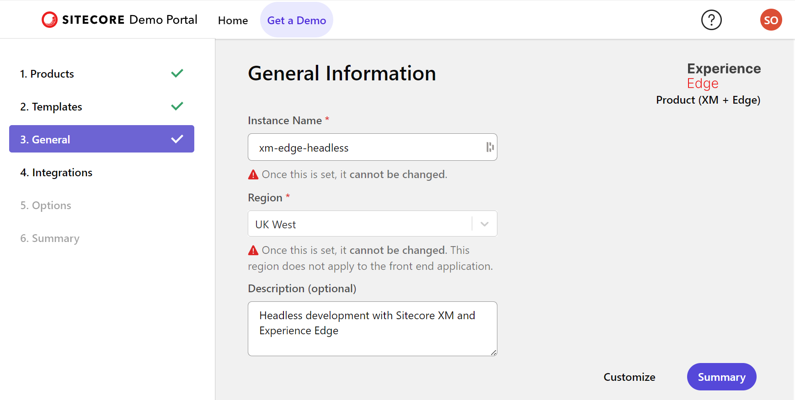
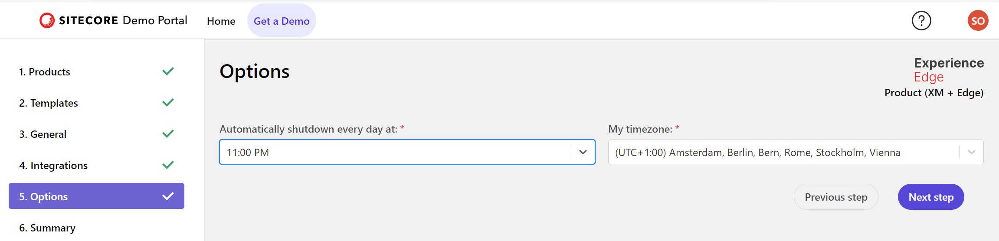
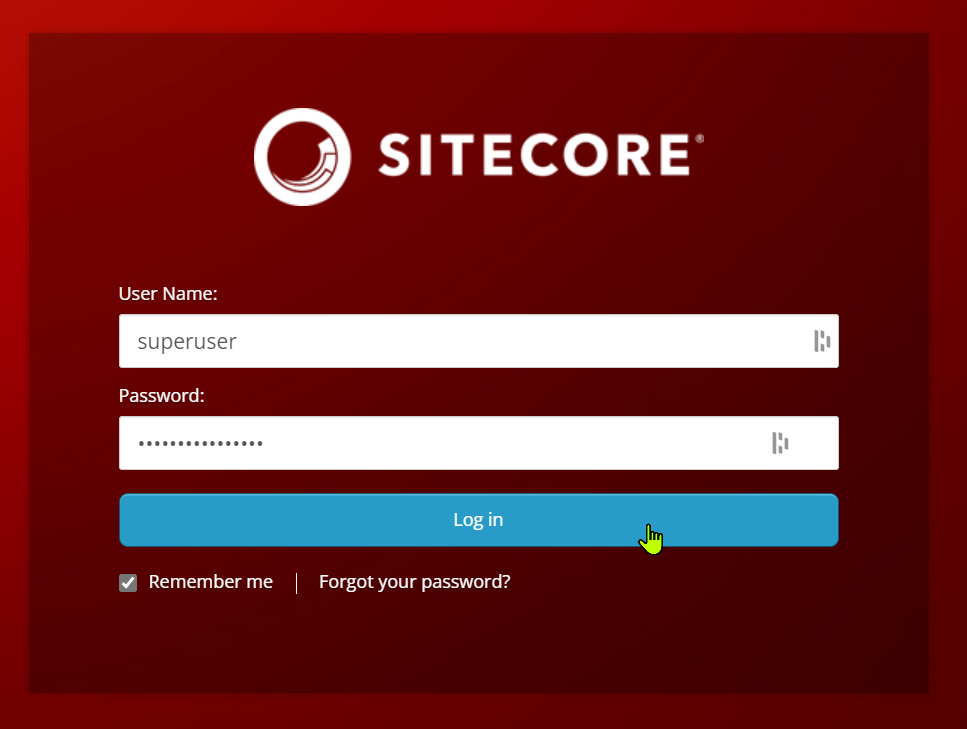

In this post, I will take you through the steps to use Sitecore XM version 10.3 running as an instance on the Sitecore Demo Portal, as a headless CMS. I will show the required configurations to build a front-end application that uses the content of the Sitecore XM instance and works with the Experience Editor.

## Introduction
What we see is that many customers upgraded their Sitecore XM/XP environment to version 10.2, but not version 10.3 or higher yet, because they don't directly see the benefits. But there are good reasons to upgrade to version 10.3 or higher because there are some interesting features available to build better composable solutions. Three features I would like to mention are:

- **JSS SDK** - We can work with the latest (21.6.2 at the time of writing) JSS SDK to build our front-end, especially useful when developing the front-end with Next.js, which we will do
- **SXA Headless** - with 10.3+ we can use the power of SXA, the Sitecore Experience Accelerator, in combination with a headless front-end
- **Webhooks** - with webhooks, we can respond to events happening in the Sitecore XM/XP CMS.

With Sitecore 10.3+ we can easily enter the composable DXP world, where the front-end is not running on top of a Sitecore XM delivery server, while still using the power of (headless) SXA. We can show our customers the capabilities of Sitecore XM (and XP) as a headless or hybrid CMS.

## Setting up the Sitecore XM 10.3+ Environment
We want to showcase headless development, so an XM 10.3+ environment is perfect for that. We can quickly set up an environment with the [Sitecore Demo Portal](https://portal.sitecoredemo.com/):


Although there are some great demos available, like **PLAY! Summit** and **Play! Shop**, they quickly become too big. We want to get started lean and mean, and therefore select the empty template with Sitecore XM and Experience Edge in it:


> What is Experience Edge? Sitecore Experience Edge is an API-based service from Sitecore that gives you globally replicated, scalable access to your Sitecore Experience Platform items, layout, and media. It replaces the traditional delivery tier of Sitecore XM and XP, and is designed to be used with headless front-end applications. Experience Edge is a cloud-based service that is designed to be used with Sitecore XM and XP, and is available as a standalone service or as part of Sitecore Managed Cloud. For a nice introduction video see[What is Sitecore Experience Edge? | YouTube]( https://www.youtube.com/watch?v=_xw-02PZQTE). Thanks Margo Stapel!

Now just fill in the name, region and description:


With the **Customize** button, it is possible to set up an integration with GitHub and Content Hub. We are not interested in Content Hub, but an underlying GitHub repository with triggers to redeploy on Push would be nice.

First, head over to your GitHub account, and generate an empty repository. In my case, I generated the repository `xm-edge-headless`. Because we need a selectable branch, head over to your CLI (I prefer to work on WSL2, the Linux subsystem for Windows, but this will work on Windows, OSX or Linux as well), and follow the instructions by GitHub to create a branch on the new created repository on the command line:


Now we can customize the GitHub integration:


Select GitHub connection, repo and branch:


Note the link at the top of the doc on how to deploy custom files to the Sitecore Content Management (CM) webroot. This is an important one because It allows us to do modifications on the installed demo portal version of Sitecore XM! For your convenience, this link points to [Help |](https://portal.sitecoredemo.com/help#git-overview) Demo Portal (sitecoredemo.com)](https://portal.sitecoredemo.com/help#git-overview).

We can now press the button **Next** step and fill in additional options regarding shutdown or our demo instance:



I'm a late bird, so I put the time on the latest possible time... an early evening for me! After selecting **Next step** again, we get a nice summary overview and we can select the **Deploy** button:


Deployment will take a while, but in the meantime, we can study some details about our deployment:


Some important things we will need when setting up our headless frontend development:

- **The JSS Editing Secret** - we need to set an environment variable `JSS_EDITING_SECRET` on our front-end application to make editing in the Experience Editor working
- **The Edge delivery URL** - this is the URL of the GraphQL Playground - https://edge.sitecorecloud.io/api/graphql/ide, we need to set an environment variable `GRAPH_QL_ENDPOINT` to `https://edge.sitecorecloud.io/api/graphql/v1` on our end-user front-end application as the Experience Edge GraphQL endpoint
- **The Edge API key** - this is the key we will use to authenticate our requests to the GraphQL endpoint using the environment variable `SITECORE_API_KEY` on our end-user front-end application, and the key to set in the headers when using the GraphQL Playground:
  ```
    {
      "sc_apikey": "<Edge API key>"
    }
    ```

The XM version is also mentioned: 10.3 stable.

We also get an administrator login **superuser**, with a password, so we can log in to the Sitecore XM environment.

What is also cool is that with the **Manage** button under Member & Ownership we can invite users with their email addresses as reader or contributor, or transfer the demo environment to another user:


With the **View Deployment Details** button, we get to a screen where we can follow the deployment progress:


In the meantime, the home screen of the Sitecore Demo Portal shows the state of our newly created instance:


But the most important information is still missing, what is the URL of our Sitecore XM environment? This appears in a section **IMPORTANT LINKS** when the deployment is completed:


The **Content Management** link will bring us to our well known Sitecore XM login box:



After these steps out Sitecore XM + Experience Edge instance is up and running and we can get started!
## An architecture intermezzo
So what do we now have up and running:

- Sitecore XM in a Content Magement (CM) role
- Sitecore Experience Edge for XM as the delivery platform

This setup is nicely described in [The architecture of Sitecore Experience Edge for XM | Sitecore Documentation](https://doc.sitecore.com/xp/en/developers/hd/21/sitecore-headless-development/the-architecture-of-sitecore-experience-edge-for-xm.html). This section also has a nice diagram of what is happening:


But we need more... our front-end application! The front-end application can be built with any technology because the Experience Edge GraphQL API is the endpoint to get all headless CMS information for both page layouts (with data) and data. The Experience Edge is also our CDN for assets.

The code of our front-end application needs to do some special tricks because it is used in two ways:

- **Rendering Host** - to render pages and content as a website to the end-user
- **Editing Host** - used in the Sitecore Experience Editor (or Pages in the case of XM Cloud), to provide a user-friendly interface for content editors to manage and edit the content of their website. This interface allows users to visually edit the website in a WYSIWYG (What You See Is What You Get) manner, directly manipulating content items as they appear on the live site. The Editing Host is specifically designed to facilitate the editing process, making it easy for non-technical users to create, edit, and manage website content without needing to understand the underlying code or structure.

Sitecore provides Sitecore JavaScript Services (JSS) or the Sitecore ASP.NET Rendering SDK to help you write the front-end application, providing all the plumbing needed to act as a Rendering Host and Editing Host. In this post, we will use the JSS SDK, as described in the following section.

But first some more architecture. There are some things we don't want to do:

- We don't want to publish every change in the CMS to Experience Edge before we can use it in our front-end application.  
- We don't want to publish our website to an external accessible server before we can use it in Experience Edge.

So what do we want to accomplish:


We will have a local development server started with `npm run start:connected` that we publish as an external URL using the tool **localtunnel**. In that case we can configure this URL as a Rendering Host and Editing Host for our local development. Using environment variables we can configure for local development to use the GraphQL endpoint of our Sitecore XM Content Management environment showing unpublished content.

The two deployments to Vercel provide:

- a "production" website for end-users, looking at published content on Experience Edge
- an "edit" website for product specialists authoring content, looking at unpublished content on the Sitecore XM Content Management environment

## Setting up our front-end project
The next step is setting up our front-end project. We will do this in the same repository that we connected to our Sitecore XM instance. The front-end project will use Next.js and TypeScript.

Let's dive into how we can set up our project. It all start with the documentation: [Sitecore Headless Development | Sitecore Documentation](https://doc.sitecore.com/xp/en/developers/hd/21/sitecore-headless-development/index-en.html). In here we can find all the information regarding Sitecore headless development using JSS.

In the root folder, we create a folder `cm`, as described in [Help | Demo Portal (sitecoredemo.com)](https://portal.sitecoredemo.com/help#git-overview). The contents of this folder will automatically be deployed to our CM instance in the folder  `C:\inetpub\wwwroot`.

Next to that, we will create a `src` folder, and in this `src` folder, we can create out front-end websites. We can use the [The JSS app initializer | Sitecore Documentation](https://doc.sitecore.com/xp/en/developers/hd/21/sitecore-headless-development/the-jss-app-initializer.html) to scaffold these websites. Lets start with a website called `acme-website`.

> Why `acme-website`? I often use ACME as a sample company name in blogposts and demos. The "ACME" company, often featured in the "Road Runner" cartoon series, is a fictional corporation that provides a wide array of products, many of which are absurdly specialized, implausible, or downright dangerous. ACME is best known for supplying Wile E. Coyote with a variety of gadgets, tools, and devices intended to help him catch the Road Runner. These products, however, invariably fail, often with comical consequences.
> 


After selecting `nextjs` we go for the following configuration settings, where we also select the `nextjs-sxa` add-on initializer, so we can combine the power of Next.js with the power of SXA:


After installation, we are greeted with:


### Remove .git folder from the scaffolded website
The scaffolding tooling sets up our headless website code, but also initializes a Git repository in the `src/acme-website` folder. This folder is already part of a Git repository, so we need to clean the `.git`` folder as follows:

```
cd src/acme-website
rm -rf .git
```

Or similar commands if you are working under Windows.

### Configure the CM instance
The JSS tooling has a command to configure a CM instance if we have access to the filesystem of that environment. Because the contents of the `cm` folder is copied to our CM environment on push to the GitHub repository, we can say that our Sitecore instance is accessible as this folder. Because we work from the folder `src/acme-website` we can specify the `cm` folder with the path `../../cm`. We also need to specify a Sitecore API key. We can create one by opening the Content Editor and creating any item under `/sitecore/system/Settings/Services/API Keys`. Below I created the item `acme`, The API key is the Item ID:


Note that **Cors Origins** and **Allowed Controllers** should be set to `*` (thanks Alexander Doroshenko!)

We can now setup our configuration using the command `npx jss setup`:


And to do the "deployment" to our local `cm` folder we can execute the command `npx jss deploy config`:


Our starting point is the following file structure:


## Create our website in Sitecore XM
In the Content Editor, we can now create our website on the Sitecore side, which we named `acme-website` . Right-click on `/sitecore/Content`, and select **Insert** > **Headless Tenant**. name the tenant `acme`.


On the created tenant insert a Headless Site named `acme-website`. On the **SITE SETTINGS** tab we can specify the **Deployment secret**. Specify the deployment secret generated by the `npx jss setup` command, and written to the file `src/acme-website/scjssconfig.json` as the value of `deploySecret`. 

## Configure the local Rendering Host
To configure the local Rendering Host (our front-end website) running at http://localhost:3000, we need to make a copy of `src/acme-website/.env` to `src/acme-website/.env.local`, and set the following values:

```
SITECORE_SITE_NAME=acme-website
SITECORE_API_HOST=https://xm-edge-headless-cm.sitecoredemo.com
SITECORE_API_KEY={1AEDB7AC-9384-48A0-8AEF-CEB1B0527078}
GRAPH_QL_ENDPOINT=https://xm-edge-headless-cm.sitecoredemo.com/sitecore/api/graph/edge
JSS_EDITING_SECRET=<JSS Editing Secret available in Sitecore Demo portal>
FETCH_WITH=GraphQL
DEBUG=sitecore-jss:*
```

Where you should use your own site name (instead of `acme-website`), your own Sitecore demo environment name (instead of `xm-edge-headless`), and your own SITECORE_API_KEY, as described above.

Save the changes and your development server will restart to make the changes to take effect.

## Testing GraphQL Playground access of CM
Now lets test access to the GraphQL Playground on the Sitecore XM Content Management instance. Here we can query the current CMS data.

1. Navigate to the GRAPH_QL_ENDPOINT with `/ui` added to the end, e.g. https://xm-edge-headless-cm.sitecoredemo.com/sitecore/api/graph/edge/ui
2. On the **HTTP HEADERS** tab set the `sc_apikey` header value as follows: 
   ```
     {
       "sc_apikey": "{1AEDB7AC-9384-48A0-8AEF-CEB1B0527078}"
     }
     ```
3. Add a sample query, e.g.
   ```
     query {
	   site {
         siteInfoCollection {
           name
         }
       }
     }
     ```

On execution of the query we can see the GraphQL results. Note that the playground provided access to the documentation and the schema, making it easy to build GraphQL queries (using intellisense) and test them out:


## Testing the local Rendering Host
We can now test the local Rendering Host. Execute the following command:

```
npm run start:connected
```

Navigate to http://localhost:3000, and you should get an empty page. I didn't, I got the error:


Luckily enough I remembered this error from before, as asked (and answered) here: [xm cloud - How to solve JSS application error "Error: Valid value for rootItemId not provided and failed to auto-resolve app root item." - Sitecore Stack Exchange](https://sitecore.stackexchange.com/questions/33199/how-to-solve-jss-application-error-error-valid-value-for-rootitemid-not-provid). 

The solution involves editing the file `xm-edge-headless/src/acme-website/src/lib/dictionary-service-factory.ts` and configuring the `rootItemId`` as documented in the code file with the GUID as described in the Sitecore Stack Exchange post.


And add the highlighted GUID value as follows:


For SXA this should not be needed, no clue why this is happening.
## Editing Host accessible to Experience Editor
The website running at http://localhost:3000 doubles as a Rendering Host and an Editing Host. This means that it can be used to both display the website and make changes to its content through the Experience Editor. The problem is that the Experience Editor needs to be able to get access to the site running at http://localhost:3000. I wrote a long blogpost about how to overcome this barrier in the context of XM Cloud Pages: [XM Cloud rendering host options and fast local development with Experience Editor & Pages - Serge van den Oever's weblog](https://www.sergevandenoever.nl/XM_Cloud_rendering_host_options_and_fast_local_development/). But the same solution works for the Experience Editor.

First, we need to make http://localhost:3000 accessible from the outside world. This can be done through a reverse proxy tool like [Localtunnel ~ Expose yourself to the world (theboroer.github.io)](https://theboroer.github.io/localtunnel-www/), or [ngrok | Unified Application Delivery Platform for Developers](https://ngrok.com/). Ngrok is the more powerful option but in this post I will use localtunnel, because it is free software and you can specify a subdomain, something which can not be done with the Ngrok free plan.

Execute the following command (your subdomain may differ):

```
npx localtunnel --port 3000 --subdomain xm-edge-headless --print-requests
```

Now navigate to https://xm-edge-headless.loca.lt, the new external URL our website is accessible on. Following the instructions on making the site accessible, and be amazed by the same blank screen, but now on an external URL.

> Note that when localtunnel is used, it always provides you with an external accessible website as a subdomain of `loca.lt`. The top-level domain `lt` is the country code top-level domain for Lithuania.

### Configure the Rendering Host in Sitecore
Next step is to make the Sitecore site `acme-website` use this Editing Host. Open the Content Editor and duplicate the item `/sitecore/system/Settings/Services/Rendering Hosts/Default` to `/sitecore/system/Settings/Services/Rendering Hosts/Local Development`, and set the following values:

- **Server side rendering engine endpoint URL**: `https://xm-edge-headless.loca.lt/api/editing/render`
- **Server side rendering engine application URL**: `https://xm-edge-headless.loca.lt`
- **Application name**: `xm-edge-headless-loca-lt`

As shown below:


Now open the Site Grouping settings of the Sitecore website `acme-website` and select as **Predefined application rendering **host** our newly created `Local` Development` Rendering Host:


## Experience Editor - edit the homepage
Now right-click on the `Home` page and select the Experience Editor:


In the Experience Editor we can drag some components from the toolbox to the page to get some content:


After saving the page it should be directly visible on our website:


So now we have our complete setup for development. We can start building our components and pages, and see the changes in real-time on our local setup.

### Experience Editor and the Editing Host
The Experience Editor uses your Editing Host which is running at http://localhost:3000 but exposed to the outside world through localtunnel on https://xm-edge-headless.loca.lt. 

Note that if the localtunnel is not running you will get the following error:

```
Connection to your rendering host failed with a Not Found error. Ensure the POST endpoint at URL **https://xm-edge-headless.loca.lt/api/editing/render** has been enabled.
```

And what I also sometimes encounter is that on the first request of the Eperience Editor I get the error:

```
The operation has timed out
```

In this case, refresh the page to solve the issue.

But how does that work? When configuring a headless Sitecore implementation to work with the Experience Editor, a proxy or middleware layer is used to enable the Experience Editor to communicate with the headless application. This proxy handles requests from the Experience Editor and forwards them to the headless rendering host. It can also modify the responses from the rendering host to include necessary scripts and markers for the Experience Editor to function correctly.

### Multiple developers, single external URL
When the localtunnel is running to expose an external URL for the Editing Host running on http://localhost:3000, multiple developers can use this same external URL. This is possible because all requests from the resulting Experience Editor page go to http://localhost:3000 on the local machine of each developer:


So each developer will see its own version of the code of the front-end application while collaborating on the content of the headless CMS. Code is distributed to other developers through pushing changes to the shared Git repository. 

This setup facilitates seamless communication between Sitecore's Experience Editor and the headless rendering host, enabling all the advanced editing features without the limitations imposed by local-only development environments.

But when this developer goes home, all developers will loose connection. This could be resolved by running localtunnel in a more centralized and stable manner to avoid losing the connection when the developer who initiated the tunnel goes offline. This approach involves setting up the localtunnel on a server or a dedicated machine that remains online continuously, ensuring that the tunnel and, consequently, the access to the application running on `http://localhost:3000` remain active regardless of individual developers' schedules. But this is a topic for a future blogpost!

## What is missing - front-end website deployments!
We are missing two front-end website deployments. A deployment for the Sitecore product specialist where they can edit and publish the website content, and a deployment for the end-user, where the published website content is shown. You can use Vercel to deploy these two websites, because it is the easiest way to get the websites up and running, but there is no reason not to use other platforms like [Netlify](https://www.netlify.com/with/nextjs/), [Azure Static Web Apps](https://learn.microsoft.com/en-us/azure/static-web-apps/deploy-nextjs-hybrid), or any self hosted website, as long as a Next.js based application can be deployed.

### Deployment of the Editing Host to Vercel
First make sure that the latest code is deployed to our GitHub repository.

The first step in deploying the Editing Host to Vercel involves setting up a new project on the Vercel platform. This is as easy as pressing the  **Add New...** button on the Vercel homepage, select **Project**, and selecting the GitHub repository to import (`xm-edge-headless`). We will name the Vercel project `xm-edge-headless-edit`.


The Environment Variables are:
```
JSS_EDITING_SECRET=<JSS Editing Secret available in Sitecore Demo portal>
SITECORE_API_KEY={1AEDB7AC-9384-48A0-8AEF-CEB1B0527078}
SITECORE_API_HOST=https://xm-edge-headless-cm.sitecoredemo.com 
# Automatically determined: GRAPH_QL_ENDPOINT=https://xm-edge-headless-cm.sitecoredemo.com/sitecore/api/graph/edge
SITECORE_SITE_NAME=acme-website
DEFAULT_LANGUAGE=
GRAPH_QL_SERVICE_RETRIES=0
FETCH_WITH=GraphQL
DEBUG=sitecore-jss:*
```

This will result in a working site:


But to make this the Editing Host for our site, we need to define a Rendering Host using the Vercel Editing Host site:


Now configure the site `acme-website` to use the `Vercel Edit` Rendering Host:


Now we use the deployed https://xm-edge-headless-edit.vercel.app/ site as the Editing Host for the Experience Editor, and the Sitecore product specialists can start building the website and edit content.
### Separation of development site and actual site
Because we can only configure one Rendering Host as Editing Host for a Sitecore site to be used in the Experience Editor, we have a problem. We should either switch to the **Local Development** Rendering Host when doing development, and switch back to the **Vercel Edit** Rendering Host when done, or we should create one (or more) Sitecore sites for development (e.g. `acme-website-dev`, `acme-website-dev-serge`, ...) using the **Local Development** Rendering Host, and have our Sitecore site `acme-website` using the **Vercel Edit** Rendering Host.

This brings us another challenge: we don't want to define styles, data sources, page designs, partial designs, and rendering variants, in both sites `acme-website` and `acme-website-dev`. Here comes the concept of the Sitecore SXA *shared site* into the picture. See [Share data sources and presentation using the multisite feature | Sitecore Documentation](https://doc.sitecore.com/xp/en/users/sxa/103/sitecore-experience-accelerator/share-data-sources-and-presentation-using-the-multisite-feature.html) for more information.

### Deployment of the production site to Vercel
The production site deployment to Vercel has a similar approach. Name the project `xm-edge-headless`, and connect to the Sitecore Experience Edge GraphQL endpoint and the corresponding Sitecore API Key.


Use the following environment variables:

```
SITECORE_API_KEY=<Edge Tenant API key available in Sitecore Demo portal>
SITECORE_API_HOST=https://xm-edge-headless-cm.sitecoredemo.com 
GRAPH_QL_ENDPOINT=https://edge.sitecorecloud.io/api/graphql/v1
SITECORE_SITE_NAME=acme-website
DEFAULT_LANGUAGE=
GRAPH_QL_SERVICE_RETRIES=0
FETCH_WITH=GraphQL
```

Content becomes visible on the production website when the content is published from Sitecore XM Content Management instance to Sitecore Experience Edge.

> Note that in the above set up even the environment variable `SITECORE_API_HOST` is not needed anymore. The `GRAPH_QL_ENDPOINT` is the only thing needed to connect to the Sitecore Experience Edge.

## Conclusion
 In this walk-through, we have successfully set up a Sitecore website, made it accessible from the outside world using localtunnel, and showed editing its content using the Experience Editor. Then we showed how to make the Experience Editor work from a website deployed to Vercel, and the deployment of the production website for the end-user to Vercel.

  Please let me know if things in this blog post are unclear, incorrect, or can be handled in a better way.