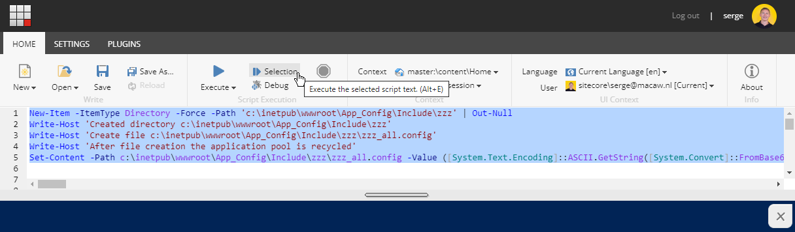
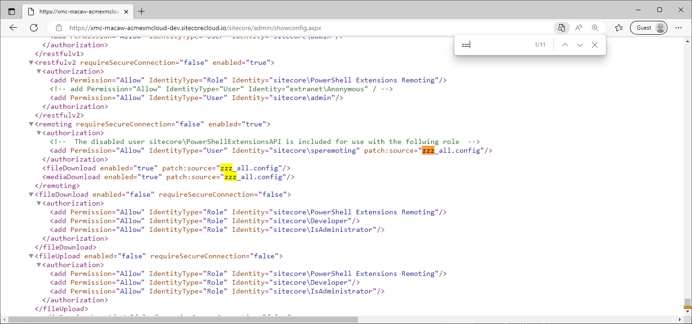

When I was writing my blog post [XM Cloud, PowerShell, and remoting](https://www.sergevandenoever.nl/XM_Cloud_PowerShell_And_Remoting/) I had to do a lot of Sitecore XM configuration fiddling to get everything working. After a few 10+ minute cycles of build and deploy on XM Cloud I decided to create some tooling to test out my configuration changes in seconds instead of minutes.

## Using patch files

To make configuration changes you never change the original Sitecore configuration files, but you use patch files as described in the documentation [Use a patch file to customize the Sitecore configuration](https://doc.sitecore.com/xmc/en/developers/xm-cloud/use-a-patch-file-to-customize-the-sitecore-configuration.html). In this post, I will not go into the details of patch files, but an important observation is that if a patch file is written to the file system of XM Cloud, the application pool is automatically recycled and the changes are applied.

## Using a single patch file

My approach is to write the contents of the file from PowerShell code that I can paste into the PowerShell ISE, select, and execute.

I initially started writing multiple files, but this failed because the application pool recycle started after writing the first file. This means that I can only write a single file at a time. 

My next step was merging multiple configuration patch files into a single file (like Sitecore does), but this was not that simple. That is why I decided to manage all my configuration changes (for now) in a single file `src\platform\App_Config\Include\zzz\zzz_all.config`. Due to the `zzz` folder, I am sure that my patches are applied last.

## Creating PowerShell code to write the patch file

In the `tools` folder, I created two scripts: `create-configcode.ps1` which writes the patch file, and the script `Test-XM.ps1` that I copied from [here](https://www.powershellgallery.com/packages/HumanTechSolutions.PowerShell.XmlUtils/1.0/Content/Functions%5CTest-Xml.ps1) to validate if the patch file is valid XML. Better to test that first before trying the patch, because invalid XML will always fail.

`tools\create-configcode.ps1`:

```powershell
# Description: 
# Creates a script ..\generated\App_Config.script.ps1 that will create the 
# c:\inetpub\wwwroot\App_Config\Include\zzz_all.config file from the source file
# src\platform\App_Config\Include\zzz\zzz_all.config. 
# Author: Serge van den Oever [Macaw]
# Version: 1.0

$VerbosePreference="SilentlyContinue" # change to Continue to see verbose output
$DebugPreference="SilentlyContinue" # change to Continue to see debug output
$ErrorActionPreference="Stop"

. "$PSScriptRoot\Test-Xml.ps1"

$rootDirectory = Resolve-Path -Path (Join-Path -Path $PSScriptRoot -ChildPath "..\src\platform\App_Config")
$destinationDirectory = 'c:\inetpub\wwwroot\App_Config'
$lines = ''

# Create directories
$lines += "New-Item -ItemType Directory -Force -Path '$destinationDirectory\Include\zzz' | Out-Null`n"
$lines += "Write-Host 'Created directory $destinationDirectory\Include\zzz'`n"
$sourceFilePath = "$rootDirectory\Include\zzz\zzz_all.config"
if (-not (Test-Path -Path $sourceFilePath)) {
    Write-Error "File $sourceFilePath does not exist"
}
$xmlValidationResults = Test-Xml -Path $sourceFilePath
if (-not $xmlValidationResults.ValidXmlFile) {
    Write-Error "Invalid XML file $($sourceFilePath): $($xmlValidationResults.Error)"
}
$destinationFilePath = "$destinationDirectory\Include\zzz\zzz_all.config"
Write-Host "Processing file $sourceFilePath"
$content = Get-Content -Path $sourceFilePath
$bytes = [System.Text.Encoding]::UTF8.GetBytes($content)
$encoded = [System.Convert]::ToBase64String($bytes)
$lines += "Write-Host 'Create file $destinationFilePath'`n"
$lines += "Write-Host 'After file creation the application pool is recycled'`n"
$lines += "Set-Content -Path $destinationFilePath -Value ([System.Text.Encoding]::ASCII.GetString([System.Convert]::FromBase64String(`"$encoded`")))`n"

$generatedFolder = Join-Path -Path $PSScriptRoot -ChildPath "..\generated"
New-Item -ItemType Directory -Force -Path $generatedFolder | Out-Null
Write-Host "Generate script to $generatedFolder\App_Config.script.ps1"
Set-Content -Path "$generatedFolder\App_Config.script.ps1" -Value $lines
Write-Host "Done."
```

`tools\Test-Xml.ps1`:

```powershell
function Test-Xml {
    <#
        .SYNOPSIS
        The Test-Xml cmdlet test an XML File for errors.
        .DESCRIPTION
        You should give the path to the XML file as an input an the cmdlet response with an object with next properties:
        Path: The full path to the given XML file to test.
        ValidXmlFile: A boolean value indication if it is a valid XML file.
        Error: Description of the error in case it exists.
        .LINK
        https://github.com/josuemb/HumanTechSolutions.PowerShell.XmlUtils
        .EXAMPLE
        Test-Xml -Path "c:\temp\myxmlfile.xml"
        Test the file: "c:\temp\myxmlfile.xml"
        .EXAMPLE
        Test-Xml -FullName "c:\temp\myxmlfile.xml"
        Test the file: "c:\temp\myxmlfile.xml"
        .EXAMPLE
        Test-Xml "c:\temp\myxmlfile.xml"
        Test the file: "c:\temp\myxmlfile.xml"
        .EXAMPLE
        Get-ChildItem -Path "C:\temp\" -Filter "*.xml" | ForEach-Object { Test-Xml $_.FullName }
        Test all xml files with an .xml extension in path: "c:\temp\"
    #>
    [CmdletBinding()]
    Param(
        [Parameter(
            Mandatory = $true,
            ValueFromPipeline = $true,
            ValueFromPipelineByPropertyName = $true,
            ValueFromRemainingArguments = $false,
            Position = 0,
            HelpMessage = "Enter the XML file path"
        )]
        [ValidateScript({ if ($_) { Test-Path $_ } })]
        [Alias("FullName")]
        [string]$Path,
        [Alias("Extended")]
        [switch]$ExtendedProperties
    )
    BEGIN {
        #Initialize control variables
        $error = ""
        $validXmlFile = $true
        #Object for returning results
        $xmlValidationObj = New-Object -TypeName psobject
        Set-Variable "CONST_PATH" -Value "Path" -Option Constant
        Set-Variable "CONST_IS_VALID" -Value "ValidXmlFile" -Option Constant
        Set-Variable "CONST_ERROR" -Value "Error" -Option Constant
        Write-Debug "Creating object for default validation settings..."
        #XML validation settings
        $settings = New-Object System.Xml.XmlReaderSettings
        Write-Verbose "Setting validation type..."
        $settings.ValidationType = [System.Xml.ValidationType]::Schema
        Write-Verbose "Setting default validation flags..."
        Write-Verbose "Stablishing default validation flags..."
        #Set default validation flags
        $settings.ValidationFlags =
        [System.Xml.Schema.XmlSchemaValidationFlags]::ProcessInlineSchema -bor
        [System.Xml.Schema.XmlSchemaValidationFlags]::ProcessSchemaLocation -bor
        [System.Xml.Schema.XmlSchemaValidationFlags]::ReportValidationWarnings
    }
    PROCESS {
        $xmlReader = $null
        try {
            Write-Verbose "Creating XML Reader..."
            $xmlReader = [System.Xml.XmlReader]::Create($Path, $settings)
            Write-Verbose "Validating..."
            Write-Debug "Path: $Path"
            Add-Type -AssemblyName System.Xml.Linq
            try {
                Write-Verbose "Loading XML file..."
                $null = [System.Xml.Linq.XDocument]::Load($xmlReader)
            }
            catch [System.Xml.XmlException], [System.Xml.Schema.XmlSchemaValidationException] {
                $validXmlFile = $false
                $error = $_.Exception.Message
            }
            finally {
                Write-Verbose "Validation done!"
            }
        }
        catch [System.ArgumentNullException] {
            Write-Error "$_.Exception.Message"
        }
        finally {
            if ($xmlReader) {
                $xmlReader.Close()
            }
        }
    
    }
    END {
        Write-Verbose "Setting results..."
        $xmlValidationObj | Add-Member -MemberType NoteProperty -Name $CONST_PATH -Value $Path -Force
        $xmlValidationObj | Add-Member -MemberType NoteProperty -Name $CONST_IS_VALID -Value $validXmlFile -Force
        $xmlValidationObj | Add-Member -MemberType NoteProperty -Name $CONST_ERROR -Value $error -Force
        return $xmlValidationObj
    }
}
```

We can now call the script `tools\create-configcode.ps1`, which generates the file `generated\App_Config.script.ps1` which looks like:

```powershell
New-Item -ItemType Directory -Force -Path 'c:\inetpub\wwwroot\App_Config\Include\zzz' | Out-Null
Write-Host 'Created directory c:\inetpub\wwwroot\App_Config\Include\zzz'
Write-Host 'Create file c:\inetpub\wwwroot\App_Config\Include\zzz\zzz_all.config'
Write-Host 'After file creation the application pool is recycled'
Set-Content -Path c:\inetpub\wwwroot\App_Config\Include\zzz\zzz_all.config -Value ([System.Text.Encoding]::ASCII.GetString([System.Convert]::FromBase64String("PGNvbmZpZ3VyYXRpb24gICAgIHhtbG5zOnBhdGNoPSJodHRwOi8vd3d3LnNpdGVjb3JlLm5ldC94bWxjb25maWcvIiAgICAgeG1sbnM6c2V0PSJodHRwOi8vd3d3LnNpdGVjb3JlLm5ldC94bWxjb25maWcvc2V0LyIgPiAgICAgPHNpdGVjb3JlPiAgICAgICAgIDxwb3dlcnNoZWxsPiAgICAgICAgICAgICA8c2VydmljZXM+ICAgICAgICAgICAgICAgICA8cmVtb3Rpbmc+ICAgICAgICAgICAgICAgICAgICAgPHBhdGNoOmF0dHJpYnV0ZSBuYW1lPSJlbmFibGVkIj50cnVlPC9wYXRjaDphdHRyaWJ1dGU+ICAgICAgICAgICAgICAgICAgICAgPGF1dGhvcml6YXRpb24+ICAgICAgICAgICAgICAgICAgICAgICAgIDxhZGQgUGVybWlzc2lvbj0iQWxsb3ciIElkZW50aXR5VHlwZT0iVXNlciIgSWRlbnRpdHk9InNpdGVjb3JlXHNwZXJlbW90aW5nIiAvPiAgICAgICAgICAgICAgICAgICAgIDwvYXV0aG9yaXphdGlvbj4gICAgICAgICAgICAgICAgICAgICA8ZmlsZURvd25sb2FkPiAgICAgICAgICAgICAgICAgICAgICAgICA8cGF0Y2g6YXR0cmlidXRlIG5hbWU9ImVuYWJsZWQiPnRydWU8L3BhdGNoOmF0dHJpYnV0ZT4gICAgICAgICAgICAgICAgICAgICA8L2ZpbGVEb3dubG9hZD4gICAgICAgICAgICAgICAgICAgICA8bWVkaWFEb3dubG9hZD4gICAgICAgICAgICAgICAgICAgICAgICAgPHBhdGNoOmF0dHJpYnV0ZSBuYW1lPSJlbmFibGVkIj50cnVlPC9wYXRjaDphdHRyaWJ1dGU+ICAgICAgICAgICAgICAgICAgICAgPC9tZWRpYURvd25sb2FkPiAgICAgICAgICAgICAgICAgPC9yZW1vdGluZz4gICAgICAgICAgICAgICAgIDxyZXN0ZnVsdjI+ICAgICAgICAgICAgICAgICAgICAgPHBhdGNoOmF0dHJpYnV0ZSBuYW1lPSJlbmFibGVkIj50cnVlPC9wYXRjaDphdHRyaWJ1dGU+ICAgICAgICAgICAgICAgICA8L3Jlc3RmdWx2Mj4gICAgICAgICAgICAgPC9zZXJ2aWNlcz4gICAgICAgICAgICAgPGF1dGhlbnRpY2F0aW9uUHJvdmlkZXIgICAgICAgICAgICAgICAgIHR5cGU9IlNwZS5Db3JlLlNldHRpbmdzLkF1dGhvcml6YXRpb24uU2hhcmVkU2VjcmV0QXV0aGVudGljYXRpb25Qcm92aWRlciwgU3BlIj4gICAgICAgICAgICAgICAgIDxkZXRhaWxlZEF1dGhlbnRpY2F0aW9uRXJyb3JzPiAgICAgICAgICAgICAgICAgICAgIDxwYXRjaDpkZWxldGUgLz4gICAgICAgICAgICAgICAgIDwvZGV0YWlsZWRBdXRoZW50aWNhdGlvbkVycm9ycz4gICAgICAgICAgICAgICAgIDxkZXRhaWxlZEF1dGhlbnRpY2F0aW9uRXJyb3JzPnRydWU8L2RldGFpbGVkQXV0aGVudGljYXRpb25FcnJvcnM+ICAgICAgICAgICAgICAgICA8IS0tIFByb3ZpZGUgYSBzdHJvbmcgcmFuZG9taXplZCBzaGFyZWQgc2VjcmV0IGluIHRoZSBlbnZpcm9ubWVudCB2YXJpYWJsZSAnU1BFX1NoYXJlZFNlY3JldCcuICAgICAgICAgICAgICAgICAgICAgIEF0IGxlYXN0IDY0IGNoYXJhY3RlcnMgaXMgcmVjb21tZW5kZWQsIGZvciBleGFtcGxlIGh0dHBzOi8vd3d3LmdyYy5jb20vcGFzc3dvcmRzLmh0bSAgLS0+ICAgICAgICAgICAgICAgICA8c2hhcmVkU2VjcmV0PiQoZW52OlNQRV9TaGFyZWRTZWNyZXQpPC9zaGFyZWRTZWNyZXQ+ICAgICAgICAgICAgICAgICA8YWxsb3dlZEF1ZGllbmNlcyBoaW50PSJsaXN0Ij4gICAgICAgICAgICAgICAgICAgICA8IS0tIFRoZSBhdWRpZW5jZSBpcyB0aGUgaG9zdCBuYW1lIG9mIHRoZSBTaXRlY29yZSBpbnN0YW5jZS4gICAgICAgICAgICAgICAgICAgICAgICAgICBJbiBYTSBDbG91ZCBhbiBlbnZpcm9ubWVudCB2YXJpYWJsZSAnaG9zdCcgaXMgYXZhaWxhYmxlIC0tPiAgICAgICAgICAgICAgICAgICAgIDxhdWRpZW5jZT5odHRwczovLyQoZW52Omhvc3QpPC9hdWRpZW5jZT4gICAgICAgICAgICAgICAgIDwvYWxsb3dlZEF1ZGllbmNlcz4gICAgICAgICAgICAgPC9hdXRoZW50aWNhdGlvblByb3ZpZGVyPiAgICAgICAgICAgICA8dXNlckFjY291bnRDb250cm9sPiAgICAgICAgICAgICAgICAgPGdhdGVzPiAgICAgICAgICAgICAgICAgICAgIDxnYXRlIG5hbWU9IklTRSI+ICAgICAgICAgICAgICAgICAgICAgICAgIDxwYXRjaDpkZWxldGUgLz4gICAgICAgICAgICAgICAgICAgICA8L2dhdGU+ICAgICAgICAgICAgICAgICAgICAgPGdhdGUgbmFtZT0iQ29uc29sZSI+ICAgICAgICAgICAgICAgICAgICAgICAgIDxwYXRjaDpkZWxldGUgLz4gICAgICAgICAgICAgICAgICAgICA8L2dhdGU+ICAgICAgICAgICAgICAgICAgICAgPGdhdGUgbmFtZT0iSXRlbVNhdmUiPiAgICAgICAgICAgICAgICAgICAgICAgICA8cGF0Y2g6ZGVsZXRlIC8+ICAgICAgICAgICAgICAgICAgICAgPC9nYXRlPiAgICAgICAgICAgICAgICAgICAgIDxnYXRlIG5hbWU9IklTRSIgdG9rZW49IlBlcm1pc3NpdmUiIC8+ICAgICAgICAgICAgICAgICAgICAgPGdhdGUgbmFtZT0iQ29uc29sZSIgdG9rZW49IlBlcm1pc3NpdmUiIC8+ICAgICAgICAgICAgICAgICAgICAgPGdhdGUgbmFtZT0iSXRlbVNhdmUiIHRva2VuPSJQZXJtaXNzaXZlIiAvPiAgICAgICAgICAgICAgICAgPC9nYXRlcz4gICAgICAgICAgICAgICAgIDx0b2tlbnM+ICAgICAgICAgICAgICAgICAgICAgPHRva2VuIG5hbWU9IlBlcm1pc3NpdmUiIGV4cGlyYXRpb249IjAwOjAwOjAwIiBlbGV2YXRpb25BY3Rpb249IkFsbG93IiAvPiAgICAgICAgICAgICAgICAgPC90b2tlbnM+ICAgICAgICAgICAgIDwvdXNlckFjY291bnRDb250cm9sPiAgICAgICAgIDwvcG93ZXJzaGVsbD4gICAgIDwvc2l0ZWNvcmU+IDwvY29uZmlndXJhdGlvbj4=")))
```
Copy this generated code, past it in PowerShell ISE, select it and execute the selected code:



When executing the code, the editor will keep spinning and never return. Do a browser refresh to get back into a working PowerShell ISE environment.

## See the changes

To see if changes are applied correctly I access the page https://xmc-macaw-acmexmcloud-dev.sitecorecloud.io/sitecore/admin/showconfig.aspx to see the resulting configuration file. I keep refreshing until I get results. When the resulting configuration file returns I know the patch is applied, the application pool is recycled, and I'm ready to test if it worked. At that moment I can also refresh PowerShell ISE to get a working version again.

Search for `zzz` to see the changes patched into the file:


