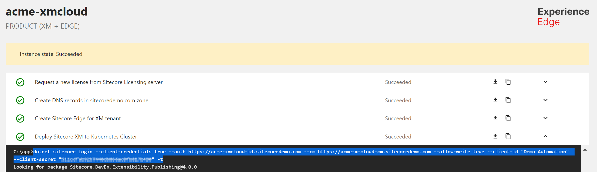
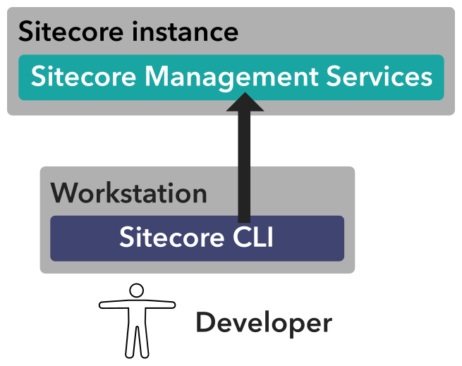
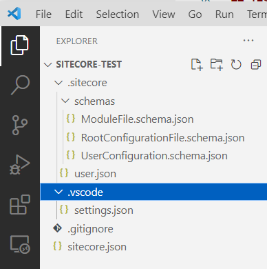
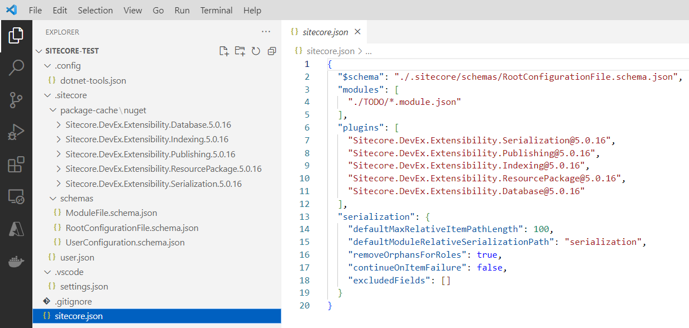
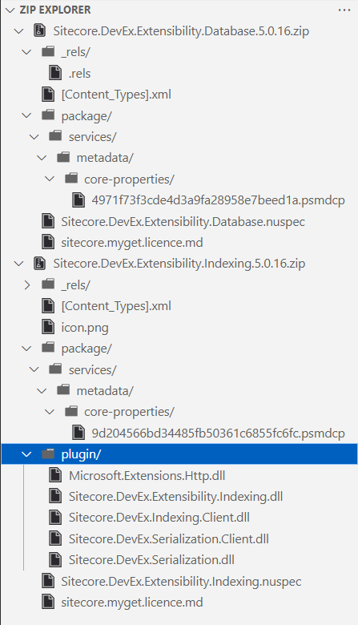

As described in my post [Sitecore demo portal series - Part 1 - create an empty environment from scratch with the demo portal](https://www.sergevandenoever.nl/Sitecore_demo_portal_empty_environment/) the [Sitecore CLI](https://doc.sitecore.com/xp/en/developers/100/developer-tools/sitecore-command-line-interface.html) is used in the configuration of a Sitecore XM 10.2 CM instance when using the Sitecore demo portal:



CLI stands for Command Line Interface, and when developers see that there is a CLI available for a product they immediately get enthusiastic because this means that tasks can be easily automated without having to write custom programs calling the APIs of the product.

Sitecore starts its documentation on the Sitecore CLI with this picture:



What this picture makes clear is that the Sitecore CLI can be used by a developer to control a remote Sitecore instance, from your developer workstation, so that means from a build pipeline as well!

If we look at the login command in the screenshot above, we can see that the CLI talks directly to the Sitecore XM Content |Management instance provisioned by the Sitecore demo portal:

```
dotnet sitecore login --client-credentials true --auth https://acme-xmcloud-id.sitecoredemo.com --cm https://acme-xmcloud-cm.sitecoredemo.com --allow-write true --client-id "Demo_Automation" --client-secret "xxxx" -t
```
(Please note that I mistakenly named the Sitecore instance **acme-xmcloud** - see the post [Sitecore demo portal series - Part 1 - create an empty environment from scratch with the demo portal](https://www.sergevandenoever.nl/Sitecore_demo_portal_empty_environment/) for an explanation)

## Sitecore CLI installation

Before we can play with the Sitecore CLI from our workstation we need to do some installation. Because Sitecore is slowly moving into modern technology, we need to have .NET Core installed. If that is not the case yet, head over to https://dotnet.microsoft.com/en-us/download/dotnet/6.0, and install the runtime for the OS that you use.

The next step is to install the Sitecore CLI tool globally on your system. Because Sitecore does not add its tools and packages to the global Microsoft NuGet feed, we need to specify the Sitecore NuGet feed to install the CLI from:

```bash
 dotnet tool install --global --add-source https://sitecore.myget.org/F/sc-packages/api/v3/index.json Sitecore.CLI
 ```

 When installation runs successfully you will be welcomed with the message:

 ```
You can invoke the tool using the following command: sitecore
Tool 'sitecore.cli' (version '5.0.16') was successfully installed.
```

If you are working on a project with multiple developers, and have a project repository, follow the installation steps described by the [Sitecore documentation](https://doc.sitecore.com/xp/en/developers/102/developer-tools/install-sitecore-command-line-interface.html).

## Testing the login on our Sitecore XM 10.2 instance

When we try to execute the `sitecore login` command shown above (without `dotnet` in front of it, Sitecore CLI is now globally installed) we get the following error:

```
Couldn't find configuration file to resolve plugins, please specify correct config path or perform sitecore init command.
```

We need to create a folder and execute `sitecore init` in this folder to be able to use the Sitecore CLI tool.I was quite surprised that the `sitecore init` command creates a project folder to be opened in [Visual Studio Code](https://code.visualstudio.com/), my favorite development environment!

So I directly start it with `code .`:



What is nice is that in the `.vscode/settings.json` file JSON schema files are connected to the different configuration files in the folder, so we will get intellisense (is that still the term?) in typing JSON.

When we execute the login command:

```
sitecore login --client-credentials true --auth https://acme-xmcloud-id.sitecoredemo.com --cm https://acme-xmcloud-cm.sitecoredemo.com --allow-write true --client-id "Demo_Automation" --client-secret "xxxx" -t
```

it still does not work. I decide to follow the advice from the Sitecore documentation and execute the following commands in the folder:

```
dotnet new tool-manifest
dotnet nuget add source -n Sitecore https://sitecore.myget.org/F/sc-packages/api/v3/index.json
dotnet tool install Sitecore.CLI
```

It responds with:

```
The template "Dotnet local tool manifest file" was created successfully.

Package source with Name: Sitecore added successfully.
You can invoke the tool from this directory using the following commands: 'dotnet tool run sitecore' or 'dotnet sitecore'.
Tool 'sitecore.cli' (version '5.0.16') was successfully installed. Entry is added to the manifest file C:\p\sitecore-test\.config\dotnet-tools.json.
```

so I assume we are now ready to go!

On execution of the login command:
```
sitecore login --client-credentials true --auth https://acme-xmcloud-id.sitecoredemo.com --cm https://acme-xmcloud-cm.sitecoredemo.com --allow-write true --client-id "Demo_Automation" --client-secret "xxxx" -t
``` 

the results look more promising:

```
Looking for package Sitecore.DevEx.Extensibility.Serialization@5.0.16
Looking for package Sitecore.DevEx.Extensibility.Publishing@5.0.16
Looking for package Sitecore.DevEx.Extensibility.Indexing@5.0.16
Looking for package Sitecore.DevEx.Extensibility.ResourcePackage@5.0.16
Looking for package Sitecore.DevEx.Extensibility.Database@5.0.16
>> Begin installing NuGet packages: Sitecore.DevEx.Extensibility.Serialization@5.0.16, Sitecore.DevEx.Extensibility.Publishing@5.0.16, Sitecore.DevEx.Extensibility.Indexing@5.0.16, Sitecore.DevEx.Extensibility.ResourcePackage@5.0.16, Sitecore.DevEx.Extensibility.Database@5.0.16
Looking for package Sitecore.DevEx.Extensibility.Serialization@5.0.16
Looking for package Sitecore.DevEx.Extensibility.Publishing@5.0.16
Looking for package Sitecore.DevEx.Extensibility.Indexing@5.0.16
Looking for package Sitecore.DevEx.Extensibility.ResourcePackage@5.0.16
Looking for package Sitecore.DevEx.Extensibility.Database@5.0.16
Could not locate plugin Sitecore.DevEx.Extensibility.Database@5.0.16. Some CLI commands may not function correctly.
Finished resolving plugins. Total elapsed resolution time: 1995ms
Logging in to environment default...
Environment configuration default did not exist. Creating new environment configuration.
Requesting authentication key from authority.
[ClientCredentialsLogin] Client Credentials: Client authentication parameters was not defined. Can be added to default if necessary for the IDP.
[ClientCredentialsLogin] Discovering token endpoint for authority https://acme-xmcloud-id.sitecoredemo.com/...
[ClientCredentialsLogin] Discovered token endpoint https://acme-xmcloud-id.sitecoredemo.com/connect/token
[ClientCredentialsLogin] Got access token, expires in 3600
Authentication key successfully received from authority.
Login information has been saved.
```

Lets see if it really works. One of the commands in the configuration of Sitecore XM 10.2 using the Sitecore demo portal (see [Sitecore demo portal series - Part 1 - create an empty environment from scratch with the demo portal](https://www.sergevandenoever.nl/Sitecore_demo_portal_empty_environment/) was:

```
sitecore index rebuild
```

When we execute this command we get some nice output:

```
>> Begin installing NuGet packages: Sitecore.DevEx.Extensibility.Database@5.0.16
>>> Skipping NuGet package Sitecore.DevEx.Extensibility.Database@5.0.16 because it is already installed.
Could not locate plugin Sitecore.DevEx.Extensibility.Database@5.0.16. Some CLI commands may not function correctly.
Rebuilding:
sitecore_core_index [Running]
sitecore_master_index [Running]
sitecore_web_index [Running]
sitecore_horizon_index [Running]
sitecore_sxa_master_index [Running]
sitecore_sxa_web_index [Running]
Processing...
The search indexes have been rebuilt:
sitecore_core_index [Completed] [units processed: 13659]
sitecore_master_index [Completed] [units processed: 10424]
sitecore_web_index [Completed] [units processed: 10424]
sitecore_horizon_index [Completed] [units processed: 3]
sitecore_sxa_master_index [Completed] [units processed: 10424]
sitecore_sxa_web_index [Completed] [units processed: 10424]
```

So the connection seems to work!

One thing to notice is the error that is given:

```
Could not locate plugin Sitecore.DevEx.Extensibility.Database@5.0.16. Some CLI commands may not function correctly.
```

while the line above states that it skipped installation of that package because it is already installed!

And if you look at the directory structure in Visual Studio Code, the plugin seems to be installed:



After some searching, I find a [Sitecore StackExchange message](https://sitecore.stackexchange.com/questions/32592/sitecore-cli-integrate-with-visual-studio-error) on the same topic that does not help either.

Still not willing to give up I decide to do some further digging. I rename the .nupkg files of the `Sitecore.DevEx.Extensibility.Database` plugin and the `Sitecore.DevEx.Extensibility.Indexing` plugin and I compare them:



The directly noticeable difference is that the working Indexing plugin has a folder with assembly files, while this folder is missing in the Database plugin.

When you look at the blog post [Create, package and publish a Sitecore CLI Plugin](https://www.nehemiahj.com/2022/06/create-package-and-publish-sitecore-cli.html) you will see that a plugin cannot exist without assemblies, so my conclusion is that the `Sitecore`.DevEx.Extensibility.Database` plugin is invalid and should be removed. Given the fact that Sitecore XM with its path to XM Cloud should be treated as a SaaS product anyway, it seems better to remove it anyway:

```
sitecore plugin remove --name Sitecore.DevEx.Extensibility.Database
```

## What plugins exist for the Sitecore CLI?

Intrigued by plugin model of the Sitecore CLI made me wonder what other plugins are available for the Sitecore CLI.

When you execute `sitecore plugin list` it just shows the locally installed plugins, I can see that in the `sitecore.json` file as well.

I decide to download the NuGet CLI tool from https://www.nuget.org/downloads and execute the command `nuget search Sitecore.DevEx.Extensibility`, which comes back with:

```
====================
Source: Package source 1
--------------------
> SitecoreWarriors.DevEx.Extensibility.Jobs | 4.1.1 | Downloads: 85
  My package description.
--------------------
> SitecoreHackathon.ThreeSC.DevEx.Extensibility.Items | 1.0.1 | Downloads: 165
  Package Description
--------------------

====================
Source: Sitecore
--------------------
> Sitecore.DevEx.Extensibility.XMCloud | 1.0.26 | Downloads: 4.804
  Package Description
--------------------
> Sitecore.DevEx.Extensibility.Database | 5.0.16 | Downloads: 713
  Package Description
--------------------
> Sitecore.DevEx.Extensibility.Indexing | 5.0.16 | Downloads: 47.393
  Package Description
--------------------
> Sitecore.DevEx.Extensibility.XConnect | 2.0.0 | Downloads: 245
  Package Description
--------------------
> Sitecore.DevEx.Extensibility.Publishing | 5.0.16 | Downloads: 74.389
  Package Description
--------------------
> Sitecore.DevEx.Extensibility.Serialization | 5.0.16 | Downloads: 84.960
  Package Description
--------------------
> Sitecore.DevEx.Extensibility.ResourcePackage | 5.0.16 | Downloads: 57.784
  Package Description
--------------------

====================
Source: Microsoft Visual Studio Offline Packages
--------------------
No results found.
--------------------
```

So also a `Sitecore.DevEx.Extensibility.XMCloud` plugin does exist!

## Sitecore.DevEx.Extensibility.XMCloud

Let's install the plugin, and see what it brings:

```
sitecore plugin add --name Sitecore.DevEx.Extensibility.XMCloud
```

followed by:

```
sitecore cloud --help
```

shows us:

```
cloud
  Remote administration of Sitecore XM Cloud via command operations

Usage:
  sitecore.cli [options] cloud [command]

Options:
  -?, -h, --help  Show help and usage information

Commands:
  login        Used to connect into the XM Cloud SaaS platform
  logout       Used to terminate a connection to the XM Cloud SaaS platform
  project      Provides administration of XM Cloud Projects for the connected Organization
  environment  Provides administration of XM Cloud Environments for the connected Organization
  deployment   Provides administration of XM Cloud Deployments for the connected Organization
```

This feels like interesting material for another blog post!
