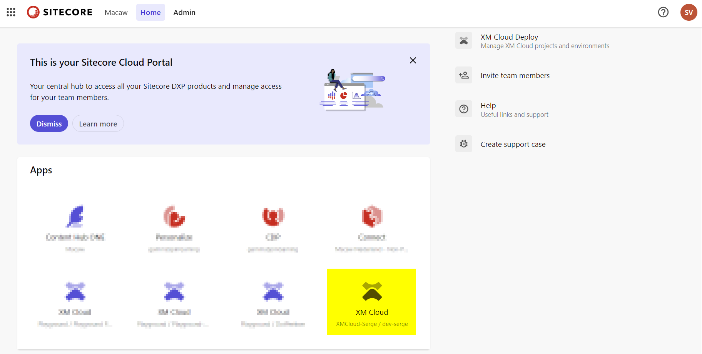
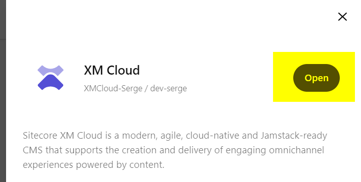
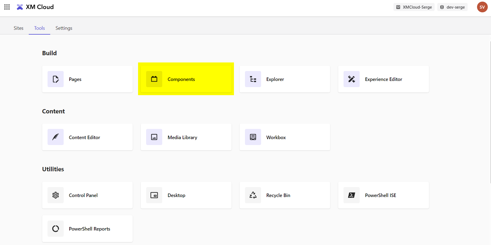
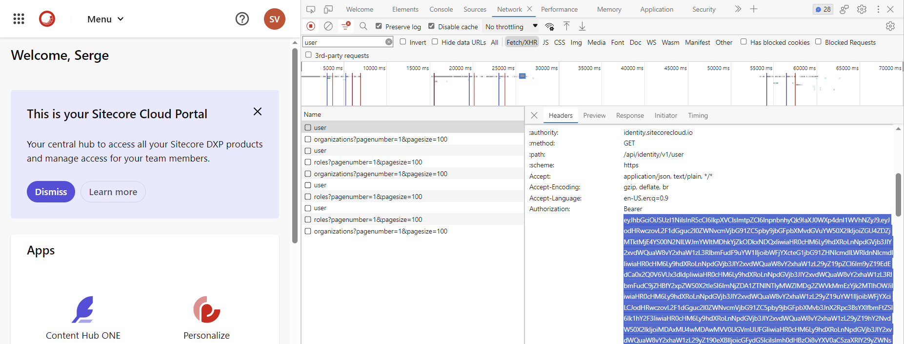
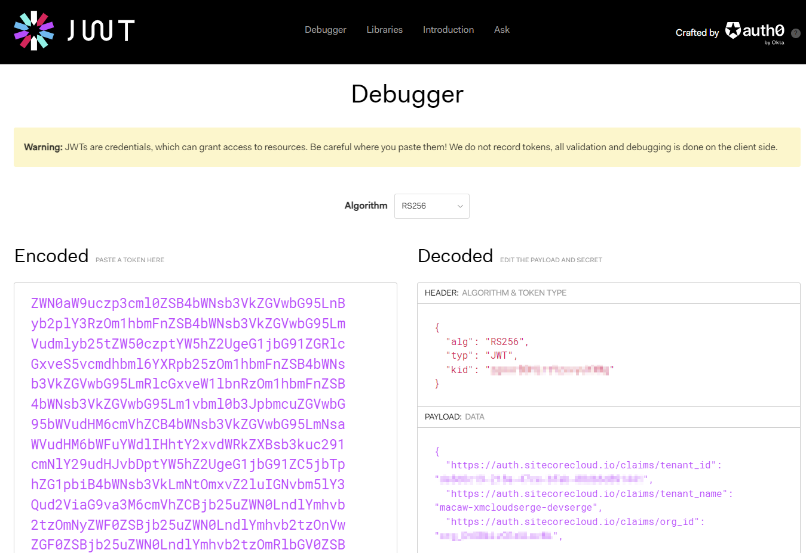

The first question I see asked after every presentation on XM Cloud, XM Cloud Components or one of the other Sitecore Sitecore products like Search or Content Hub One: how can I get access to play with it.

## How do I get access to XM Cloud Components?

As XM Cloud Components (or Sitecore Components as it is sometimes mentioned by Sitecore) is (currently) part of XM Cloud, you have access to it if you have access to XM Cloud. So it is not a dedicated product that can be purchased separately.

As I understood there are still a lot of Sitecore developers that do not have access to XM Cloud yet. Reach out to your partner manager with a customer opportunity, and your partner manager can provide you with an XM Cloud license to prepare for that customer. 

## How do I reach Components?

If you open the Sitecore Portal on the URL https://portal.sitecorecloud.io/ you will see your different SaaS "apps". Now click on one of your XM Cloud environments:



On the right side appears a menu with an "Open" button:



If you click this button and select the "Tools" tab at the top of the screen that appears, you should end up in the Tools overview of XM Cloud:



One of the tools is "Components".

## Licensing

Components is part of XM Cloud, and does not require a separate license. I wonder how this works with using components created with XM Cloud Components on a completely different site. The components are stored on an Azure Storage Account, and I wonder if Sitecore can/will measure access to this storage account.

## But what if Components isn't there?

I heard from people that they don't see "Components". I have no clue if Components can be feature-flagged per organization, but if you don't see it, try to navigate directly to the XM Cloud Components system by opening the URL: https://components.sitecorecloud.io. Navigating to this URL should redirect you to the correct organization and library.

If this does not work, it is time for some claims debugging.

Do a request to any page on the Sitecore portal, and copy the value of the bearer token `Authorization` header. This header looks something like:



So skip the text "bearer", copy the complete string starting wit "ey".

No head over to the site https://jwt.io/, scroll down to the Debugger, and paste your token:



In the Decoded Payload Data, you will see a JSON structure with the field "scope". This scope field show all the claims that are available to you. My set of claims is as follows:

```
openid
profile
email
offline_access
identity.user:read
identity.user:update
identity.user_organizations:read
backbone.events:read
connect.tokens:create
connect.portal:read
platform.regions:list
identity.user_roles:read
identity.organization:read
identity.organization:update
identity.organization_invitations:list
identity.organization_invitations:create
identity.organization_invitations:read
identity.organization_invitations:delete
identity.organization_members:list
identity.organization_members:read
identity.organization_members:delete
identity.organization_members_roles:create
identity.organization_members_roles:delete
identity.roles:list
identity.roles:read
identity.org_connections:read
identity.org_connections:write
xmclouddeploy.projects:manage
xmclouddeploy.environments:manage
xmclouddeploy.organizations:manage
xmclouddeploy.deployments:manage
xmclouddeploy.monitoring.deployments:read
xmclouddeploy.clients:manage
xmclouddeploy.sourcecontrol:manage
xmcloud.cm:admin
xmcloud.cm:login
connect.webhooks:read
connect.webhooks:create
connect.webhooks:update
connect.webhooks:delete
platform.tenants:listall
backbone.events:enable
backbone.events:disable
backbone.audit:read
backbone.sourcekeys:create
backbone.sourcekeys:read
backbone.sourcekeys:delete
ui.extensions:read
edge.tokens:create
edge.tokens:read
edge.tokens:delete
edge.tokens:update
hc.mgmnt.types:write
hc.mgmnt.apikeys:manage
hc.mgmnt.types:read
hc.mgmnt.media:manage
hc.mgmnt.states:publish
hc.mgmnt.items:manage
hc.mgmnt.users:read
hc.mgmnt.clients:read
hc.mgmnt.taxonomies:read
hc.mgmnt.taxonomies:write
mms.upload.file:add
mms.upload.file:remove
backbone.contact:publish
backbone.contact:subscribe
backbone.session:publish
backbone.session:subscribe
backbone.order:publish
backbone.order:subscribe
backbone.orderline:publish
backbone.orderline:subscribe
backbone.page:publish
backbone.page:subscribe
backbone.product:publish
backbone.product:subscribe
backbone.custom:publish
backbone.custom:subscribe
cmp.sites:create
cmp.sites:read
cmp.sites:update
cmp.sites:delete
cmp.collections:create
cmp.collections:read
cmp.collections:update
cmp.collections:delete
cmp.components:create
cmp.components:read
cmp.components:update
cmp.components:delete
cmp.datasources:create
cmp.datasources:read
cmp.datasources:update
cmp.datasources:delete
cmp.variants:create
cmp.variants:read
cmp.variants:update
cmp.variants:delete
cmp.variants:style
cmp.variants:stage
cmp.variants:configure
cmp.variants:publish
cmp.styles:create
cmp.styles:read
cmp.styles:update
cmp.styles:delete
cmp.styles:stage
cmp.styles:publish
cmp.proxy:read
cmp.blobs:create
support.tickets:create
usage.metrics:list
search.portal:manage
search.discover:manage
search.admin:manage
search.internal:manage
search.util:manage
search.account:manage
discover.portal:manage
discover.search-rec:manage
discover.admin:manage
discover.internal:manage
discover.util:manage
discover.event:manage
discover.account:manage
forms.endpoints:read
forms.endpoints:create
forms.endpoints:update
forms.endpoints:delete
forms.submissions:read
forms.submissions:create
forms.submissions:update
forms.submissions:delete
forms.exports:create
forms.exports:read
audit.logs:r
```
The set starting with `cmp.` seems to be the claims required for access to XM Cloud Components.


