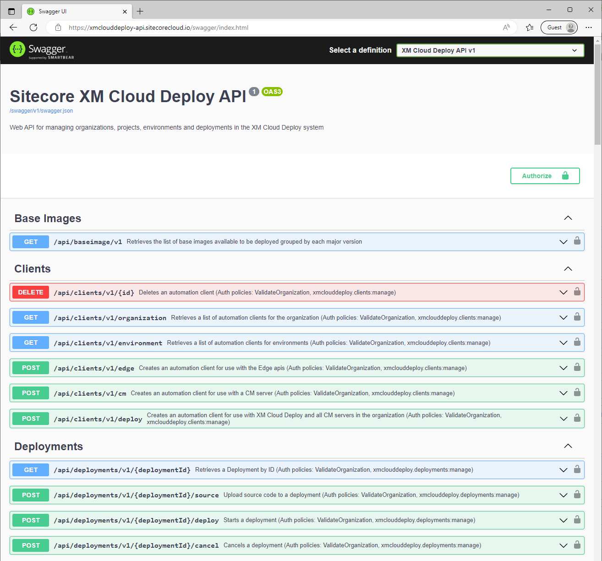
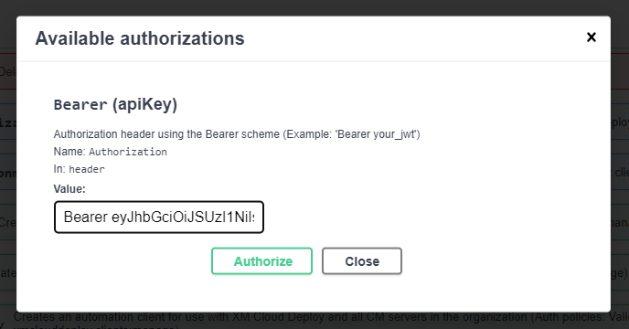

XM Cloud Deploy manages both the Cloud CMS modifications deployment to XM, and the frontend code deployment to the internal editing host. This can be done through the provided web UI (https://deploy.sitecorecloud.io/) and the Sitecore CLI. In the blog post [XM Cloud build and deploy like a pro](https://www.sergevandenoever.nl/XM_Cloud_build_and_deploy_like_a_pro/) I described how you can use PowerShell to automate deployments against the Sitecore CLI. But XM Cloud Deploy also provides a REST API that can be used to automate deployments. This REST API is also used by the XM Cloud Deploy web UI, so if you look at the network tab of your browser when performing actions in the web UI and filter on `Fetch/XHR` you will see all the REST API calls that are executed:

And if you switch to the **Headers** tab you will see that the requests are done using an **Authorization** header with a bearer token:

The API host is also visible, e.g. https://xmclouddeploy-api.sitecorecloud.io which shows us what it is, the *Sitecore XM CLoud GitOps API*!: 

## Swagger and OpenAPI

Any good REST API uses [Swagger](https://swagger.io/) to self-document the REST API, and so does the XM Cloud Deploy API. Open up the URL https://xmclouddeploy-api.sitecorecloud.io/swagger and you will see:

What you will also see is a link to the [OpenAPI specification](https://spec.openapis.org/oas/latest.html) of the REST API:

This is a description of all available API calls in a JSON format:

But what is the OpenAPI specification? In their own words:

> The OpenAPI Specification (OAS) defines a standard, programming language-agnostic interface description for HTTP APIs, which allows both humans and computers to discover and understand the capabilities of a service without requiring access to source code, additional documentation, or inspection of network traffic. When properly defined via OpenAPI, a consumer can understand and interact with the remote service with a minimal amount of implementation logic. Similar to what interface descriptions have done for lower-level programming, the OpenAPI Specification removes guesswork in calling a service.

The cool thing is that this specification can be used to create a client SDK for the REST API in any language that you like, so you don't have to interact with the API on an HTTP level. See https://openapi.tools/ for a whole bunch of tools regarding OpenAPI:

## Testing API calls in the Swagger UI

Another cool feature of the Swagger UI is that you can test out API calls. Because the XM Cloud Deploy REST API needs authentication, you first need to authenticate in the Swagger UI. Do this through the **Authorize** button in the Swagger UI:

Then copy the value of the **Authorization** header from the requests in the network tabn to the **Value** field and press **Authorize**:

This results in the correct authorization:

Close the window, and now you can test out the different API calls in the Swagger UI. As an example open the `/api/sourcecontrol/v1/templates` call by selecting the down arrow on the right side:

You will see the parameters (`provider` in this case) and the expected response in case of a correct result (200 return code). If you press the **Try it out** button, set the **provider** value to `GitHub` and press the **Execute** button you will see the results of the call:

## Troubleshooting

Note that if you get a 403 (Not Authorized) result you need to retrieve the value of the **Authorization** header again and do the **Authorize** again as described above. 

