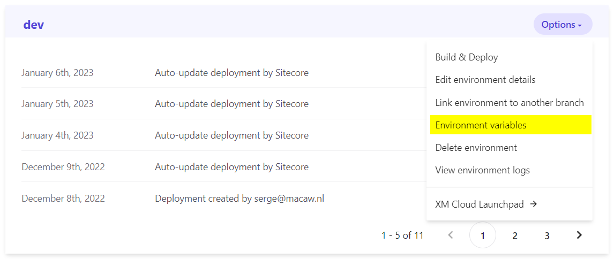
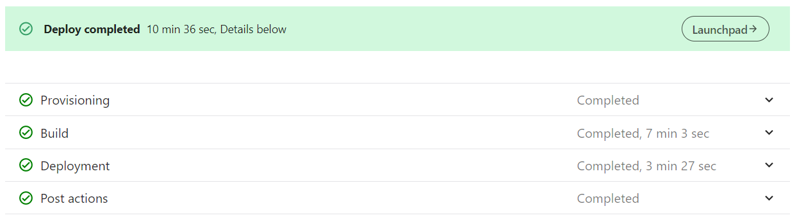
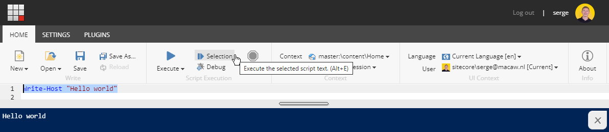
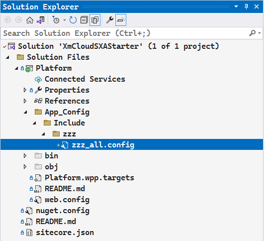
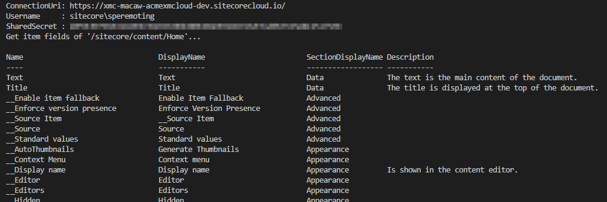

Sitecore XM / XM Cloud wouldn't be as powerful as it is without the power of PowerShell. Luckily enough also in XM Cloud PowerShell is available at its full strength. In this blog post I will explain how to enable PowerShell ISE (disabled by default) and PowerShell remoting.

With PowerShell remoting it is possible to execute PowerShell code on the Sitecore XM server from a PowerShell script executing on your dev box or on a build server.

## Enabling PowerShell in XM Cloud

In XM Cloud Deploy on a given environment there is an option to manage environment variables for an environment:



In there is an environment variable `SITECORE_SPE_ELEVATION`, set its value to `Allow`.

For PowerShell remoting we will use a shared secret and manage that secret in an environment variable as well, so let's create that environment variable. As a shared secret we will use a 64 characters key. Generate it at https://www.grc.com/passwords.htm and copy the value from the field, e.g. `D77454875CC06F6E2B36A965E10479FD284737D215BD4AADF85E886D934DE701`. Note that this value is regenerated every time you refresh the page. Set the environment variable `SPE_SharedSecret` to this value. You can make the environment variable private, in that case, the key will not be visible in the XM Cloud Deploy environment, so make sure you store the key somewhere for later use.

We now need to do a redeploy. It is the only way I know of to make the environment variable changes effective.



A build and deploy is a lengthy process of more than 10 minutes, so I try to avoid it as much as possible. 

## Validate that PowerShell is working

You should now be able to use the PowerShell ISE (Integrated Scripting Environment) accessible from the XM Cloud Launchpad.

To test it out type a simple script like:

```PowerShell
Write-Host "Hello World!"
```

Then select it, and use the **Selection** button to execute that single line:



## Create a specific user for PowerShell remoting

For PowerShell remoting we need to specify a user name and a shared secret (although username and password can work as well).

We did already set the shared secret in the environment variable `SPE_SharedSecret`. We will now create a specific user for PowerShell remoting. Developers come and go on projects, so we don't want to tie remoting scripts to a specific developer.

In the XM Cloud launchpad select **User Manager**:


Create a user **speremoting** (sitecore\speremoting), give it any email address (e.g. `speremoting@whatever.com` - it is not used) and any password (also not used).

Make sure the user is enabled and unlocked.

## PowerShell remoting configuration

The next step is to create a configuration file in the repository created by XM Cloud to enable remoting. Because we probably only want to enable remoting in the development environment it would be best to use [configuration layers](https://doc.sitecore.com/xmc/en/developers/xm-cloud/configuration-layers.html) which should enable the environment specific configurations:

> Contains the patch files you create to configure XM Cloud for different environments, such as QA, production, or development.
>
> For example, in a development environment, you can add patch files that enable additional logging information.

But I don't understand how to configure it for the dev environment only, have other configurations for the other environments, while still having a single code repository.

So for now I created a file `C:\p\AcmeXMCloud-latest\src\platform\App_Config\Include\zzz\zzz_all.config` with the required configuration changes that I want.

There is a good reason why I create all configuration changes in a single file. I have a neat trick to apply these changes directly in the PowerShell ISE so I don't have to do a build and deploy, and can test my changes in a matter of seconds, instead of waiting 10+ minutes. See the blog post [XM Cloud - use PowerShell ISE to test configuration changes](https://www.sergevandenoever.nl/Sitecore_XM_using_PowerShell_ISE_to_test_configurations/) for more information.

Make sure that the file is correctly in the Visual Studio tree. Otherwise, it will not be correctly deployed in the build and deploy:



And use the following configuration, based on [ShieldsDown.config for Sitecore PowerShell developers](https://alan-null.github.io/2017/01/spe-dev-config):

```xml
<configuration
    xmlns:patch="http://www.sitecore.net/xmlconfig/"
    xmlns:set="http://www.sitecore.net/xmlconfig/set/"
>
    <sitecore>
        <powershell>
            <services>
                <remoting>
                    <patch:attribute name="enabled">true</patch:attribute>
                    <authorization>
                        <add Permission="Allow" IdentityType="User" Identity="sitecore\speremoting" />
                    </authorization>
                    <fileDownload>
                        <patch:attribute name="enabled">true</patch:attribute>
                    </fileDownload>
                    <mediaDownload>
                        <patch:attribute name="enabled">true</patch:attribute>
                    </mediaDownload>
                </remoting>
                <restfulv2>
                    <patch:attribute name="enabled">true</patch:attribute>
                </restfulv2>
            </services>
            <authenticationProvider
                type="Spe.Core.Settings.Authorization.SharedSecretAuthenticationProvider, Spe">
                <detailedAuthenticationErrors>
                    <patch:delete />
                </detailedAuthenticationErrors>
                <detailedAuthenticationErrors>true</detailedAuthenticationErrors>
                <!-- Provide a strong randomized shared secret in the environment variable 'SPE_SharedSecret'.
                     At least 64 characters is recommended, for example https://www.grc.com/passwords.htm  -->
                <sharedSecret>$(env:SPE_SharedSecret)</sharedSecret>
                <allowedAudiences hint="list">
                    <!-- The audience is the host name of the Sitecore instance. 
                         In XM Cloud an environment variable 'host' is available -->
                    <audience>https://$(env:host)</audience>
                </allowedAudiences>
            </authenticationProvider>
            <userAccountControl>
                <gates>
                    <gate name="ISE">
                        <patch:delete />
                    </gate>
                    <gate name="Console">
                        <patch:delete />
                    </gate>
                    <gate name="ItemSave">
                        <patch:delete />
                    </gate>
                    <gate name="ISE" token="Permissive" />
                    <gate name="Console" token="Permissive" />
                    <gate name="ItemSave" token="Permissive" />
                </gates>
                <tokens>
                    <token name="Permissive" expiration="00:00:00" elevationAction="Allow" />
                </tokens>
            </userAccountControl>
        </powershell>
    </sitecore>
</configuration>
```

Note the use of environment variables through `$(env:host)` and `$(env:SPE_SharedSecret)`, so required values are not in the configuration files and we have a clean code repository.

A build and deploy is needed to apply the configuration changes. For quick testing of configuration changes, you can also use the trick that I describe in a the blog post [XM Cloud - use PowerShell ISE to test configuration changes](https://www.sergevandenoever.nl/Sitecore_XM_using_PowerShell_ISE_to_test_configurations/) so you can apply changes instantly through the PowerShell ISE.

## Testing PowerShell remoting

To test PowerShell remoting against Sitecore XM CLoud I created a folder `tools` with a `config.json` file containing the required configuration settings:

`tools\config.json`:
```json
{
    "connectionUri": "https://xmc-macaw-acmexmcloud-dev.sitecorecloud.io/",
    "username": "sitecore\\speremoting",
    "SPE_SharedSecret": "D77454875CC06F6E2B36A965E10479FD284737D215BD4AADF85E886D934DE701"
}
```

Change to match your configuration - and no this is not the shared secret we use:-)

And next to it I created a `get-itemfields.ps1` file to retrieve the fields for a given Sitecore item:

`tools\get-itemfields.ps1`:
```powershell
param(
    [string]$itemPath = "/sitecore/content/Home"
)

Set-Location -Path $PSScriptRoot

$config = Get-Content -Raw -Path ./config.json | ConvertFrom-Json
Write-Output "ConnectionUri: $($config.connectionUri)"
Write-Output "Username     : $($config.username)"
Write-Output "SharedSecret : $($config.SPE_sharedSecret)"

Write-Output "Get item fields of '$itemPath'..."
Import-Module -Name SPE 
$session = New-ScriptSession -ConnectionUri $config.connectionUri -Username $config.username -SharedSecret $config.SPE_SharedSecret
Invoke-RemoteScript -Session $session -ScriptBlock {
    Get-Item $Using:itemPath | Get-ItemField -IncludeStandardFields -ReturnType Field -Name "*" | Format-Table Name, DisplayName, SectionDisplayName, Description -auto
}
Stop-ScriptSession -Session $session
```

Resulting in:



## Troubleshooting
Note that if the username or SPE_SharedSecret are incorrect you will get a non-descriptive error like:

```
Exception calling "Invoke" with "1" argument(s): "Element 'Objs' with namespace name 'http://schemas.microsoft.com/powershell/2004/04' was not found. Line 2, position 2.```
```

That is because in case of errors an HTML page is returned instead of the expected XML.


