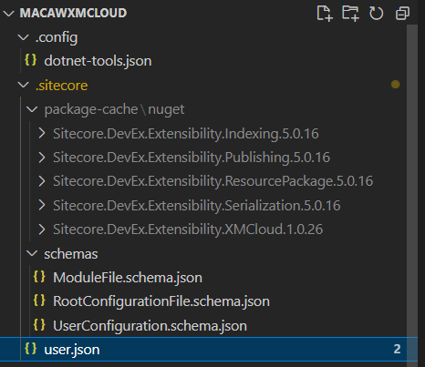
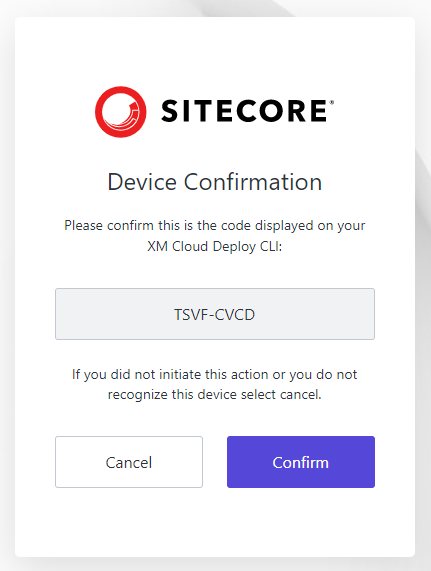
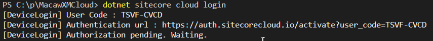
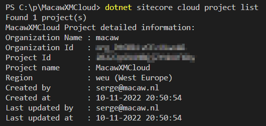
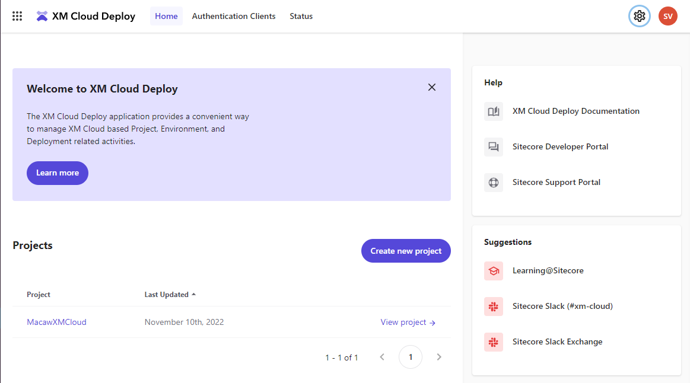
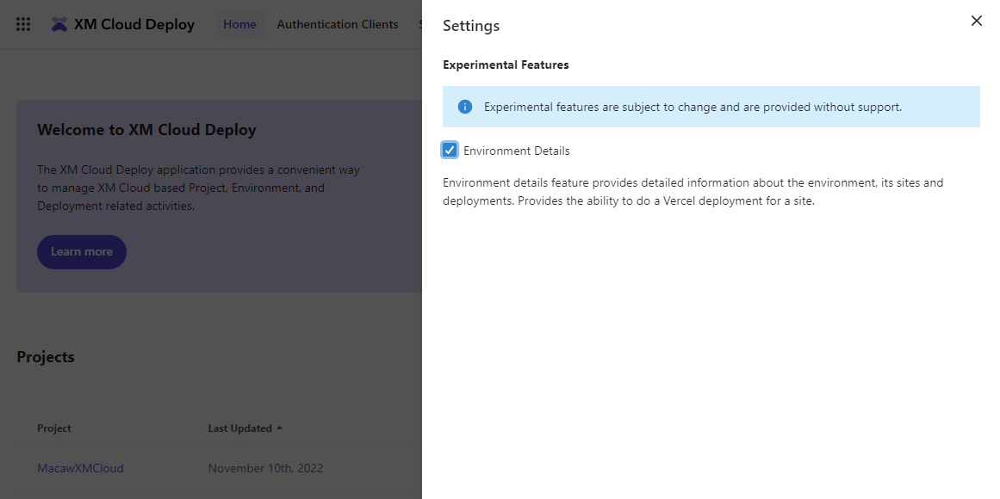
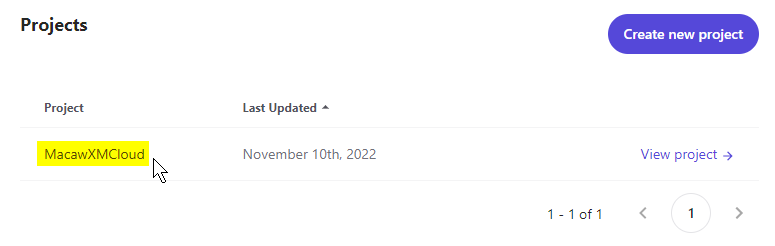
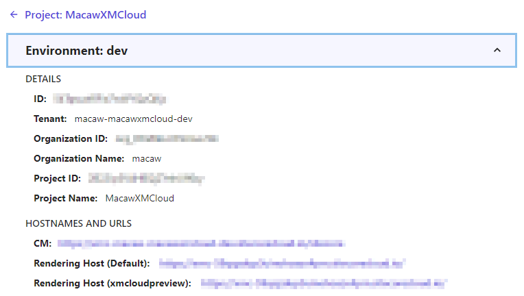

When working with the [Sitecore CLI](https://doc.sitecore.com/xmc/en/developers/xm-cloud/sitecore-command-line-interface.html) to retrieve information from XM Cloud, for many operations a Project Id is required. There are multiple ways to obtain this Project Id. In this post I will describe two ways to do this.

The first way is using the Sitecore CLI itself. To work with the Sitecore CLI, we need to have the Sitecore CLI configured. Within an XM Cloud project create by XM Cloud, this configuration is already part of the code repository.



If you open a terminal window and navigate to the root folder of your project, you first need to login to XM Cloud:

```
dotnet sitecore cloud login
```

The connection information is available in the `user.json` file, and you are presented with a web interface to approve the authentication:





After pressing the `Confirm` button you are automatically authenticated if you recently logged in on the Sitecore Cloud portal, otherwise you are presented with a login screen.

When logged in into XM Cloud, the Project Id can be retrieved using the command:

```
dotnet sitecore cloud project list
```



On [Sitecore Slack](https://sitecore.chat) also another approach was described to get the Project Id. 

Open the XM Cloud Deploy app on https://deploy.sitecorecloud.io/:



Click on the settings icon in the upper right corner and enable in **Experimental Features** the **Environment Details**:



If you now click on the project name in the XM Cloud Deploy app:



And then click on the environment name:


A pane with environment information is available with all the IDs you need.



Note that on Sitecore Learning there is a whole section on [XM Cloud Command Line Interface](https://learning.sitecore.com/learn/course/1037/xm-cloud-command-line-interface-cli;lp=36).