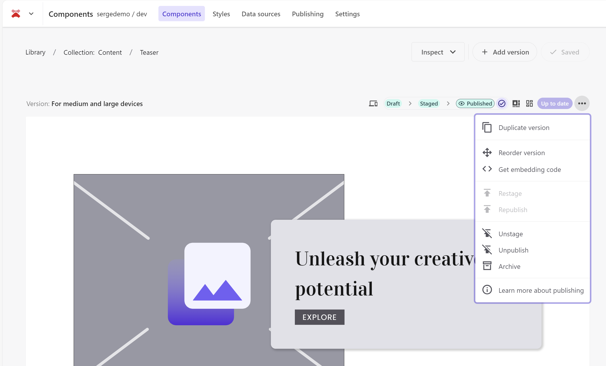
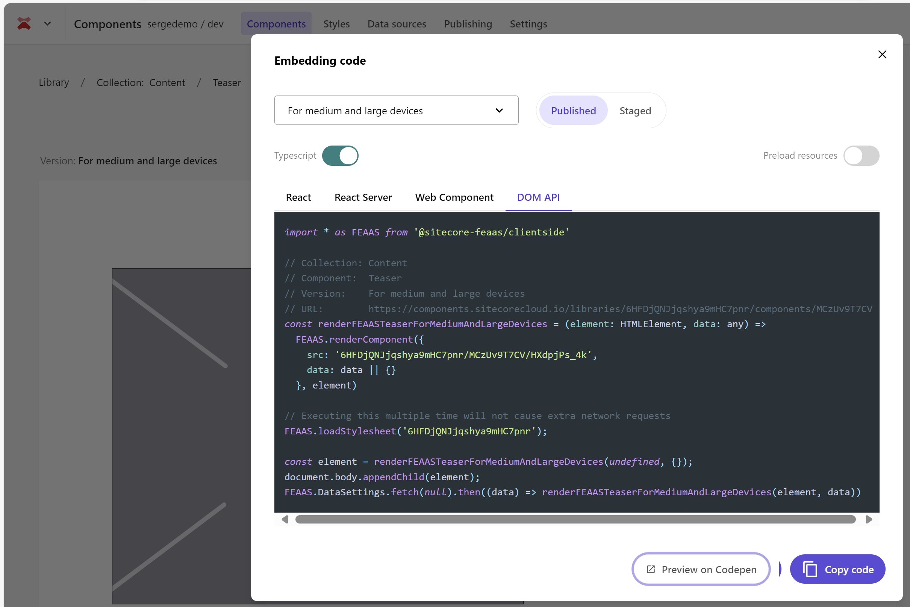
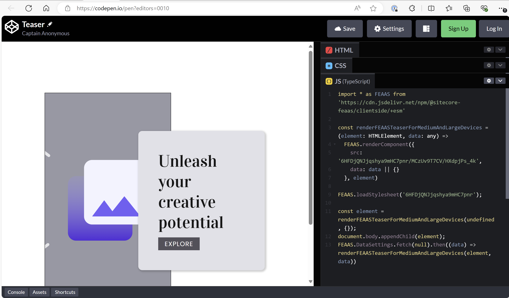
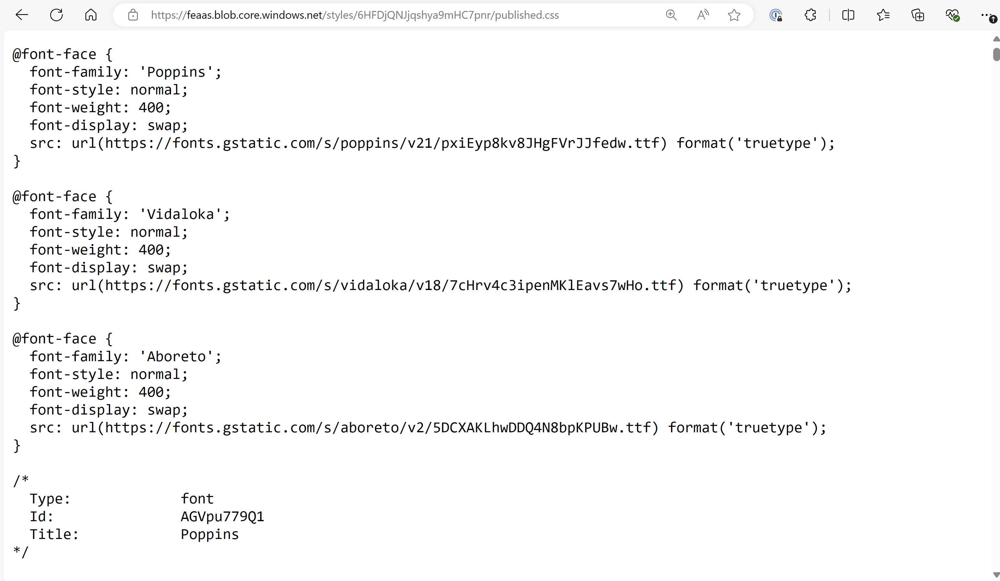

Sitecore XM Cloud Components offers a powerful and user-friendly way to build a Style Library, serving as the foundation of your design system. Currently, the elements defined in the Style Library are primarily used for creating components within XM Cloud Components. But could its potential extend further? For instance, can the Style Library be integrated into custom React component development?

If so, this would enable a unified design system that supports both marketer-created components in XM Cloud Components and developer-built React components. This integration is particularly valuable when these components need to blend seamlessly on the same page, ensuring consistency and a cohesive user experience.

## Get embedding code

The first pointer in the direction of reuse become visible when you select the **Get embedding code** menu option on the three dots of a component:



Selection of this menu options open a popup where code samples are given for using the component in React, React Server (as a React server component), as a Web Component, or using the DOM API.



And the nice thing is that this code can also be opened on Codepen to see it in action:



Lets inspect the provided code samples:

### React

```typescript
import * as FEAAS from '@sitecore-feaas/clientside/react'

// Collection: Content
// Component:  Teaser
// Version:    For medium and large devices
// URL:        https://components.sitecorecloud.io/libraries/6HFDjQNJjqshya9mHC7pnr/components/MCzUv9T7CV
export function FEAASTeaserForMediumAndLargeDevices({ data } : { data: any }) {
  return <FEAAS.Component 
    preload="true"
    src="6HFDjQNJjqshya9mHC7pnr/MCzUv9T7CV/HXdpjPs_4k"
    data={data || {}}
  />
}

<FEAASTeaserForMediumAndLargeDevices data={null} />
```

Observations:
- There is a special component loader that hides the place where the component lives
- The URL in the comments points to the component in the XM Cloud Components designer
- The loading of the CSS is handled by the `<FEAAS.Component />` component  

### React Server

```typescript
import * as FEAAS from '@sitecore-feaas/clientside/react'

// Collection: Content
// Component:  Teaser
// Version:    For medium and large devices
// URL:        https://components.sitecorecloud.io/libraries/6HFDjQNJjqshya9mHC7pnr/components/MCzUv9T7CV
export async function FEAASTeaserForMediumAndLargeDevices({ data } : { data: any }) {
  return <FEAAS.ServerComponent 
    preload="true"
    src="6HFDjQNJjqshya9mHC7pnr/MCzUv9T7CV/HXdpjPs_4k"
    data={data ? JSON.stringify(data) : {}}
  />
}

{/* @ts-ignore Async Server Component */}
<FEAASTeaserForMediumAndLargeDevices data={null} />
```

Observations:
- There is a special component loader `<FEAAS.ServerComponent />` for handling React server components

### Web Components

```typescript
<script type="module">import '@sitecore-feaas/clientside'</script>
<link rel="stylesheet" href="https://feaas.blob.core.windows.net/styles/6HFDjQNJjqshya9mHC7pnr/published.css" crossorigin="anonymous"  />

<!--
Collection: Content
Component:  Teaser
Version:    For medium and large devices
URL:        https://components.sitecorecloud.io/libraries/6HFDjQNJjqshya9mHC7pnr/components/MCzUv9T7CV
-->
<feaas-component
  src="6HFDjQNJjqshya9mHC7pnr/MCzUv9T7CV/HXdpjPs_4k"
  instance="f0ptBmMHZKdtxXwz6raNZ"
  data='null'>
</feaas-component>
```

Observations:

- For web components the styling (CSS) and the component are loaded seperately
- The full URL of the CSS file for the Style Library is mentioned as a href
- The CSS is stored on Azure Blob Storage
  
### DOM API

```typescript
import * as FEAAS from '@sitecore-feaas/clientside'

// Collection: Content
// Component:  Teaser
// Version:    For medium and large devices
// URL:        https://components.sitecorecloud.io/libraries/6HFDjQNJjqshya9mHC7pnr/components/MCzUv9T7CV
const renderFEAASTeaserForMediumAndLargeDevices = (element: HTMLElement, data: any) =>
  FEAAS.renderComponent({
    src: '6HFDjQNJjqshya9mHC7pnr/MCzUv9T7CV/HXdpjPs_4k',
    data: data || {}
  }, element)

// Executing this multiple time will not cause extra network requests
FEAAS.loadStylesheet('6HFDjQNJjqshya9mHC7pnr');

const element = renderFEAASTeaserForMediumAndLargeDevices(undefined, {});
document.body.appendChild(element);
FEAAS.DataSettings.fetch(null).then((data) => renderFEAASTeaserForMediumAndLargeDevices(element, data))
```

Observations:
- The CSS can also be loaded seperately using a FEASS function `FEAAS.loadStylesheet('6HFDjQNJjqshya9mHC7pnr');`
- This function uses a special identifier, `6HFDjQNJjqshya9mHC7pnr`
- This identifier is not documented somewhere in the XM Cloud Components UI, I actually expected this to be the component library API key

## The CSS

So as we could see, the CSS is available as a direct link as becomes visible when using the Web Component variant. In our case this URL is https://feaas.blob.core.windows.net/styles/6HFDjQNJjqshya9mHC7pnr/published.css.

If you open this URL in your browser, the actual CSS becomes visible:



And I must say, it is not the most readable CSS. For example for typography extra larger (H1) the result is:

```css
/*
  Type:             typography
  Id:               RRbPrllH1F
  Title:            Extra large
  Description:      H1
  Example Content:  Example
*/
.-typography--extra-large:not(._._._._._._#_),
.-theme--default [class^="-heading1"]:not(#_),
.-use--_4_lC01VCn [class^="-heading1"]:not(x):not(x#_),
.-theme--default [class*=" -heading1"]:not(#_),
.-use--_4_lC01VCn [class*=" -heading1"]:not(x):not(x#_),
.-theme--default h1:not(#_),
.-use--_4_lC01VCn h1:not(x):not(x#_),
.-theme--default .--_4_lC01VCn:not(._._._._#_),
.-heading1--dark:not(._._._._#_),
.-heading1--light:not(._._._._#_),
.-theme--dark [class^="-heading1"]:not(#_),
.-use--AijAuU48jC [class^="-heading1"]:not(x):not(x#_),
.-theme--dark [class*=" -heading1"]:not(#_),
.-use--AijAuU48jC [class*=" -heading1"]:not(x):not(x#_),
.-theme--dark h1:not(#_),
.-use--AijAuU48jC h1:not(x):not(x#_),
.-theme--dark .--AijAuU48jC:not(._._._._#_) {
  line-height: var(---typography--line-height, inherit);
  font-family: "Vidaloka";
  font-weight: 400;
  font-style: normal;
  font-size: 42px;
  letter-spacing: inherit;
  ---typography--line-height: initial;
  ---typography--icon-size: initial;
}
```

Luckely enough the resulting CSS is heavily documented, but in a next post I will investigate how to use the styles outside of the XM Cloud Components.