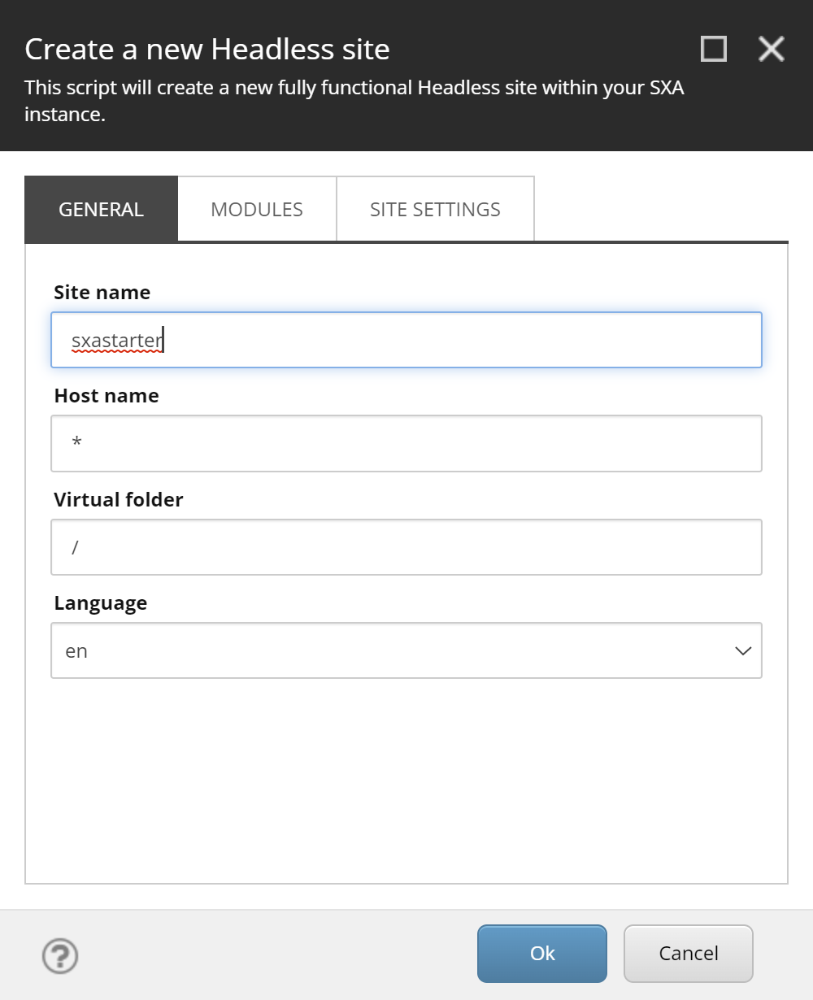

In this post I will show you how you can start working with XM Cloud, without having access to an XM Cloud organization yet, by setting up XM Cloud using Docker containers on your local machine.

## Getting the project

To get started we need to clone an XM Cloud project template that contains all the required Docker configuration files.

On GitHub we can find these repositories at https://github.com/orgs/sitecorelabs/repositories.

We will use the repository https://github.com/sitecorelabs/xmcloud-foundation-head-staging, because it is mentioned in the [XM Cloud documentation](https://doc.sitecore.com/xmc/en/developers/xm-cloud/walkthrough--setting-up-your-full-stack-xm-cloud-local-development-environment.html) in the first Tip block.

Clone the repository as follows:
```
git clone https://github.com/sitecorelabs/xmcloud-foundation-head-staging.git xmcloud-sxa
```

## Configuration of the containers

In the folder `xmcloud-sxa` we will now find all the required files to spin up the Docker containers.

Do `cd xmcloud-sxa` to go to the new created folder. In this folder execute:

`init.ps1` - configure your system for working with Docker Compose and XM Cloud - in a terminal window with Administrator rights execute the following command: 

```ps1
.\init.ps1 -InitEnv -LicenseXmlPath "C:\license\license.xml" -AdminPassword "b"
```

Note that the location of your Sitecore license file and the administrator password that you choose may vary. After executing this command restart you terminal before executing the next command.

The init command genersates the following output:

```text
Preparing your Sitecore Containers environment!
Installing SitecoreDockerTools...
WARNING: Version '10.2.7' of module 'SitecoreDockerTools' is already installed at 'C:\Users\serge\Dropbox\PC
(2)\Documents\WindowsPowerShell\Modules\SitecoreDockerTools\10.2.7'. To reinstall this version '10.2.7', run Install-Module or Updated-Module
cmdlet with the -Force parameter.
Importing SitecoreDockerTools...
WARNING: The names of some imported commands from the module 'SitecoreDockerTools' include unapproved verbs that might make them less
discoverable. To find the commands with unapproved verbs, run the Import-Module command again with the Verbose parameter. For a list of
approved verbs, type Get-Verb.
     \               +               /                                   /`\
       \             |             /
         \           |           /            /`\
           \        / \        /
             \    /______\   /
             /   |___|___|   \
           /   |;|       |;|   \
         /      \\.     . /      \                                                                                                                    /         ||:   . |         \                         /`\                                                                                    /           ||:     |           \                                                                                                                          ||:     |                                                                                                                                      ||:    .|
                 ||      |
                 |:      |
                 ||:__ . |                ------------------
___________ _ ||_| |_.|  |________________|                |___________________
......................................... |                | ..................
.............................. -------------------------------------- .........
........ _________  .......... |                   |                | .........
        /          |           |                   |                |
       /          /    ------------------------------------------------------
       |         |     |                  |                 |               |
       |         |     |                  |                 |               |
------          ---------------------------------------------------------------
\         _____ _______ ________ ______  ______ _____ ________   _____        /
 \       / ____|__   __|__   __|   ___/ / ____/  ___  |   __  \ |  ___|      /
~~\     | (___    | |     | |   | |__  | |    | |   | |  |__)  || |__       /~~
~~~\     \____\   | |     | |   |  __| | |    | |   | |  _    / |  __|     /~~~
~~~~\    ____| )__| |__   | |   |  |___| |___ | |___| |  | \  \ | |___    /~~~~
~~~~~\  |_____/|________| |_|   |____ / \_____/\____/ |__|  \_  \_____|  /~~~~~
~~~~~~\                                                                 /~~~~~~
~~~~~~~\                                                               /====~~~
~~~~~~~~~~~~~~~~~~~~~~~~~~~~~~~~~~~~~~~~~~~~~~~~~~~~~~~~~~~~~~~~~~~~~~~~~~~~~~~
Downloading and installing mkcert certificate tool...
Generating Traefik TLS certificate...
Using the local CA at "C:\Users\serge\AppData\Local\mkcert" ✨
The local CA is already installed in the system trust store! 👍
Note: Firefox support is not available on your platform. ℹ️

Using the local CA at "C:\Users\serge\AppData\Local\mkcert" ✨

Created a new certificate valid for the following names 📜
 - "*.sxastarter.localhost"

Reminder: X.509 wildcards only go one level deep, so this won't match a.b.sxastarter.localhost ℹ️

The certificate is at "./_wildcard.sxastarter.localhost.pem" and the key at "./_wildcard.sxastarter.localhost-key.pem" ✅

Using the local CA at "C:\Users\serge\AppData\Local\mkcert" ✨

Created a new certificate valid for the following names 📜
 - "xmcloudcm.localhost"

The certificate is at "./xmcloudcm.localhost.pem" and the key at "./xmcloudcm.localhost-key.pem" ✅

Adding Windows hosts file entries...
Populating required .env file values...
Done!

###########################################################################
To avoid HTTPS errors, set the NODE_EXTRA_CA_CERTS environment variable
using the following commmand:
setx NODE_EXTRA_CA_CERTS C:\Users\serge\AppData\Local\mkcert\rootCA.pem

You will need to restart your terminal or VS Code for it to take effect.
###########################################################################
```

## Spinning up the containers

Now it is time to spin up the containers.

`.\up.ps1` - the script to start Docker Compose and bring your complete container-based environment to live. Note that XM Cloud wants to connect to https://sitecorecloud.io to first confirm your device, and in a next step it authenticates your device at https://auth.sitecorecloud.io.

If you get an error like:
```
Building containers...
Invalid template: "gcK+~o9`CeGJ2lA/ckk@k;9x}($"
C:\p\xmcloud-sxa\up.ps1 : Container build failed, see errors above.
```

rerun the .\init.ps1 command, because in the generated `.env` file an illegal value is created for `MEDIA_REQUEST_PROTECTION_SHARED_SECRET`. 

When all containers are started you are presented with the homescreen of XM Cloud:


## Configuring the project

In the folder `src\sxastarter` we can find the SXA starter template project.

We need to do do some setup in this folder by running `jss setup`. If the `jss` command is not available, install it using the command `npm install -g @sitecore-jss/sitecore-jss-cli`.

The XM Cloud CM container has an API key `xmcloudpreview` pre-configured with the GUID `{1C8CF303-D973-4D40-811B-D3297D4643F2}`. So we will use that one.


Ignore the NEXT STEPS, because with XM Cloud we have another approach to deploy the project to XM Cloud. The important thing is that the `jss setup` command generated the file `scjssconfig.json`, which looks like:

```json
{
  "sitecore": {
    "instancePath": "",
    "apiKey": "{1C8CF303-D973-4D40-811B-D3297D4643F2}",
    "deploySecret": "8mrq6lmww74vqqk901jpr9o3ip65tgotqznsni5iuax",
    "deployUrl": "https://xmcloudcm.localhost/sitecore/api/jss/import",
    "layoutServiceHost": "https://xmcloudcm.localhost"
  }
}
```

## Preparing XM Cloud for deployment of our JSS app

The XM Cloud environment is empty. We need to prepare it for deployment of our JSS app. For this we need to scaffold a headless tenant and a headless site with the name of the JSS app.

You can find the name of the JSS app in the `package.json` file:


In this case the name is `sxastarter`.

In the content editor create a headless tenant (I call it `acme`):


And on the tenant create a headless site with the name `sxastarter`:


Configure this site in the three tabs:



Keep the default selected modules:


Copy the deployment secret from the `scjssconfig.json` file:


## Starting the app

Run `npm install` to prepare the app, followed by `npm run start:connected` to start the app in Sitecore connected mode.

The app should now be available on https://www.sxastarter.localhost/.

If you browse to this URL you will get the following error:


This error can be solved by configuring a root item ID. This root item ID must be configured in the file: <jss-app>\src\lib\dictionary-service-factory.ts

The comments described how to solve the issue.

For <jss-app>\src\lib\dictionary-service-factory.ts:


The GUID to be used is the template ID of the home item of your JSS app:


## Disabling personalize

And again we get an error:


The local XM Cloud environment will not be connected to CDP, so for now we commenct out the `CdpPageView` in the `src\Scripts.tsx` file:


And we now have a white screen!!

## Testing the Experience Editor

Now open the home page in the Experience Editor and we can edit the page!


Note that we can't edit the page in the Pages editor, as explained in the post [The XM Cloud container - don't fiddle (too much) with it...](https://www.sergevandenoever.nl/XM_Cloud_container_nofiddle/).

Happing hacking with XM Cloud on your local machine!