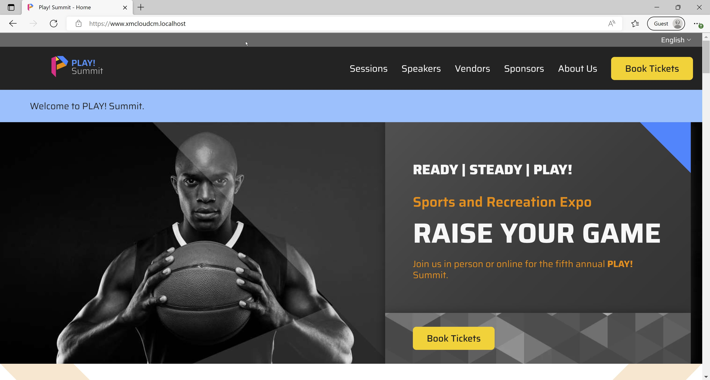

In my post [Running the XM Cloud SXA Starter on your local machine](https://www.sergevandenoever.nl/XM_Cloud_SxaStarter/) I showed how you can experiment with XM Cloud on you local machine using Docker containers, wiyjout having access to an organization in the [Sitecore Cloud portal](https://porta.sitecorecloud.io). Good to have a glimpse to that post before continuing here so you know what to expect. Although the setup of the **Play! Summit** demo app is even easier!

Next to the repository I used in the above post (the SXA Starter template repository), there is also the [Play! Summit for XM Cloud](https://github.com/sitecorelabs/Sitecore.Demo.XmCloud.PlaySummit) repository.

If you check out this repo on your Windows machine:

```
git clone https://github.com/sitecorelabs/Sitecore.Demo.XmCloud.PlaySummit.git
```

Then execute `cd Sitecore.Demo.XmCloud.PlaySummit` to go to the new created folder, and in this folder execute the following command in a terminal window with Administrator rights:

```
.\init.ps1 -InitEnv -LicenseXmlPath "C:\license\license.xml" -AdminPassword "b"
```

You are ready to start the Docker containers using the command `.\up.ps1`.

I (almost always) get the error:


But running `.\up.ps1` again is in most cases enough to get the containers running correctly.

The `.\up.ps1` script is really smart, it pushes all serialized items to the CM environment, so no manual configuration of a tenant and site is not required to get the site running.

After some waiting you are presented with the website running on https://www.xmcloudcm.localhost/:



Navigate to https://cm.xmcloudcm.localhost/sitecore/shell/sitecore/client/applications/launchpad to see the XM Cloud launch pad. 


Note that we can't edit the page in the Pages editor, as explained in the post [The XM Cloud container - don't fiddle (too much) with it...](https://www.sergevandenoever.nl/XM_Cloud_container_nofiddle/).

It could be that you get an authenticationm error on Docker Hub, then run `docker login` to authenticate to `https://hub.docker.com/`. Create an account if you don't have one yet.

Happing hacking with XM Cloud Play! Summit on your local machine!


