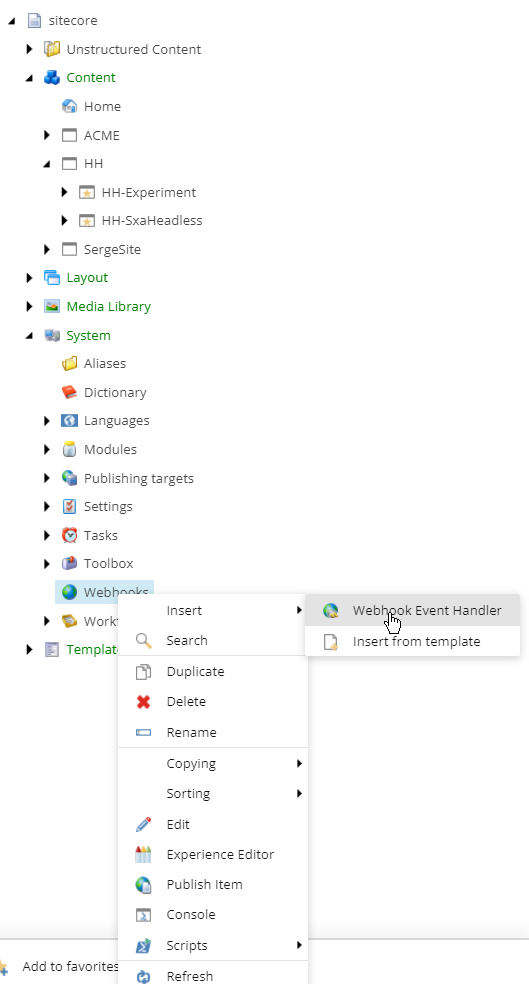
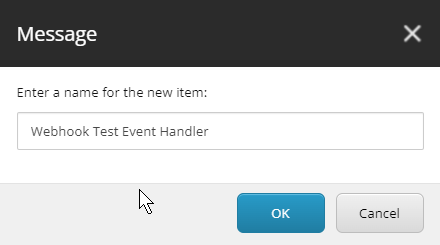
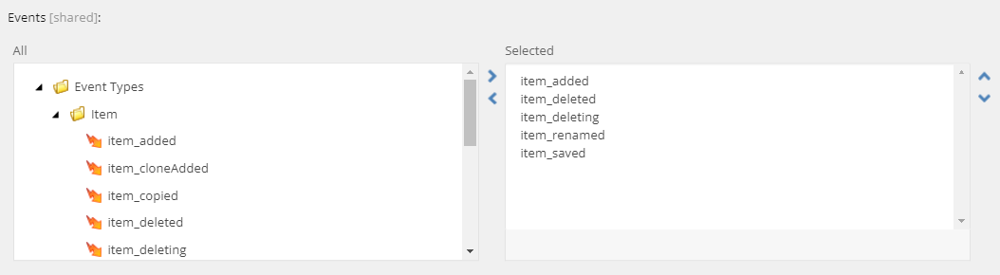
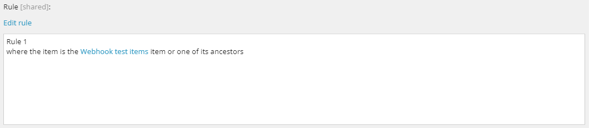
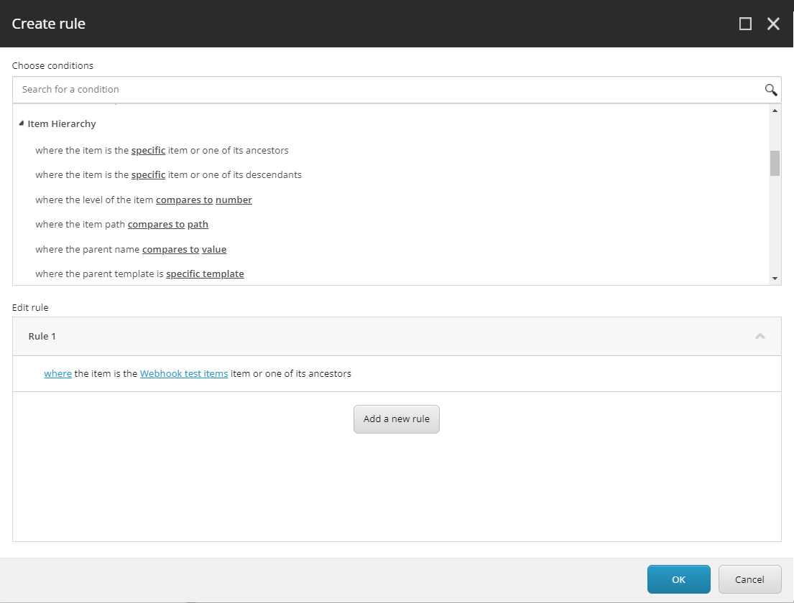
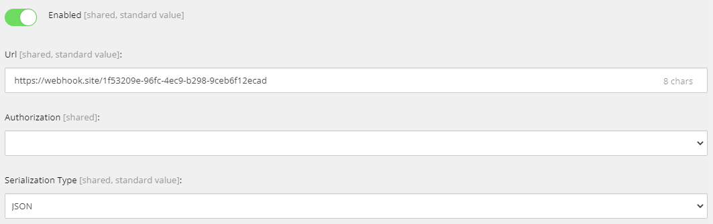
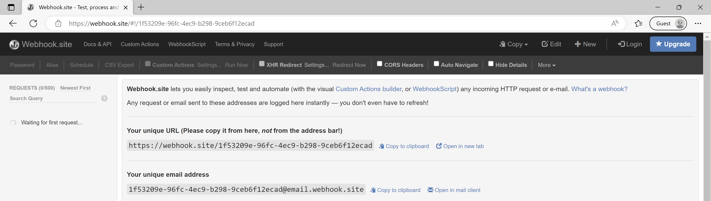

In Sitecore XM Cloud, and starting from version 10.3 of Sitecore XM, there is a new extensibility model available: webhooks. This new functionality is an important step toward less code deployed in the Sitecore XM Content Management (CM) server.

But what are webhooks? Webhooks are used in connecting two different online applications. Webhooks allow one program to send data to another as soon as a certain event takes place. Because they are event-driven, webhooks are ideal for things like real-time notifications and data updates.

So, webhooks are a way for one app to send real-time information to another app. They are typically implemented by making an HTTP POST request to a specific URL when an event occurs in the first app. In the context of a content management system (CMS), webhooks can be used to trigger updates or actions in other systems or apps when certain events happen within the CMS. For example, a CMS webhook could be used to automatically send a notification to a marketing automation platform when a new blog post is published on the website, or to an e-commerce platform when a new product is added to the CMS. The data sent in the webhook will often include details about the event, such as the name of the user who triggered the event, the date and time of the event, and any relevant data associated with the event.

Webhooks are considered simple because they involve a relatively straightforward process. They do not require the use of complex protocols or APIs, and they can be easily set up and configured. The process typically involves just a few steps:

- One app (the sender) is configured to send an HTTP POST request to a specific URL (the receiver) when a specific event occurs

- The receiver is set up to listen for incoming POST requests at that URL

- When the event occurs in the sender, it sends the POST request with the relevant data to the receiver

- The receiver processes the incoming data and takes any necessary actions

Because webhooks use standard HTTP protocols, they can be integrated with a wide variety of apps and systems, and developers do not need to worry about compatibility issues or complex integration processes. Additionally, webhooks allow for bi-directional communication, meaning that the sender and receiver apps can exchange information, which makes it simple to use.

But the fact that webhooks use the HTTP protocol and communicate through POST messages does not mean that there is any standardization in webhooks. Each implementation has its flavor, its format of the event, and its way of handling security.

## Sitecore XM Content Management server and webhooks

XM Cloud and Sitecore XM 10.3 provide webhooks for item events and publishing events.

## Creating your first webhook

To create a new 


Give the webhook event handler a name, for now, I use the name `Webhook Test Event Handler`:

.

On the event handler you can now select the event to react on. The available events are currently in two categories:

- Item events
- Publish events

For each categories there is a set of events you can configure that the event handler will be called on.

For this first test I select some item events:

- item_added
- item_deleted
- item_deleting
- item-renamed
- item_saved

There are many more events, but for a first test this seemed sufficient.



Note that all events are about something that already happened (item_added, item_deleted), but there is one event that is executed **before** the actual action, so the action can be prevented. This is the event `item_deleting`.

It is also possible to specify the conditions for the items where the event is executed. You can do this on the event handler in the rules:



Multiple rules can be specified.

I create a folder `/sitecore/content/ACME/ACME-Shared/Data/Webhook test items`, and specified that I want to have an event for all items in this folder:



Next you can configure a URL that represents the webhook (the URL a HTTP POST message is sent to), the format (JSON or XML), and authorization information (skipped for now).

As the URL I specified a test endpoint on https://webhook.site/ to get started, we will get into more powerful scenarios later.



We can now wait for the first event to come in:




## Publishing events

There are also publishing events the system can react on. These events are:
- publish_begin
- publish_end
- publish_fail
- publish_statusUpdated

When you start a publish, in this case a single item, it is interesting to see what happens:

- `publish:statusUpdated` - number of processed items 0
  
    ```json
    {
        "EventName": "publish:statusUpdated",
        "Status": {
            "CurrentLanguageName": "English",
            "CurrentTargetName": "master",
            "Expired": false,
            "Failed": false,
            "IsDone": false,
            "Messages": [],
            "Processed": 0,
            "State": 2
        },
        "WebhookItemId": "14d2921a-aab4-458f-bd9b-70ae7a5fb0ae",
        "WebhookItemName": "Webhook Test Event Handler"
    }
    ```
- `publish:begin`
  
    ```json
    {
        "EventName": "publish:begin",
        "PublisherOptions": {
            "CompareRevisions": false,
            "Deep": true,
            "FromDate": "2022-11-29T17:32:22.28Z",
            "Mode": "SingleItem",
            "PublishDate": "2023-01-20T15:22:18.167Z",
            "PublishingTargets": [
            "{8E080626-DDC3-4EF4-A1D1-F0BE4A200254}"
            ],
            "RepublishAll": false,
            "RecoveryId": "6021488d-4327-46f6-93c8-d5313a762d0f",
            "SourceDatabaseName": "master",
            "TargetDatabaseName": "master",
            "RootItemId": "1e7a632b-3b98-4f6f-b3e3-e8155be4c9ae",
            "UserName": "sitecore\\serge@macaw.nl",
            "WillBeQueued": true,
            "Languages": [
            "en"
            ]
        },
        "WebhookItemId": "14d2921a-aab4-458f-bd9b-70ae7a5fb0ae",
        "WebhookItemName": "Webhook Test Event Handler"
    }
    ```
- `publish:statusUpdated` - state 2, number of processed items mentioned

    ```json
    {
        "EventName": "publish:statusUpdated",
        "Status": {
            "CurrentLanguageName": "English",
            "CurrentTargetName": "master",
            "Expired": false,
            "Failed": false,
            "IsDone": false,
            "Messages": [],
            "Processed": 4950,
            "State": 2
        },
        "WebhookItemId": "14d2921a-aab4-458f-bd9b-70ae7a5fb0ae",
        "WebhookItemName": "Webhook Test Event Handler"
    }
    ```
- :
- `publish:statusUpdated` - state 2, number of processed items mentioned
  
    ```json
    {
        "EventName": "publish:statusUpdated",
        "Status": {
            "CurrentLanguageName": "English",
            "CurrentTargetName": "master",
            "Expired": false,
            "Failed": false,
            "IsDone": false,
            "Messages": [],
            "Processed": 7848,
            "State": 2
        },
        "WebhookItemId": "14d2921a-aab4-458f-bd9b-70ae7a5fb0ae",
        "WebhookItemName": "Webhook Test Event Handler"
    }
    ```
- `publish:end`
    ```json
    {
        "EventName": "publish:end",
        "PublisherOptions": {
            "CompareRevisions": false,
            "Deep": true,
            "FromDate": "2022-11-29T17:32:22.28Z",
            "Mode": "SingleItem",
            "PublishDate": "2023-01-20T15:22:18.167Z",
            "PublishingTargets": [
            "{8E080626-DDC3-4EF4-A1D1-F0BE4A200254}"
            ],
            "RepublishAll": false,
            "RecoveryId": "6021488d-4327-46f6-93c8-d5313a762d0f",
            "SourceDatabaseName": "master",
            "TargetDatabaseName": "master",
            "RootItemId": "1e7a632b-3b98-4f6f-b3e3-e8155be4c9ae",
            "UserName": "sitecore\\serge@macaw.nl",
            "WillBeQueued": true,
            "Languages": [
            "en"
            ]
        },
        "WebhookItemId": "14d2921a-aab4-458f-bd9b-70ae7a5fb0ae",
        "WebhookItemName": "Webhook Test Event Handler"
    }
    ```
- `publish:statusUpdated` - state 5, expired: false, report
    ```json
    {
        "EventName": "publish:statusUpdated",
        "Status": {
            "CurrentLanguageName": "English",
            "CurrentTargetName": "master",
            "Expired": false,
            "Failed": false,
            "IsDone": true,
            "Messages": [
            "Job started: Publish to 'master'",
            "Publish Target: Edge",
            "Item and Dependent Entities sent: 7821",
            "Additional Entities sent: 27",
            "Items processed: 7848",
            "Items failed to process: 0",
            "Items acknowledged: 7848",
            "Items deleted: 0",
            "Items skipped: 0",
            "",
            "Job ended: Publish to 'master' (units processed: 7848)"
            ],
            "Processed": 7848,
            "State": 5
        },
        "WebhookItemId": "14d2921a-aab4-458f-bd9b-70ae7a5fb0ae",
        "WebhookItemName": "Webhook Test Event Handler"
    }
    ```
- `publish:statusUpdated` - state 5, expired: true, report

    ```json
    {
        "EventName": "publish:statusUpdated",
        "Status": {
            "CurrentLanguageName": "English",
            "CurrentTargetName": "master",
            "Expired": true,
            "Failed": false,
            "IsDone": true,
            "Messages": [
            "Job started: Publish to 'master'",
            "Publish Target: Edge",
            "Item and Dependent Entities sent: 7821",
            "Additional Entities sent: 27",
            "Items processed: 7848",
            "Items failed to process: 0",
            "Items acknowledged: 7848",
            "Items deleted: 0",
            "Items skipped: 0",
            "",
            "Job ended: Publish to 'master' (units processed: 7848)"
            ],
            "Processed": 7848,
            "State": 5
        },
        "WebhookItemId": "14d2921a-aab4-458f-bd9b-70ae7a5fb0ae",
        "WebhookItemName": "Webhook Test Event Handler"
    }
    ```
## Webhooks look simple!

Initially, webhooks don't feel complicated. But when you start peeling off the layers of the onion there's a ton of nuance and things you need to think through as you do webhooks at scale.


## Webhooks and development

There are ways to test and develop with webhooks.

https://webhook.site/
