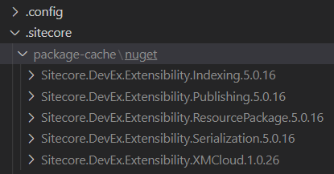
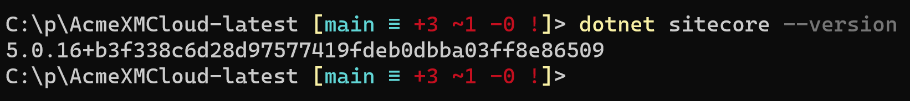
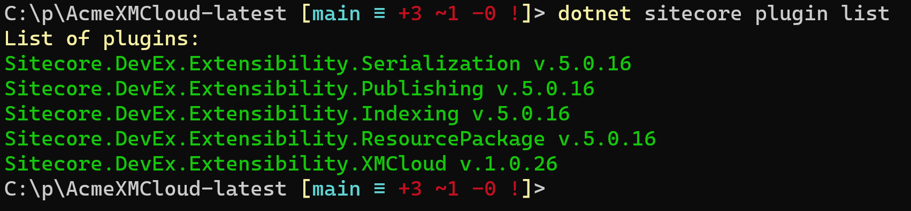
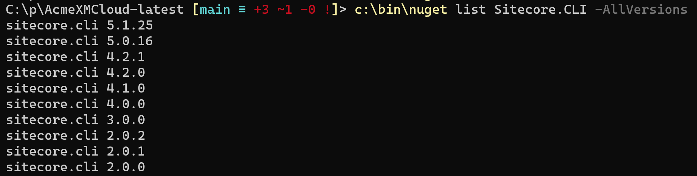
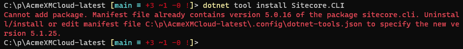
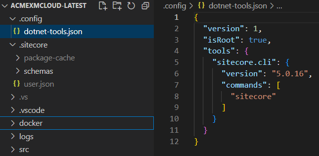
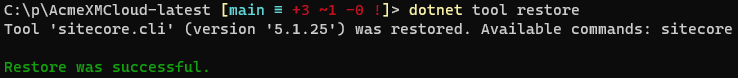
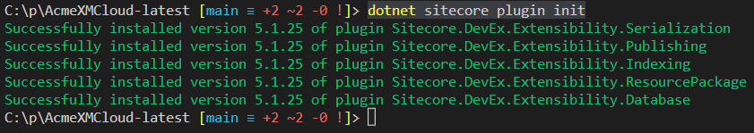
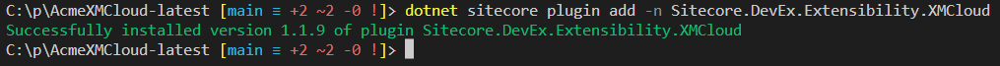

It is important to use the latest version of the Sitecore CLI package and plugins to work as best as possible with XM Cloud. How can I find my current version, the latest version, and the versions of the Sitecore CLI plugins, and how do I upgrade?

## What version of the Sitecore CLI is currently in use?

If you are in the root folder of your XM Cloud solution as scaffolded by XM Cloud, you can see the versions of used plugins in the folder `.sitecore`:



And the version of the Sitecore CLI can be seen by using the command:

```
dotnet sitecore --version
```

Which results in:



So the version is 5.0.15. 

You can also retrieve the versions of the installed list of plugins using the command:

```
dotnet sitecore plugin list
```

Which results in:



But do we have the latest version of the Sitecore CLI? I could not find any option to `dotnet nuget ...` to get the list over NuGet versions of the `Sitecore.CLI` package. But `NuGet.exe` to the rescue. The latest version of `Nuget.exe` can be downloaded at https://www.nuget.org/downloads. I manage these kinds of stand-alone command-line tools in a folder `c:\bin`.
 
We can now check what versions are available for the package `Sitecore.CLI` using the command:

```
c:\bin\nuget list Sitecore.CLI -AllVersions
```

Note that way too many packages are listed, so you have to scroll up a bit to get something like:



## Update Sitecore CLI and plugins

In the [Sitecore XM Cloud documentation on Sitecore CLI](https://doc.sitecore.com/xmc/en/developers/xm-cloud/install-sitecore-command-line-interface.html) it is not clear how to update the version of the Sitecore CLI and the installed plugins.

If you execute `dotnet tool install Sitecore.CLI` you will get:



If you look in the mentioned file `.config\dotnet-tools.json` you will see the version:



If you update this version to for example 5.1.25 execute the following steps:
1. Delete all files in the `.sitecore\package-cache\nuget` folder
2. Update the file `.config\dotnet-tools.json` to set the version of the Sitecore CLI to for example version 5.1.25 (the latest version we determined earlier)
3. Update the file `sitecore.json` and remove all plugins
4. Execute the command `dotnet tool restore` which results in:
   
   
5. Execute the command `dotnet sitecore plugin init` which results in:
   
   

   but does not install the XM Cloud plugin
6. Install the missing XM Cloud plugin with the command `dotnet sitecore plugin add -n Sitecore.DevEx.Extensibility.XMCloud` which results in:

   

And finally, we are up-to-date with the newest Sitecore CLI and the plugins.

In anyone knows a smarter/faster way, please let me know! I would prefer a command like:

```
dotnet sitecore upgrade
```

or something like that for upgrading both the Sitecore CLI version and the plugins in one run.