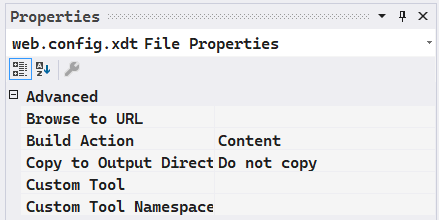

As described in the [XM Cloud developer documentation](https://doc.sitecore.com/xmc/en/developers/xm-cloud/the-xm-cloud-build-configuration.html), the file `xmcloud.build.json` in the root of your XM Cloud project repository is used to configure transformation on existing XML files. The most important XML file in Sitecore context is the `web.config` file. In this blog post, I will describe how to do a transform on the `customErrors` configuration, so we get a more descriptive error message than **Runtime Error** when we are doing development against XM Cloud.

## Get current web.config 

Before we know what to transform, we need to get the content to transform. Getting the current content of the `web.config` file on XM Cloud is easy. From PowerShell ISE you can execute the command:

```
get-content c:\inetpub\wwwroot\web.config
```

Copy the output, and store it somewhere in a file web.config.default.xml, so VSCode can do proper color highlighting on it and you have a reference of the initial state of the `web.config` file.

## The default setting of customErrors

If you look at the default setting in the default `web.config`, it is as follows:

```xml
<!--  CUSTOM ERROR MESSAGES
          Set customError mode values to control the display of user-friendly
          error messages to users instead of error details (including a stack trace):

          "On" Always display custom (friendly) messages
          "Off" Always display detailed ASP.NET error information.
          "RemoteOnly" Display custom (friendly) messages only to users not running
          on the local Web server. This setting is recommended for security purposes, so
          that you do not display application detail information to remote clients.
    -->
    <customErrors mode="RemoteOnly" />
```

For our use case, we want to "transform" the `remoteOnly` value to `off`, so on development we will see detailed error information, instead of the non-descriptive message:


## But what is a transform?

An XML Document Transform (XDT) is a feature in Microsoft's Web Deployment Tool (MSDeploy) that allows you to modify an XML-based configuration file (such as web.config) during deployment. It works by applying a set of transformation rules defined in an XDT file to the original configuration file.

An XDT file is an XML file that contains the changes you want to make to the original configuration file. The XDT file uses a special set of attributes and elements that define the location and type of changes to be made. The most common XDT attributes are `xdt:Transform` and `xdt:Locator`, which specify the type of transformation to be made and the location of the element to be transformed respectively.

XDT supports several types of transformations, including:

- `xdt:Transform="Replace"`: Replaces the entire matching element in the original configuration file with the element in the XDT file.

- `xdt:Transform="Insert"`: Inserts the element in the XDT file as a child of the matching element in the original configuration file.
- 
`xdt:Transform="InsertBefore"`: Inserts the element in the XDT file as a sibling before the matching element in the original configuration file.

`xdt:Transform="InsertAfter"`: Inserts the element in the XDT file as a sibling after the matching element in the original configuration file.

`xdt:Transform="Remove"`: Removes the matching element in the original configuration file.

`xdt:Transform="SetAttributes"`: Sets the attributes of the matching element in the original configuration file to the attributes of the element in the XDT file.

XDT is a powerful tool that allows you to make changes to configuration files during deployment without modifying the original files directly. This makes it easier to maintain different configurations for different environments and to make changes to the configuration files without having to rebuild the application.

In the case of XM Cloud, the transformation is applied by the toolchain of XM Cloud Deploy, and there is currently no support yet to specify different transforms for different environments. This means that you should be careful with the transforms you apply - because they will be executed in all environments. The example in this blog post is a transformation that you probably only want on your dev environment.

Some references to documentation on XDT transformation in the context of `web.config`:

[Web.config Transformation Syntax for Web Project Deployment Using Visual Studio](https://learn.microsoft.com/en-us/previous-versions/aspnet/dd465326(v=vs.110))
[Web.config transformations - The definitive syntax guide](https://blog.elmah.io/web-config-transformations-the-definitive-syntax-guide/)

## Setting up the transformation

In Visual Studio open the solution in the root of your project. By default, this solution is called `XMCloudSXAStarter.sln`, but nothing prevents you from renaming this solution file.

Add the file `App_Data\xdts\web.config.xdt` to the project `Platform`:


And make sure that the `Build Action` is `Content` in the properties of the file:



Set the contents of the file `web.config.xdt` to:

```xml
<?xml version="1.0" encoding="utf-8" ?>
<configuration xmlns:xdt="http://schemas.microsoft.com/XML-Document-Transform">
  <system.web>
    <customErrors mode="Off" xdt:Transform="SetAttributes"/>
  </system.web>
</configuration>
```

Add the transformation to the file `xmcloud.build.json` in the root of your project, and make sure that the project is configured in the `buildTargets`:

```json
    "buildTargets": [
      "./src/platform/Platform.csproj"
    ],
    "transforms": [
      {
        "xdtPath": "/app_data/xdts/web.config.xdt",
        "targetPath": "/web.config"
      }
    ],
```

Note that the paths are relative to the web root.

Now start a Build & Deploy from XM Cloud Deploy, and keep your finger crossed.

## What happens - from the log files

If you look at the build log file, you will see that the following steps are executed:

```
2023-01-20T11:25:52 INFO XDT transformations starting
2023-01-20T11:25:52 INFO Fetching XDT Transform tools
2023-01-20T11:25:54 INFO Feeds used:
2023-01-20T11:25:54 INFO https://api.nuget.org/v3/index.json
2023-01-20T11:25:54 INFO Attempting to gather dependency information for package 'Microsoft.Web.Xdt.3.0.0' with respect to project 'C:\temp', targeting 'Any,Version=v0.0'
2023-01-20T11:25:54 INFO Gathering dependency information took 516 ms
2023-01-20T11:25:54 INFO Attempting to resolve dependencies for package 'Microsoft.Web.Xdt.3.0.0' with DependencyBehavior 'Lowest'
2023-01-20T11:25:54 INFO Resolving dependency information took 0 ms
2023-01-20T11:25:54 INFO Resolving actions to install package 'Microsoft.Web.Xdt.3.0.0'
2023-01-20T11:25:54 INFO Resolved actions to install package 'Microsoft.Web.Xdt.3.0.0'
2023-01-20T11:25:54 INFO Retrieving package 'Microsoft.Web.Xdt 3.0.0' from 'nuget.org'.
2023-01-20T11:25:55 INFO GET https://api.nuget.org/v3-flatcontainer/microsoft.web.xdt/3.0.0/microsoft.web.xdt.3.0.0.nupkg
2023-01-20T11:25:55 INFO OK https://api.nuget.org/v3-flatcontainer/microsoft.web.xdt/3.0.0/microsoft.web.xdt.3.0.0.nupkg 3ms
2023-01-20T11:25:55 INFO Installing Microsoft.Web.Xdt 3.0.0.
2023-01-20T11:25:55 INFO Adding package 'Microsoft.Web.Xdt.3.0.0' to folder 'C:\temp'
2023-01-20T11:25:56 INFO Added package 'Microsoft.Web.Xdt.3.0.0' to folder 'C:\temp'
2023-01-20T11:25:56 INFO Successfully installed 'Microsoft.Web.Xdt 3.0.0' to C:\temp
2023-01-20T11:25:56 INFO Executing nuget actions took 1.13 sec
2023-01-20T11:25:56 INFO Installed XDT Transform tools
2023-01-20T11:25:56 INFO Transforming C:\inetpub\wwwroot\web.config with transform C:\inetpub\wwwroot\app_data\xdts\web.config.xdt
2023-01-20T11:25:56 INFO Applying XDT transformation 'C:\inetpub\wwwroot\app_data\xdts\web.config.xdt' on 'C:\inetpub\wwwroot\web.config'...
2023-01-20T11:25:56 INFO XDT transformations complete
```