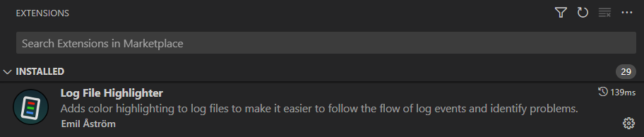

XM Cloud Deploy has a web UI with some great features to start a build and deploy, monitor the progress, and inspect the log files. But it also has some drawbacks. In this blog post, I will describe these drawbacks and show how to improve the workflow.

## XM Cloud Deploy web UI - start the build and deploy

In the web UI of XM Cloud Deploy you can start a build and deploy by selecting the **Build & Deploy** action in the options menu on an environment:


This will start a build and deploy of the code that is in a configured branch in a repository that currently *must* reside in GitHub. The location of this repository can be found under **Edit project details**, but this project can not be changed:


I had issues with this when I initially created my repository on an organization account on GitHub, because the Vercel deployment of an organization repository can only be done with a paid team Vercel account, while a personal GitHub repository can be de3ployed to Vercel on a free tier.

The configuration of the branch that will be used can be configured from the environment **Options** menu under the action **Link environment to another branch**:


## XM Cloud Deploy web UI - progress of the build

For completed or deployments in progress, there is an action view the deployment logs:


This action brings you to a specific deployment, where you can see the details of a deployment in action or a completed deployment:

![Deployment view]At first sight, this all looks pretty cool, bu there are some drawbacks...

## XM Cloud Deploy web UI - drawbacks

I encountered the following drawbacks with this approach:

1. I'm bound to the initially configured GitHub repository, and can't use other repositories like Azure DevOps
2. Code must be committed and pushed to the repository first before executing a build and deploy
3. I have to watch a web UI to see the progress - but the advantage is that I can see the logging in real-time
4. The web-based log viewer is basic, no support for search, not possible to copy the log output text if it is bigger (try it on the **Build** log output - I reported this as a bug), no support for color to see the different pieces of information 

But in their wisdom Sitecore also provides the Sitecore CLI, where all required actions can be done through CLI commands, and can be automated through PowerShell scripts.

This brought me to some simple script automation that I will share in this blog post, and that has some advantages...

## Sitecore CLI for deployment - advantages

Using the Sitecore CLI for deployments has some advantages:

1. Code can reside in any repository, or no repository at all, because we use the code from the filesystem - the Sitecore CLI packages and uploads a snapshot of the filesystem
2. I can execute the build and deployment directly from VS Code, and see the progress in VS Code
3. I can automate the collection of the raw log data, and parse that information in any way that I want to produce log files on the filesystem 
4. I can open the log files from the filesystem in for example VS Code, search through the log file, and use a smart log viewer to colorize the log output

Based on the Sitecore CLI I created some scripts to automate the build and deploy in a single script, and I now have the following workflow.

From a PowerShell terminal in VS Code I start the build and deploy:


In the terminal I see the progress of this deployment, see some details like organization, environment, and deployment id, but also a link that I can click from within VS Code to bring me to the web UI with the progress of the deployment:


So although I start the deployment from the Sitecore CLI using an option to package and upload the code of the project, it is still handled by the XM Cloud Deploy system as if I started it through the web UI.

When the deployment is completed the raw log information is retrieved from the cloud, parsed and transformed, and stored on the filesystem in the folder `deployment-logs`. Information with links to the generated log files is displayed in the terminal, so I can directly open a log file I want to inspect:


The build log is in most cases the most interesting one to inspect.

All log files are generated in the `deployment-logs` with the deployment id in the filename:


And due to the installed extension [Log File Highlighter](https://marketplace.visualstudio.com/items?itemName=emilast.LogFileHighlighter):



 I see a colorized view of the log:

 

With all the support for search that VSA Code provides us.

## Give me the code!

To automate the deployment, and parse and generate the log files I use PowerShell. In the folder `tools` at the root of the project, there are three files.

`tools\buildanddeploy-config.json`, configure with your settings:

```json
{
    "XMCloud_OrganizationName": "macaw",
    "XMCLoud_ProjectName": "AcmeXMCloud",
    "XMCLoud_EnvironmentName": "dev"
}
```

`tools\buildanddeploy.ps1`:

```powershell
# Execute a build and deploy of you project to an XM Cloud environment from the CLI.
# Configuration is done in the file tools\buildanddeploy-config.json.
# Configuration should be in the following format:
# {
#     "XMCloud_OrganizationName": "MyOrganization",
#     "XMCloud_ProjectName": "MyProject",
#     "XMCloud_EnvironmentName": "MyEnvironment"
# }
#
# When the build is completed the raw log file is retrieved and split into separate log files per stage.
# Log files are storted in the folder deployment-logs.
# Author: Serge van den Oever [Macaw]
# Version: 1.0

$VerbosePreference = 'SilentlyContinue' # change to Continue to see verbose output
$DebugPreference = 'SilentlyContinue' # change to Continue to see debug output
$ErrorActionPreference = 'Stop'

Push-Location -Path $PSScriptRoot\..
if (-not (Test-Path -Path .\tools\buildanddeploy-config.json)) {
    Write-Error "File .\tools\buildanddeploy-config.json does not exist"
}
$config = Get-Content -Raw -Path .\tools\buildanddeploy-config.json | ConvertFrom-Json

$organizationName = $config.XMCloud_OrganizationName
$projectName = $config.XMCLoud_ProjectName
$environmentName = $config.XMCLoud_EnvironmentName

Write-Host "Organization: $organizationName"
Write-Host "Project: $projectName"

$projectList = dotnet sitecore cloud project list --json | ConvertFrom-Json
$project = $projectList | Where-Object { $_.name -eq $projectName }
if (-not $project) {
    dotnet sitecore cloud login # maybe not authenticated?
    $projectList = dotnet sitecore cloud project list --json | ConvertFrom-Json
    $project = $projectList | Where-Object { $_.name -eq $projectName }
}
if (-not $project) {
    Write-Error "Project '$projectName' not found in organization '$organizationName'."
}
$projectId = $project.id
Write-Host "Project id: $projectId"

$environmentList = dotnet sitecore cloud environment list --project-id $projectId --json | ConvertFrom-Json
$environment = $environmentList | Where-Object { $_.name -eq $config.XMCloud_EnvironmentName }

if (-not $environment) {
    Write-Error "Environment '$environmentName' not found."
}

$environmentId = $environment.id
Write-Host "Environment id: $environmentId"
Write-Host "Environment host: $($environment.host)"
Write-Host "Environment last updated at: $($environment.lastUpdatedAt)"
Write-Host "Environment last updated by: $($environment.lastUpdatedBy)"
Write-Host "Environment provisioning status: $($environment.provisioningStatus)"

Write-Host "Creating and uploading a deployment package..." -NoNewline
$deployment = dotnet sitecore cloud deployment create --environment-id $environmentId --working-dir . --upload --no-watch --no-start --json | ConvertFrom-Json
if ($deployment.Status -eq "Operation Failed") {
    Write-Host ""
    Write-Error "Creation of deployment failed: $($deployment.Message)"
}
Write-Host " done."
$deploymentId = $deployment.id
Write-Host "Deployment is provisioned and queued. Deployment id: $deploymentId"
Write-Host "See deployment status at https://deploy.sitecorecloud.io/deployment/$deploymentId/details"
$deploymentStart = dotnet sitecore cloud deployment start --deployment-id $deploymentId --no-watch --json | ConvertFrom-Json
Write-Host "Deployment started. Deployment id: $deploymentId"
dotnet sitecore cloud deployment watch --deployment-id $deploymentId
Write-Host "Build and deploy completed."
Write-Host "Retrieving deployment logs..." -NoNewline
dotnet sitecore cloud deployment log --deployment-id $deploymentId --path deployment-logs
$currentLocation = (Get-Location).Path
$logFilePath = "$currentLocation\deployment-logs\Deployment_$($deploymentId)_logs.json"
Write-Host "The raw deployment log can be found at '$logFilePath'"

# Process the deployment log to create sensible information
if (-not (Test-Path -Path "$PSScriptRoot\buildanddeploy-processlog.ps1")) {
    Write-Error "Expected file '$PSScriptRoot\buildanddeploy-processlog.ps1' does not exist."
}
. "$PSScriptRoot\buildanddeploy-processlog.ps1" -deploymentId $deploymentId
Pop-Location
```

`tools\buildanddeploy-processlog.ps1`:

```powershell
# Process a raw deploment log file in the folder deployment-logs to split into separate log files per stage.
# Author: Serge van den Oever [Macaw]
# Version: 1.0
param (
    [Parameter(Mandatory=$true)]$deploymentId
)

$VerbosePreference = 'SilentlyContinue' # change to Continue to see verbose output
$DebugPreference = 'SilentlyContinue' # change to Continue to see debug output
$ErrorActionPreference = 'Stop'

$rawLogfilePath = "$PSScriptRoot\..\deployment-logs\Deployment_$($deploymentId)_logs.json"
if (-not (Test-Path -Path $rawLogfilePath)) {
    Write-Error "Deployment log file with deployment id '$deploymentId' not found at $rawLogfilePath"
}
$rawLogfilePath = Resolve-Path -Path $rawLogfilePath
$rawLogfilePath = $rawLogfilePath.Path
Write-Host "Deployment raw log file path: $rawLogfilePath"
$logData = Get-Content -Raw -Path $rawLogfilePath | ConvertFrom-Json
$stages = $logData.Stage
$logs = $logData.Logs
$stages | ForEach-Object {
    $stageName = $_.Name
    $stageLogs = $logs | Where-Object { $_.Stage -eq $stageName }
    $lines = ''
    $stageLogs | ForEach-Object {
        $logTime = $_.LogTime.SubString(0,19) # only date and time
        $logLevel = $_.LogLevel.ToUpper()
        $logMessage = $_.LogMessage
        $lines += "$logTime $logLevel $logMessage`n"
    }
    $stageLogFilePath = "$PSScriptRoot\..\deployment-logs\Deployment_$($deploymentId)_$($stageName).log"
    Set-Content -Path $stageLogFilePath -Value $lines
    $_  | Add-Member -NotePropertyName LogFile -NotePropertyValue (Resolve-Path -Path $stageLogFilePath).Path
}
$stagesResult = $stages | Format-Table -Property Name, State, LogFile -AutoSize | Out-String -Width 512
$stagesLogFilePath = "$PSScriptRoot\..\deployment-logs\Deployment_$($deploymentId)_StagesOverview.log"
Set-Content -Path $stagesLogFilePath -Value $stagesResult
$stagesLogFilePath = (Resolve-Path -Path $stagesLogFilePath).Path
Write-Host "Deployment stages overview log file path: $stagesLogFilePath"
Write-Host $stagesResult
```

Let me know if you see any improvements for these scripts, for me they do the job.

## Troubleshooting

If you get an error like:

```
C:\p\AcmeXMCloud-latest [main ≡ +6 ~3 -0 !]> .\tools\buildanddeploy.ps1
Organization: macaw
Project: AcmeXMCloud
C:\p\AcmeXMCloud-latest\tools\buildanddeploy.ps1 : Project 'AcmeXMCloud' not found in organization 'macaw'.
```

Do a login using the Sitecore CLI:

```
dotnet sitecore cloud login
```

And approve in the opened browser window. I also updated the scripts above to do this automatically where possible.