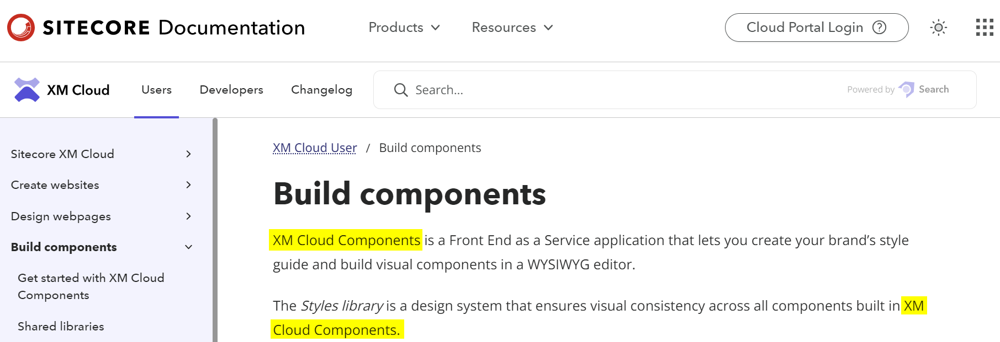
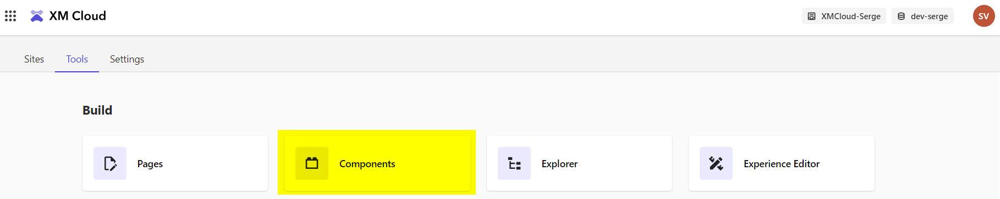

Sitecore maintains a change log of all changes to the XM Cloud SaaS solution. This changelog can be found at https://developers.sitecore.com/changelog. An interesting change, tagged as "improvement" was [Improved interface, functionality and flows in Sitecore Components](https://developers.sitecore.com/changelog/xm-cloud/improved-interface-functionality-and-flows-in-sitecore-components).

## An (AI generated) summary

**Summary of the New Sitecore Components Release (Early Access)**

1. **Enhancements & Features:**
    - Significant UI improvements.
    - Support for external React components.
    - Improved component creation with a new grid and right-hand menu.

2. **Updates Required for Latest Features:**
    - Update to @sitecore-feaas/clientside 0.3.6 or later.
    - Update to @sitecore-jss/* 21.2.0 or later.
    - Developers should manually update changes from the starter foundation.

3. **Release Highlights:**
    - Configurable responsive grid layout in the component canvas for flexibility in component design.
    - Enhanced Component builder UI and functionalities.
    - Right-hand bar for comprehensive Component configurations.
    - Introduction of a new data picker, item picker, and a Settings tab. The Settings tab offers:
        - Library naming and sharing capabilities.
        - Registration and configuration of external React components.
        - Integration with Content Hub ONE using API key.

4. **Detailed Features:**
    - **Component Builder:**
        - Set background images.
        - Nest inline elements (like buttons) in text.
        - Add spacers that utilize all available space.
        - Support for data mapping within text elements.
        - Extended code embedding dialog for React components, TypeScript support, and data fetching.
    - **Right-hand Bar:**
        - Overview screen with relevant links and version alerts.
        - Manage element configurations, including design and layout aspects.
        - Component data-fetching in runtime.
        - Enhanced data picker and integration with XM Cloud.
        - Components fetch 3rd party data automatically.
        - Configure data source specifics such as URL, HTTP methods, and more.
        - Data item picker for precise selection and configuration.
    - **Integration with Content Hub ONE:**
        - Automatic data source recognition upon API key configuration.
    - **React Component Features:**
        - Register any React component with the SDK.
        - Include schema configurations visible to content authors.
    - **Other UI Updates:**
        - New icons.
        - Simplified context toolbar.
        - Grid enablement for sections.
        - Refined interface for component use in Pages.
        - Uniform configuration tools for all elements.

This new release brings a plethora of improvements and new functionalities for developers and users of Sitecore Components.

## Some personal thoughts

If we disect this improvement there are some interesting things to notice:

### Sitecore Components

The "product" is called **Sitecore Components** a few times in the text. In documentation it was always named **XM Cloud Components**:

Is is true that the FrontEnd as a Service components created with the Components builder can be used from both XM Cloud pages, as well as any other web page built with HTML. The components can either be consumed as Web Components, or the React wrapper component can be used. Is this a change in direction, to positions the product as Sitecore Components?

On the other hand: **Components** is in the UI still one of the tools in the XM Cloud start screen under **Tools**:

### The use of external React components

I did not try this out yet, but this will bring a big improvement: the use of external React components. If we can bring our own components, a way more powerful user experience can be created with more interactive components, instead of the simplistic components we could build before! For more information see the documentation [Walkthrough: Registering an external React component](https://doc.sitecore.com/xmc/en/developers/xm-cloud/walkthrough--registering-an-external-react-component.html). More on this in a later post, when I have time to delve into this new feature.

### Better responsive grid layout

Another important improvement is "New configurable, responsive grid layout in the component canvas for drawing, resizing, and rearranging containers within a component.". I must say this is a big improvement, I never understood the sizing and placement of elements in the component, until now...

### Runtime data fetching

Components can now fetch their own data on runtime in Pages. You finally see changes made in your content reflected in the rendering of the components.

### New data picker

The created components are as powerful as the data that can be bound to it. Besides straight databinding to fields in the Data Source results, it is also possible to use a JSONPath in expert mode. If you select the (i) information icon you are led to the page https://www.npmjs.com/package/jsonpath-plus, with the type of JSONPath queries that can be executed.

## Conclusion

It looks like Sitecore Components is getting grown up. And this is an important next step for Sitecore to stay relevant in the fast growing space of WYSIWYG tooling to build components and websites like https://builder.io, https://www.plasmic.app/, and many more. And for me personally it now finally becomes relevant to dive deeper into what Sitecore Components can bring to the table. So watch out for more Components posts!