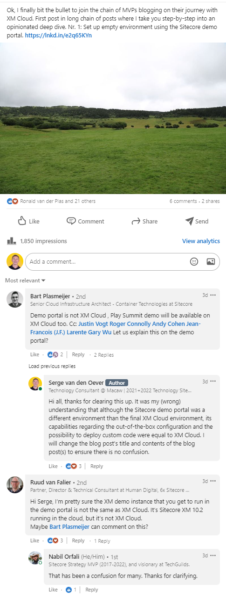

## Nota bene

This post was originally called **XM Cloud series - Part 1 - create an empty environment from scratch with the demo portal**, until it became clear to me that the Sitecore demo portal is **NOT** XM Cloud, but a way to quickly set up a vanilla Sitecore 10.2 CM environment, connected to Experience Edge for content delivery.

The contents of the original post can be found at [Sitecore demo portal series - Part 1 - create an empty environment from scratch with the demo portal](https://www.sergevandenoever.nl/Sitecore_demo_portal_empty_environment/), now rewritten to the fact that the Sitecore demo portal uses vanilla Sitecore XM 10.2.

If you want to see the process how it is actually going to work with XM Cloud, I would like to point you to the following resources:

[Sitecore XM Cloud – Provisioning first website](https://timmarsh.co.uk/2022/08/17/sitecore-xm-cloud-provisioning-first-website/)
[Setup your first Headless SXA Site in XM Cloud](https://www.youtube.com/watch?v=zot3G52F2ts)

