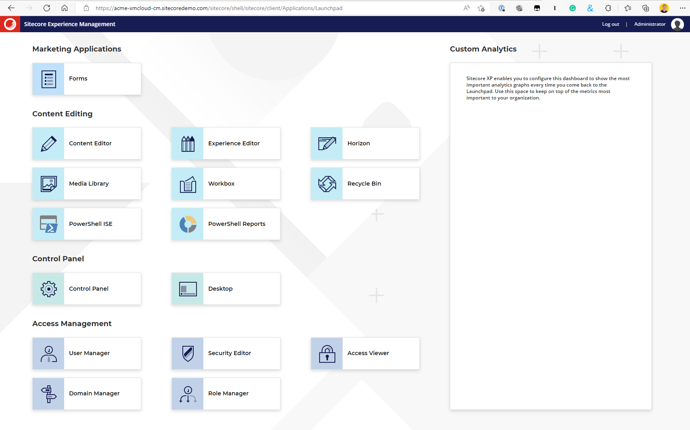

XM Cloud is finally at the fingertips of partners and Sitecore MVPs through the access that was provided to us to the [Sitecore demo portal](https://portal.sitecoredemo.com/). Many blog posts have been written to show the first steps with the demo portal, and how to create a demo site based on the **Play! Summit** and **Play! Shop** demo templates:


In this post, I will start with the empty template that consists of XM Cloud and Edge. This means that manual steps are required to:
- create the Sitecore headless site through the Sitecore Content Editor
- the "head" website based on [Next.js](https://nextjs.org/) through the Sitecore CLI
These manual steps will be described in additional blog posts in this XM Cloud series.

Note that the Sitecore demo portal is available for quickly getting demos up and running, so this will not be the experience you will get when building real XM Cloud solutions for customers.

## Getting XM Cloud up and running

The first step is to select the **Product (XM + Edge)** template as the demo template. This demo template will Install both XM Cloud for content management, and Experience Edge for content delivery.

Let's go through the steps:


If we press the **Customize** button, a description can be given to the demo site instance:


As in the other demo templates, we get some possible integrations. In this case this is only GitHub and Content Hub, while in the other demos there are other integrations available as well, depending on the selected demo.

Note that these integrations are for demo purposes as well. For this case I will use the GitHub integration, but normally in projects for customers we use Azure DevOps for managing our Git repositories. Using GitHub is convenient in this case because we will use Vercel for the deployment of the "head" website, and Vercel has a great developer experience (DX) when the source code is hosted on GitHub.

When we select the GitHub integration it shows that the integration is INCOMPLETE:


We need to press the **Configure** button to establish a connection to GitHub:


Note that a selected integration can be removed by selecting the three dots:


When we press the **Add connection** button, we are redirected to GitHub to authorize Sitecore to my repositories:


Although Sitecore is my best friend, I prefer to only authorize Sitecore to only selected repositories:


Because I want this project to use a new repository, I head over to GitHub to create a new empty repository for the ACME XM Cloud project to land on:


On returning to the GitHub repository selection screen I'm happy suprised that it directly finds the newly created repository:


After pressing the **Install & Authorize** button I get a fancy two-factor authentication screen to open my GitHub mobile app to enter the displayed numbers. Your experience might differ, depending on how you configured your authentication on GitHub:


After all these steps we can continue in the Sitecore demo portal to select the GitHub connection, where my account is now visible:


And on pressing the **Next** button I can select the repository and branch to use:


The GitHub connection is now configured, and we can continue to the next step where a time can be selected that the running instance will automatically shut down:


A handy feature for a demo portal, and this will save Sitecore a lot of money!

At the end a nice overview screen is presented and the deployment can start!


An impressive overview screen is presented to see all configurations and the status of the deploy:


On selection of the **View Details** button at the top right, a details screen with the executing steps is shown:


Also note that every step can be selected for further details:


Most steps have nothing to show, but the **Deploy Sitecore XM to Kubernetes Cluster** reveals that the Sitecore CLI is used for some of the steps. The following cli commands are executed:

```bash
dotnet sitecore login --client-credentials true --auth https://acme-xmcloud-id.sitecoredemo.com --cm https://acme-xmcloud-cm.sitecoredemo.com --allow-write true --client-id "Demo_Automation" --client-secret "xxxx" -t
dotnet sitecore index schema-populate
dotnet sitecore index schema-populate (yes twice)
dotnet sitecore publish
dotnet sitecore index rebuild
```

When the deployment is completed a nice email is sent with further information:


## So what do we have now

We now have a vanilla Sitecore XM 10.2 Content Management (CM) server in the cloud running on a Kubernetes cluster managed by Sitecore. It is Sitecore's promise that it will automatically install updates and patches on this server when they become available. So no more migrations, it almost sounds like SaaS!

If we log in on XM Cloud, we get the well known 10.2 UI:



It still shows the message that *Sitecore XP enables you to configure this dashboard to show the most important analytics graphs every time you come back to the Launchpad. Use this space to keep on top of the metrics most important to your organization.* :-)

We can also see that the Horizon editor is available.

Next to this, the following modules are installed:
- SXA Headless
- Headless services
- Experience Edge Connector

We will use these modules in the following blog posts to set up a Sitecore site, and to build the "head" website using Next.js.