XM Cloud comes with headless SXA, and supports the good old JSS way of building components. In this post I do the simplest thing to create a new component by copying the out-of-the-box `RichText` component, name it `SergeText`, and export two variants from the `SergeText.tsx` file: `Default` and `MoreSerge`. Why two variants? Sitecore JSS does not have the concept of rendering variants, but Headless SXA does. And I will show you in this post how to enable this functionality.

But first the code for my component with the two variants:

```typescript
import React from "react";
import { Field, RichText as JssRichText } from "@sitecore-jss/sitecore-jss-nextjs";

interface Fields {
  Text: Field<string>;
}

export type SergeTextProps = {
  params: { [key: string]: string };
  fields: Fields;
};

export const Default = (props: SergeTextProps): JSX.Element => {
  const text = props.fields ? (
    <span>
      SERGE: <JssRichText field={props.fields.Text} />
    </span>
  ) : (
    <span className="is-empty-hint">Rich text</span>
  );
  const id = props.params.RenderingIdentifier;

  return (
    <div className={`component rich-text ${props.params.styles.trimEnd()}`} id={id ? id : undefined}>
      <div className="component-content">
        SERGE: <span>{text}</span>
      </div>
    </div>
  );
};

export const MoreSerge = (props: SergeTextProps): JSX.Element => {
  const text = props.fields ? (
    <span>
      MORE SERGE: <JssRichText field={props.fields.Text} />
    </span>
  ) : (
    <span className="is-empty-hint">Rich text</span>
  );
  const id = props.params.RenderingIdentifier;

  return (
    <div className={`component rich-text ${props.params.styles.trimEnd()}`} id={id ? id : undefined}>
      <div className="component-content">
        MORE SERGE: <span>{text}</span>
      </div>
    </div>
  );
};
```

## Formatting and Prettier

First issue that I encountered was that when I do a build, it return [Prettier](https://prettier.io/) errors. Prettier is an opinionated code formatter, so I installed the Visual Studio code [Prettier - Code formatter](https://marketplace.visualstudio.com/items?itemName=esbenp.prettier-vscode) and used the `Format Document` (Shift+Alt+F) command to do the formatting for me.

An pointed out by [Justin Vogt](https://www.linkedin.com/in/justinvogt/) on [Sitecore Slack](https://sitecorechat.slack.com/archives/C03NXTAPKE3/p1668698399241099) you can change the Prettier settings in `src/sxastarter/.prettierrc`:

```json
{
  "endOfLine": "crlf",
  "semi": true,
  "singleQuote": true,
  "tabWidth": 2,
  "trailingComma": "es5",
  "printWidth": 100
}
```

I personally prefer a wider `printWidth` because I always work on wide monitors (160 for example), and `singleQuote` set to `false`, because the single quote ' and the back-tick for template string \` are too similar for me. But **DON'T** change this setting, because there are scripts that generate files in the `temp` folder (like `temp/componentFactory.ts`), and these scripts are generated with single quotes.

If you change settings in `src/sxastarter/.prettierrc` you might need to reformat all your code or you could get a lint errors because the linter `ESLint` uses the `prettier` plugin to validate the code.

If you dare you can add the following line to you `package.json` scripts section and run `npm run prettier` to reformat all code files:

```json
"prettier": "prettier --write ./src/**/*.tsx ./src/**/*.ts ./scripts/**/*.ts"
```

## Linting and ESLint

The other thing that Justin pointed out was linting. The lint command executed in an XM Cloud build is specified by the `lintCommand` in `xmcloud.build.json`:

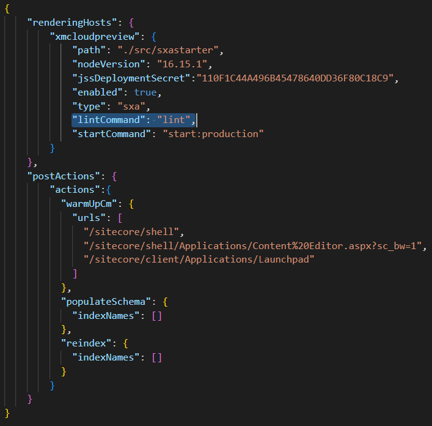

the `lintCommand` maps to an npm script defined in the `package.json` file in the folder `./src/sxastarter` as defined in the `path` setting (`renderingHosts.xmcloudpreview.path`) in `xmcloud.build.json`:

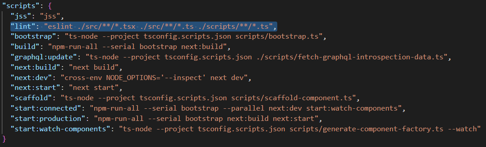

Justin pointed out that linting can be disabled by blanking the `lintCommand`, but I strongly suggest not to do this - code quality is an important thing in a project. Just run `npm run lint` in the folder `./src/sxastarter` (or your own named folder for the code of the "head") before committing your code, so you are sure you will not get lint errors during the XM Cloud build. Note that `npm run build` executes the linting as well.

I do a lot of front-end development in the React space, so for me this is all like sliced bread, but with people comming from the Visual Studio/C#/Microsoft space I often see fear and terror in their eyes:-) Just get used to it... It is just like NuGet packages and opening up `.csproj` files... 

## Back to the build again

When I do a build again, I get the error `Invalid GraphQL endpoint '/sitecore/api/graph/edge'. Verify that 'layoutServiceHost' property in 'scjssconfig.json' file or appropriate environment variable is set`.

We did never run a `jss setup`, but can use values in the `.env` file of our frontend project (probably in the location `src/sxastarter/.env`) to make the build work. We need to set two values:

- `SITECORE_API_KEY`
- `SITECORE_API_HOST`

But how do we know these values?

First the `SITECORE_API_KEY`. Open the Content Editor and navigate to `/sitecore/system/Settings/Services/API Keys/xmcloudpreview`. Copy (under **Quick Info**) the **Item ID** (a GUID), and use this GUID value for `SITECORE_API_KEY`.

Next `SITECORE_API_HOST`. Take the base URL of you Content Editor, e.g. https://xmc-macaw-macawxmcloud-dev.sitecorecloud.io/.

Now execute the following steps:

1. Rerun the build, which should succeed now
2. Commit the code changes to GitHub
3. Head over to https://deploy.sitecorecloud.io/ (or select **Manage my projects** under **Quick actions** on the homepage of https://portal.sitecorecloud.io/)
4. Select your project
5. Under **Options** start a **Build & Deploy**

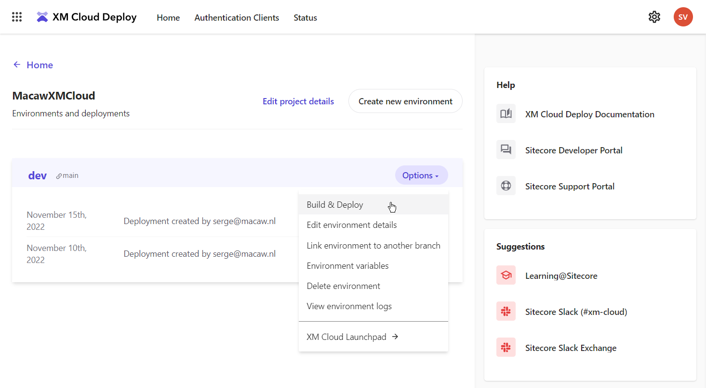

Note that this deploy does a complete rebuild and deploy of the XM Cloud container and Visual Studio solution. It takes almost 12 minutes, a bit long to test out a simple component:

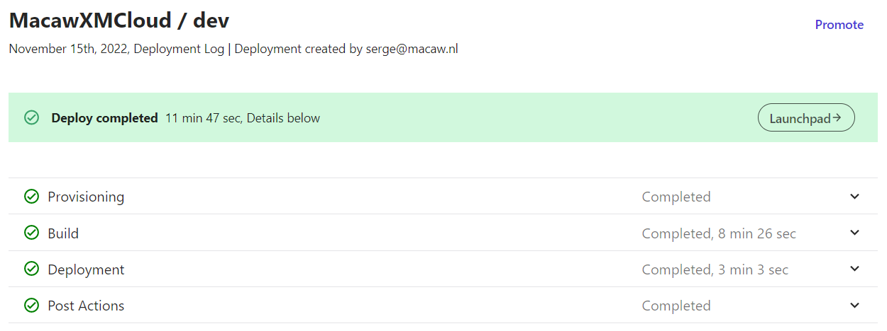

---
Fun fact... the deployment output:

```
Winter is coming...
Environment '54TqsuxtRFia7wWYQzQKjc' starting for deployment 'HwXxg5nZvM4onkVvfvyqc'.
Waking up the minions.
Deployment 'HwXxg5nZvM4onkVvfvyqc' completed successfully for environment 'dev'.
```

Minions... wasn't that a Commerce thing?!

---

## Create the rendering in XM Cloud

Next step is to create a new rendering in the Content Editor, and set the **Component Name** to the name of the component file, e.g. `SergeText`:

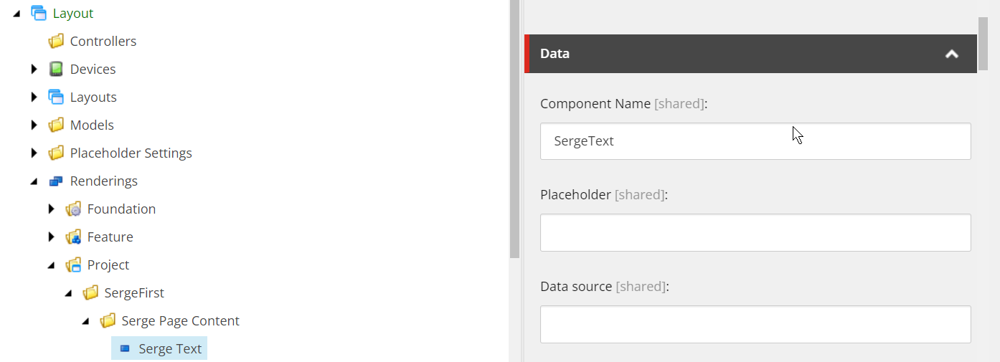

If we look at the `Rich Text` rendering we can see that there are some additional values to be set:

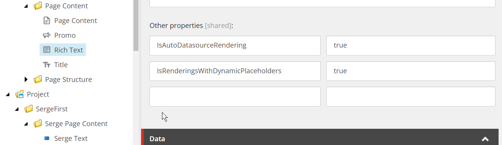

The `isAutoDataSourceRendering` enables that a data source is automatically created after adding that rendering to a page.

The `isRenderingsWithDynamicPlaceholders` is completely undocumented in the Sitecore documentation, and does not return any results on Google. 

And the **Parameters Template** and **Open Properties after Add**:

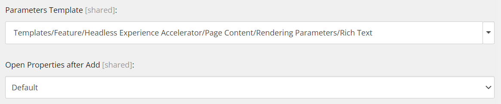

And the **Datasource Location** and **Datasource Template**:

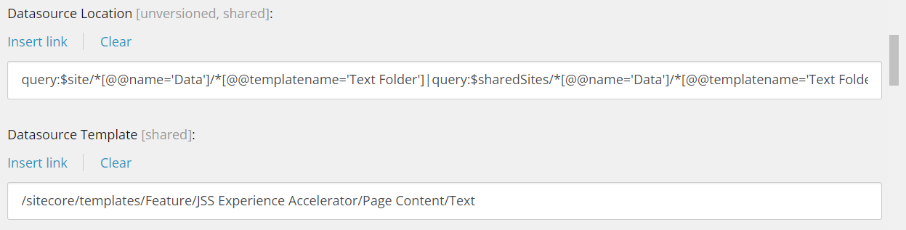

And as a bonus make it compatible with the `Rich Text` rendering:

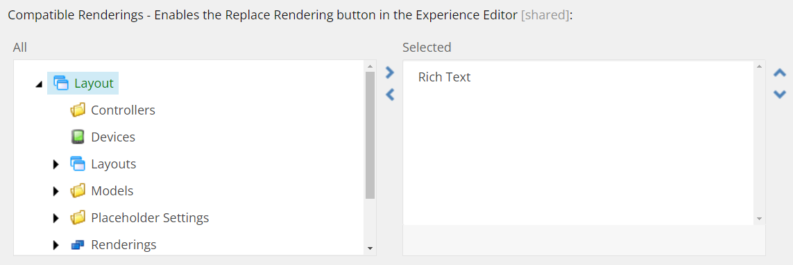

This not-so-simple registration of the rendering makes the rendering appear in the **Components** toolbox:

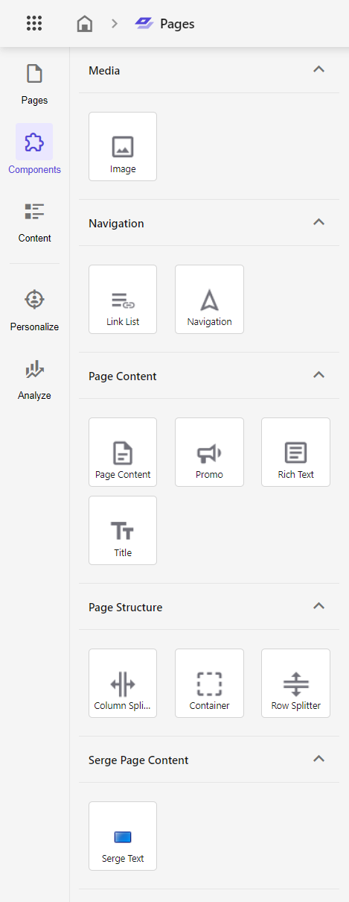

## Trouble

But when I dragged the component on the `Home` page... boom!

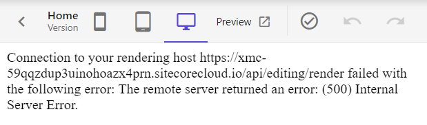

Interesting observation: XM Cloud has a built-in rendering host! I asked the Sitecore team and they explained that the built-in rendering host works for JSS based websites, and uses Node.js to provide the rendering host.

If you go to your project in XM Cloud Deploy, and under settings you have **Experimental Features** > **Environmental Details** enabled, you can see the details of the rendering hosts:

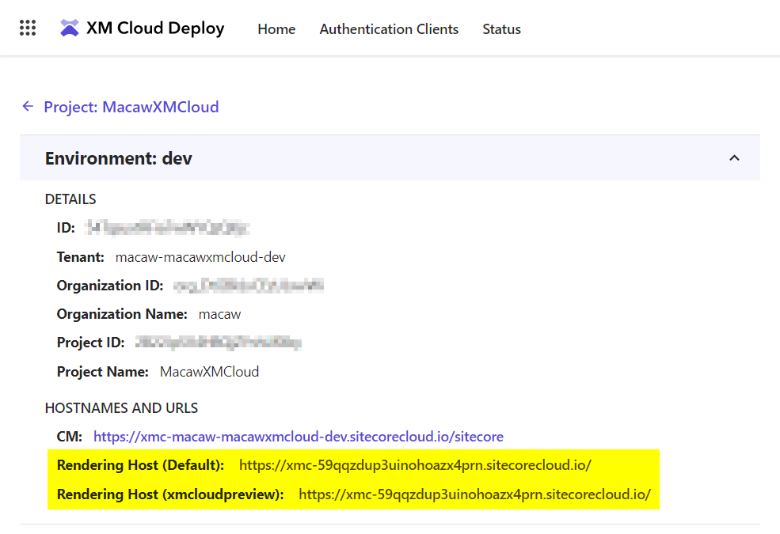


But what went wrong... my component wasn't that hard, and was actually a copy of the `Rich Text` component...

If you head over to you project, and under options select **View environment logs**, you get a nice overview of all Sitecore log files, including a log file `RenderingHost.xmcloudpreview.log`:

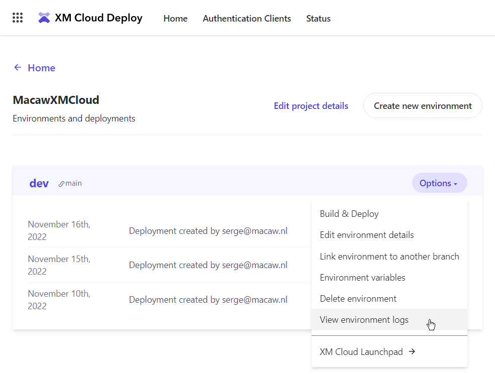

So we now know that Pages uses the rendering host configuration `xmcloudpreview`, which we can look up in the Content Editor under the item path `/sitecore/system/Settings/Services/Rendering Hosts/xmcloudpreview`:

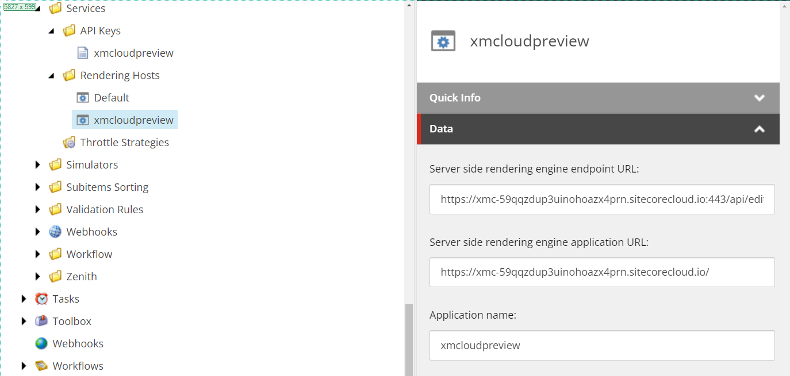

But what does the log file says? It has some interesting output about the Next.js service being bootstrapped and built:

```
> sxastarter@21.0.0 start:production
> npm-run-all --serial bootstrap next:build next:start
> sxastarter@21.0.0 bootstrap
> ts-node --project tsconfig.scripts.json scripts/bootstrap.ts
Writing runtime config to /app/src/temp/config.js
Registering JSS component CdpPageView
Registering JSS component ColumnSplitter
Registering JSS component Container
Registering JSS component ContentBlock
Registering JSS component Image
Registering JSS component LinkList
Registering JSS component Navigation
Registering JSS component PageContent
Registering JSS component PartialDesignDynamicPlaceholder
Registering JSS component Promo
Registering JSS component RichText
Registering JSS component RowSplitter
Registering JSS component SergeText
Registering JSS component Title
Writing component factory to /app/src/temp/componentFactory.ts
Registering sitemap-fetcher plugin graphql-sitemap-service
Writing sitemap-fetcher plugins to /app/src/temp/sitemap-fetcher-plugins.ts
Registering middleware plugin personalize
Registering middleware plugin redirects
Writing middleware plugins to /app/src/temp/middleware-plugins.ts
Registering page-props-factory plugin component-props
Registering page-props-factory plugin error-pages
Registering page-props-factory plugin normal-mode
Registering page-props-factory plugin personalize
Registering page-props-factory plugin preview-mode
Writing page-props-factory plugins to /app/src/temp/page-props-factory-plugins.ts
Registering next-config plugin graphql
Registering next-config plugin robots
Registering next-config plugin sass
Registering next-config plugin sitemap
Writing next-config plugins to /app/src/temp/next-config-plugins.js
> sxastarter@21.0.0 next:build
> next build
info  - Loaded env from /app/.env
Attention: Next.js now collects completely anonymous telemetry regarding usage.
This information is used to shape Next.js' roadmap and prioritize features.
You can learn more, including how to opt-out if you'd not like to participate in this anonymous program, by visiting the following URL:
https://nextjs.org/telemetry
info  - Linting and checking validity of types...
info  - Creating an optimized production build...
info  - Compiled successfully
info  - Collecting page data...
info  - Generating static pages (0/2)
info  - Generating static pages (2/2)
info  - Finalizing page optimization...
Route (pages)                              Size     First Load JS
┌   /_app                                  0 B             104 kB
├ ● /[[...path]]                           78.6 kB         183 kB
├ ○ /404                                   428 B           105 kB
├ λ /api/editing/data/[key]                0 B             104 kB
├ λ /api/editing/render                    0 B             104 kB
├ λ /api/healthz                           0 B             104 kB
├ λ /api/robots                            0 B             104 kB
└ λ /api/sitemap                           0 B             104 kB
+ First Load JS shared by all              145 kB
  ├ chunks/framework-4d78cf2ac5283a04.js   66.4 kB
  ├ chunks/main-841c7cc3df303507.js        35.8 kB
  ├ chunks/pages/_app-7e176b706e459b13.js  1.35 kB
  ├ chunks/webpack-cf2f34d48a1cd57d.js     928 B
  └ css/f38d1ec96fc8e22c.css               40.7 kB
ƒ Middleware                               103 kB
λ  (Server)  server-side renders at runtime (uses getInitialProps or getServerSideProps)
○  (Static)  automatically rendered as static HTML (uses no initial props)
●  (SSG)     automatically generated as static HTML + JSON (uses getStaticProps)
> sxastarter@21.0.0 next:start
> next start
ready - started server on 0.0.0.0:3000, url: http://localhost:3000
info  - Loaded env from /app/.env
TypeError: Cannot read properties of undefined (reading 'trimEnd')
    at SergeText_Default (/app/.next-container/server/pages/[[...path]].js:929:63)
    at Wc (/app/node_modules/react-dom/cjs/react-dom-server.browser.production.min.js:68:44)
    at Zc (/app/node_modules/react-dom/cjs/react-dom-server.browser.production.min.js:70:253)
    at Z (/app/node_modules/react-dom/cjs/react-dom-server.browser.production.min.js:76:89)
    at $c (/app/node_modules/react-dom/cjs/react-dom-server.browser.production.min.js:78:98)
    at bd (/app/node_modules/react-dom/cjs/react-dom-server.browser.production.min.js:77:404)
    at Z (/app/node_modules/react-dom/cjs/react-dom-server.browser.production.min.js:76:217)
    at Xc (/app/node_modules/react-dom/cjs/react-dom-server.browser.production.min.js:68:409)
    at Zc (/app/node_modules/react-dom/cjs/react-dom-server.browser.production.min.js:70:210)
    at Z (/app/node_modules/react-dom/cjs/react-dom-server.browser.production.min.js:76:89)
TypeError: Cannot read properties of undefined (reading 'trimEnd')
    at SergeText_Default (/app/.next-container/server/pages/[[...path]].js:929:63)
    at Wc (/app/node_modules/react-dom/cjs/react-dom-server.browser.production.min.js:68:44)
    at Zc (/app/node_modules/react-dom/cjs/react-dom-server.browser.production.min.js:70:253)
    at Z (/app/node_modules/react-dom/cjs/react-dom-server.browser.production.min.js:76:89)
    at $c (/app/node_modules/react-dom/cjs/react-dom-server.browser.production.min.js:78:98)
    at bd (/app/node_modules/react-dom/cjs/react-dom-server.browser.production.min.js:77:404)
    at Z (/app/node_modules/react-dom/cjs/react-dom-server.browser.production.min.js:76:217)
    at Xc (/app/node_modules/react-dom/cjs/react-dom-server.browser.production.min.js:68:409)
    at Zc (/app/node_modules/react-dom/cjs/react-dom-server.browser.production.min.js:70:210)
    at Z (/app/node_modules/react-dom/cjs/react-dom-server.browser.production.min.js:76:89)
Error: Request failed with status code 500
```

In short: `TypeError: Cannot read properties of undefined (reading 'trimEnd') at SergeText_Default`

## Solving the trouble

My `Default` variant component in `SergeText.tsx` does contain indeed a trimEnd() function (copied from `RichText.tsx`) which isn't programmed very defensive:

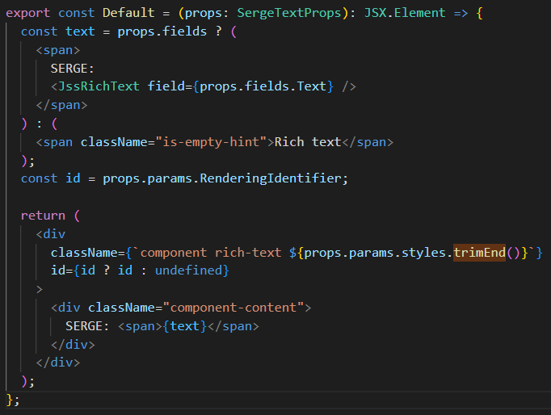

A better (defensive) way would be:

```typescript
<div
   className={`component rich-text ${props?.params?.styles?.trimEnd()}`}
      id={id ? id : undefined}
>
```

After a rebuild the `Home` page now works correctly, and shows the Serge Text field:

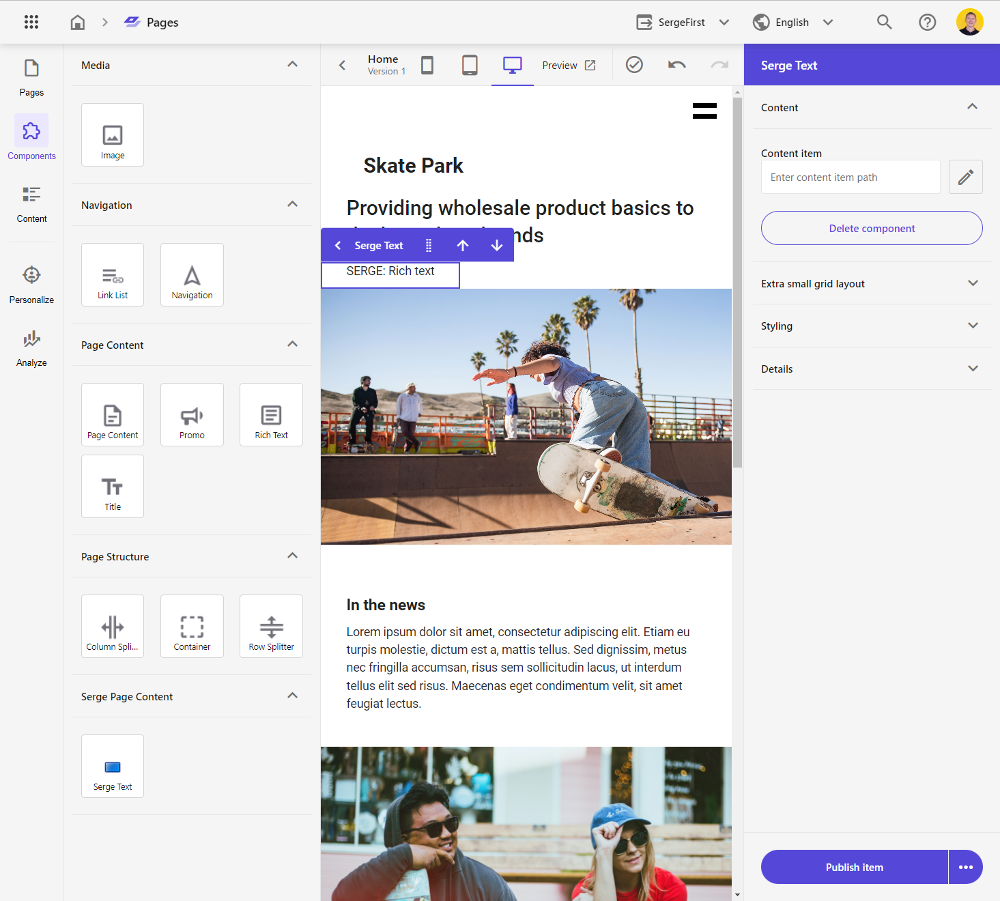

Strange thing is that if I remove the component and drag it on the page again, I don't get the same experience as the `Rich Text` component where a datasource is automatically created (like we configured on `Serge Text` as well), but I'm presented with an "Assign content item" popup with the locations where I can create the datasource:

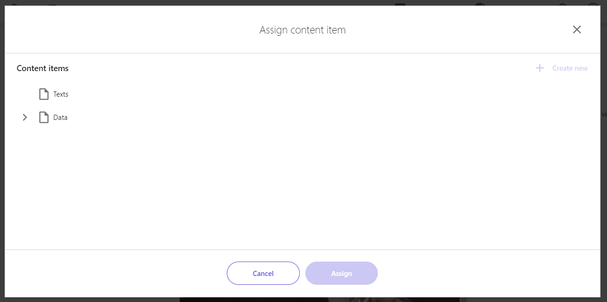

And when I select `Data` (this is the `Data` folder under the page I'm editing):

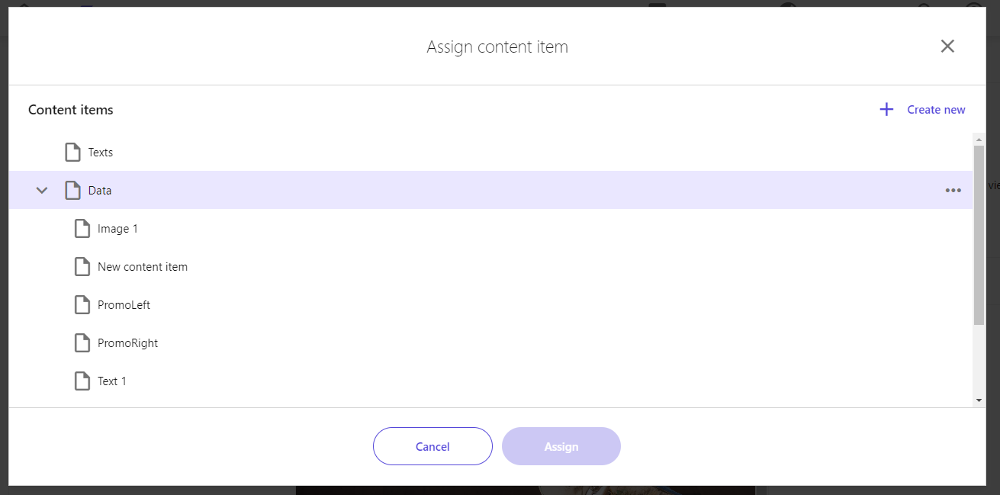

I can then select **+ Create new**:

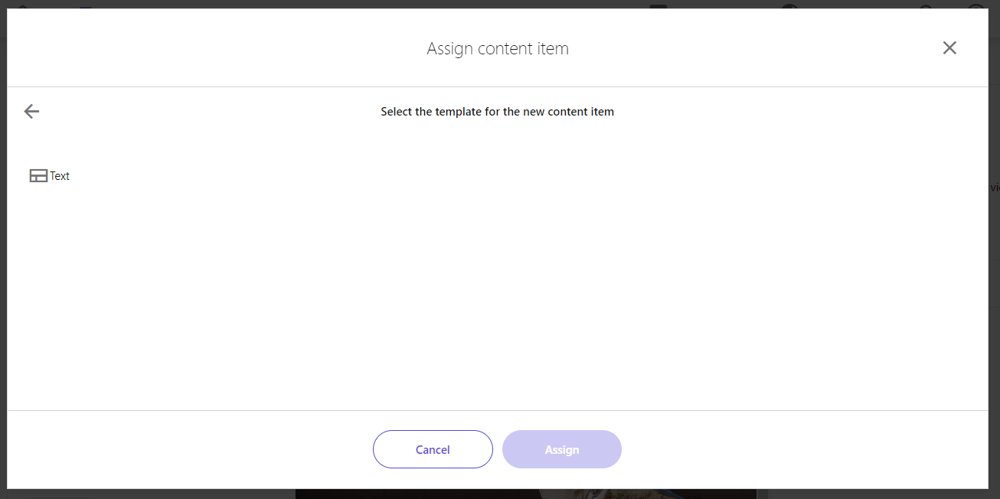

Select the `Text` template:

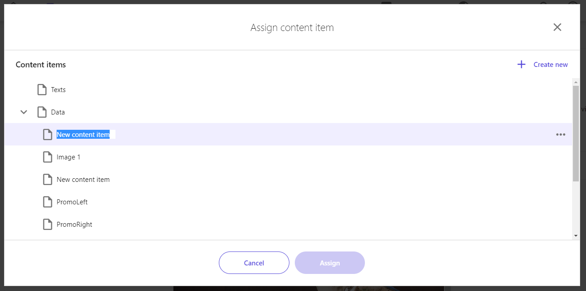

And give it a name.

And now I can finally edit my text in Pages:

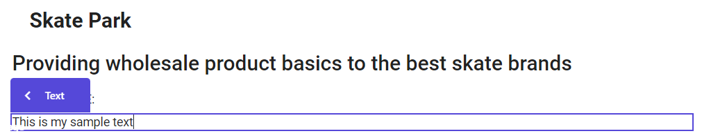

## Clone a rendering

A completely different approach is to clone a rendering by right-click on `Rich Text`, select **Scripts** > **Clone Rendering**


And then move the created rendering to the right location. 

## Rendering variants

But what about the rendering variants? Now Headless SXA kicks in...

Under your scaffolded SXA site under `Presentation` add an **Available Renderings** item, with the name `Serge Page Content` (same name as used under `/sitecore/layout/Renderings/Project/SergeFirst`), and add the `Serge Text` rendering to the renderings:

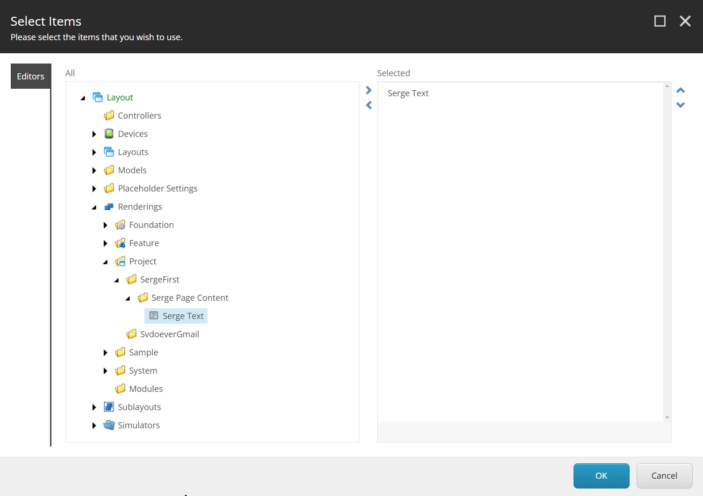

And create a `Serge Text` variant under `Headless Variants` with two variant definitions: `Default` and `MoreSerge`, as defined as exports in the `SergeText.tsx` components file.

And now under **Advanced Styling** you can select the rendering variants:

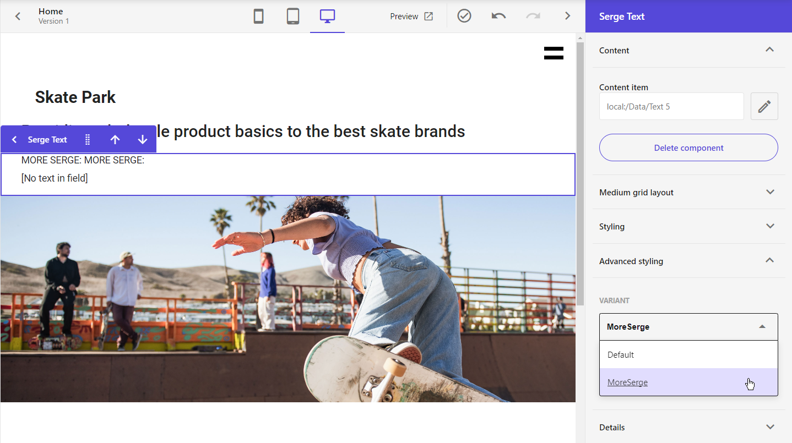

If I specify that `Serge Text` rendering is compatible with `Rich Text` rendering, I don't see any option in Pages to replace the `Serge Text` rendering with the `Rich Text` variant, while there does appear a button to replace the rendering with a compatible rendering in the good old Experience Editor:

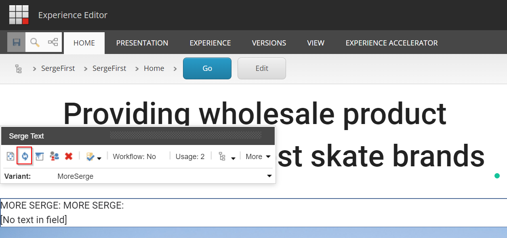

## Conclusion

So far my adventures in creating my own component, create a rendering, and extend the rendering using SXA to support rwendering variants.

We also investigated how to debug your issues by using the log files.

And finally we came to the conclusion that cloning a rendering is way simpler than configuring a rendering from scratch. 


