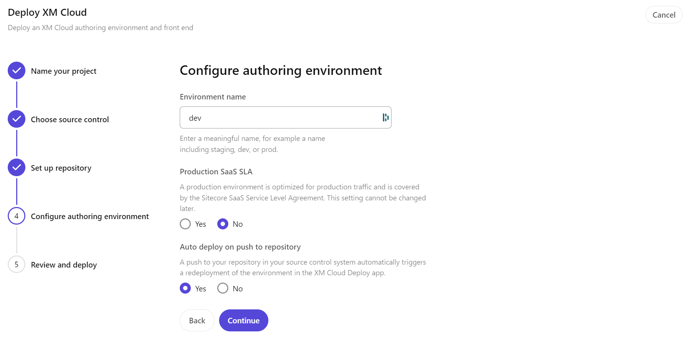

In the past, when working with XM Cloud, I used a single environment with scripts for deployment of code from a repository not connected to the XM Cloud project. In this blog post I will describe the deployment of a brand new project on XM Cloud. This involves setting up the project, environment(s), integration with GitHub, and configuring the deployment settings. A good opportunity to look at the Sitecore intended way of using an XM Cloud project, and to see what is new/changed in the way Sitecore manages projects and its environments.

## Getting started

Project and environment deployment is done with XM Cloud Deploy. To access XM Cloud Deploy, go to you Sitecore Portal at https://portal.sitecorecloud.io/, and on the quick links select **XM Cloud Deploy**:

Within **XM Cloud Deploy** a new project can be created, if you have still room for new projects in your organization. At macaw we can have two projects, and each project can have two non-pro and one prod environment. The relationship between project and environment is as follows:

Source: [XM Cloud Introduction](https://developers.sitecore.com/learn/getting-started/xm-cloud-introduction)

## Creating the project

Under **Projects** there is the possibility to create a new project:

A project has a name:

And a project can be connected to a source control system. For now this is GitHub or Azure DevOps. In this walk-through, we will be using GitHub as our source control system:

### Single repository - multiple environments

In previous blog posts I showed how to use each environment within a project as a stand-alone development environment. This allowed the use of 6 different environments to test out XM Cloud. In that case a project should not be connected to source control, because each environment used its own repository. That also mend that it was not easily possible to use the built-in mechanisms to promote a project though dev > QA -> Prod environments. I a real setup we should do it the "Sitecore way", so that is why I will connect the project properly to source control.

If you want to read more on how to "abuse" XM Cloud to utilize each environment "stand-alone", have a look at the blog post:

[XM Cloud build and deploy like a pro](https://www.sergevandenoever.nl/XM_Cloud_build_and_deploy_like_a_pro/)

I created a set of Sitecore CLI based PowerShell scripts to support this scenario in the best possible way. Those scripts are available at the following GitHub repository:

https://github.com/svdoever/xmcloud-dev-tools

## Connecting to GitHub source control

The XM Cloud deployment wizard guides us through the creation of a new repository, or using an existing repository. As we do a complete "from scratch" deployment of a new project, we will base it on the existing XM Cloud template.

On **Continue** I initially got an error. I had to redo the **Connect to a new account**, because the Sitecore integration with GitHub "Sitecore Deploy Prod" needs access to "All repositories". It should be able to create a new repository.

When the integration is set up correctly the following screen is shown:

I now could go back to the **Set up repository** screen, and the action succeeded.

### Personal GitHub - Personal Vercel

As you can see above I did use my personal GitHub account, and not an Organization GitHub account. The reason? If I use an Organization GitHub account I **MUST** connect it to a paid Vercel Team account for hosting the front-end (more on that later). In a real project this will probably always be the case, but as a blog post writer I want to experiment, so that is why my https://github.com/svdoever account is used.

## Configuring the authoring environment

Next the following screen is presented:

In this screen we can configure the first environment within the **sergedemo** project. As examples names line **staging**, **dev** or **prod** are given. Lets start with a **dev** environment.

Because it is not a production environment, no "Production SaaS SLA" is needed. I did however enable "Auto deploy on push to repository" to see how this works out, so every push to source control will trigger a redeploy of the environment.

An overview screen is given of the choices made, and we can start the deployment:

The whole process is automated, and it will go through all required steps:

## The deployment

Of every step of the deployment a details view is available, so you can see what is actually happening:

The total initial deployment took 5 min 38 sec. Given the fact that **Deployment** and **Post action** both took over 4 min, deployment actions could be executed in parallel:

Also a **Promote** button became available, but because we did not configure additional environments, it is currently not possible to promote the solution. It is not possible to promote to itself:

Under **Deployments** we can see the deployment of the **dev** environment of the **sergedemo** project:

### What happend in deployment

The XM Cloud documentation give in their section [Deploy a project and environment | Sitecore Documentation](https://doc.sitecore.com/xmc/en/developers/xm-cloud/deploy-a-project-and-environment.html) an overview of what happens during deployment (in bold):

- **Creates a new repository in the connected source control account and copies the source code from the XM Cloud foundation template to the new repository.**
  A new GitHub/DevOps repository is generated from the template repository [sitecorelabs/xmcloud-foundation-head (github.com)](https://github.com/sitecorelabs/xmcloud-foundation-head). This repository will serve as the base for your project, containing all necessary configurations and code for your XM Cloud environment. It contains both the Docker configuration to run an XM Cloud compatible setup of Sitecore XM (including Sitecore XM, SOLR, and SQL Server and [Traefik, The Cloud Native Application Proxy | Traefik Labs](https://traefik.io/traefik/)) and the Headless SXA based front-end application in `src/sxastarter`.
- **Provisions the infrastructure and SaaS tenants to host the Content Management (CM) instance in the environment you defined.**
  This is the power of XM Cloud, a complete SaaS platform is spinned-up (probably as multiple servers in a kubernetes cluster) per instantiated environment. Sounds like a costly and complex to manage environment, that is managed by the Sitecore XM Cloud team.
- **Pulls the source code from the repository to a hosted XM Cloud build server and builds the solution.**
  Another power of the XM Cloud SaaS platform: a complete build pipeline and infrastructure is available to build not only the Sitecore solution (`src/platform` in the repository), but also the Next.js based front-end solution is built.
- **Deploys the XM Cloud build artifacts on the provisioned CM instance.**
  In the end, the build artifacts produced by the build pipeline are provisioned on the XM Cloud Content Management (CM) instance, but also the Next.js based front-end solution is deployed to an internal rendering host provided within the XM Cloud SaaS environment.

Having the back-end and headless front-end combined in a single repository, and built and deployed at the same time ensures stability

## Back to the Sitecore Portal - create first site

We did the required work in the **XM Cloud Deploy** app, time to go back to the **Sitecore Portal**. In the portal we see an overview of our "Apps". One of the apps is the new created XM Cloud environment **dev** that is part of the XM Cloud project **sergedemo**:

When we click on it, a side-panel is opened with shortcut actions on the app (the XM Cloud environment):

Those shortcuts are not of that much use at this moment, because we first need to create a site. Select "Open app" to open your XM Cloud environment:

When we select "Create site" we are presented with the following screen:

We can either start with an empty site or with the "Skate Park" template site. For now we will start with the Skate Park. On the configuration screen we can specify the site name, language and optionally a site identifier used in analytics. For now we create a site named **skatepark** in English, and we create a new site identifier:

For creating the new site identifier, the following screen is presented:

So in the end we have the following configuration:

The site is created, which can take up to 2 minutes:

On completion the **skatepark** site is visible:

Note that the name of the site is **skatepark**, and that the site is created into a collection ("Headless Site Collection" in Sitecore terms) named **skatepark** as well.
