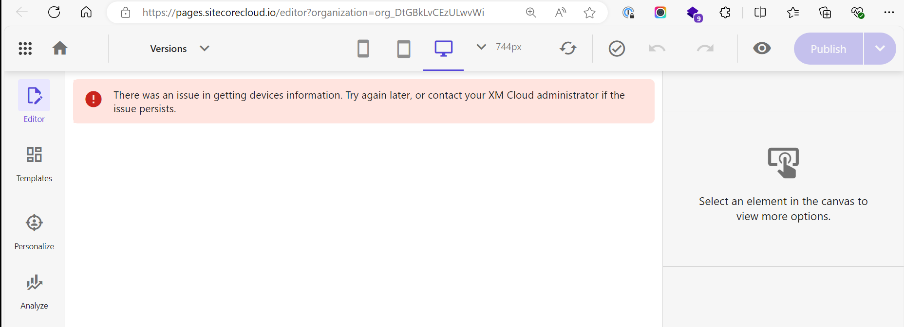
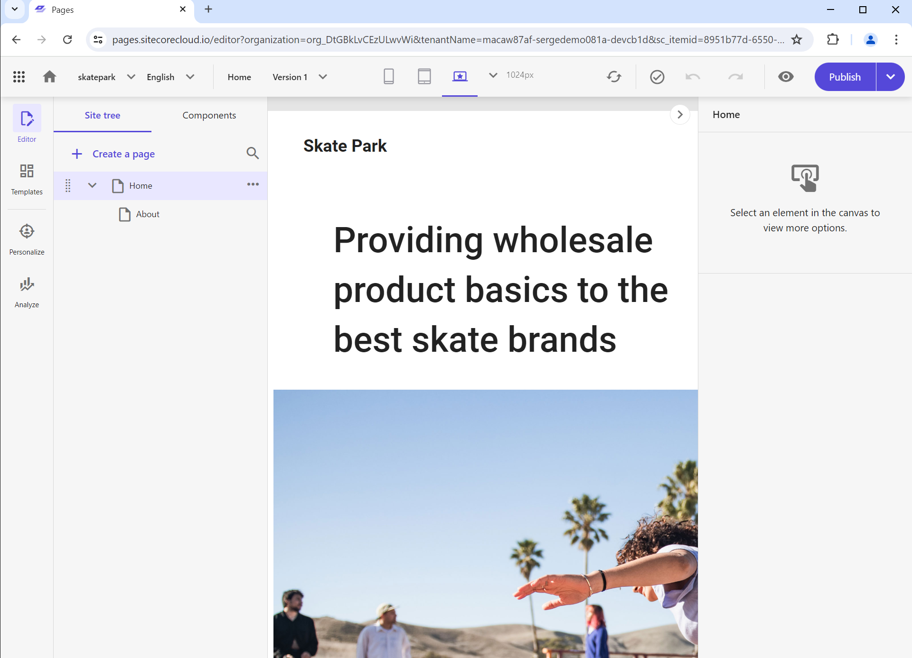
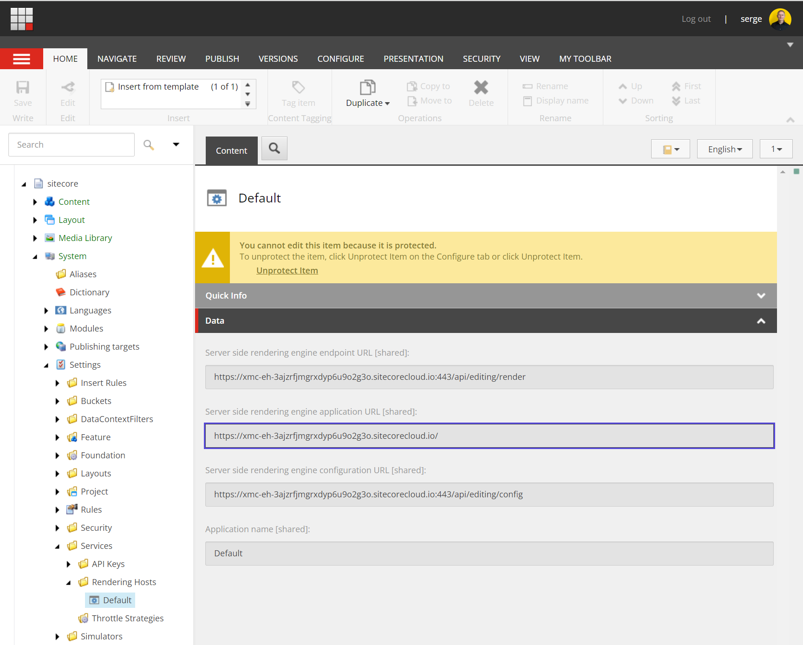

XM Cloud is a powerful SaaS product designed to simplify and automate the deployment process, particularly when integrated with a Git repository hosted on platforms like GitHub or Azure DevOps. In this post, we'll explore Sitecore's official documentation on what exactly happens during a deployment, and I'll share my insights on the process.

## What does the XM Cloud documentation tell us?

The XM Cloud documentation provides a detailed breakdown of the deployment process in their [Deploy a project and environment](https://doc.sitecore.com/xmc/en/developers/xm-cloud/deploy-a-project-and-environment.html) guide. Let's delve into each step outlined in the documentation:

### Creates a New Repository in the Connected Source Control Account and Copies the Source Code from the XM Cloud Foundation Template to the New Repository

When you initiate a project, XM Cloud automatically generates a new repository in your connected GitHub or Azure DevOps account. This repository is a clone of the foundation template, which can be found at [sitecorelabs/xmcloud-foundation-head](https://github.com/sitecorelabs/xmcloud-foundation-head).

This foundational repository is the cornerstone of your project, containing essential configurations and code required for an XM Cloud environment. It includes Docker configurations to run an XM Cloud-compatible setup of Sitecore XM, along with components like SOLR, SQL Server, and [Traefik](https://traefik.io/traefik/), a cloud-native application proxy. Moreover, it houses a Headless SXA-based front-end application in the `src/sxastarter` directory.

### Provisions the Infrastructure and SaaS Tenants to Host the Content Management (CM) Instance in the Environment You Defined

One of XM Cloud's most compelling features is its ability to provision the entire infrastructure necessary for your Sitecore environment. This means that when you define your environment, XM Cloud spins up a complete SaaS platform, likely running across multiple servers in a Kubernetes cluster.

This level of automation eliminates the need for manual infrastructure management, as the Sitecore XM Cloud team handles all aspects of scalability, reliability, and cost management. The complexity of this setup might seem daunting, but it’s all managed behind the scenes, providing you with a seamless and scalable solution.

### Pulls the Source Code from the Repository to a Hosted XM Cloud Build Server and Builds the Solution

Once your infrastructure is provisioned, XM Cloud pulls the latest code from your repository into a hosted build server. This build process is comprehensive, encompassing not only the Sitecore solution found in the `src/platform` directory but also the Next.js based front-end application.

The automated build pipeline provided by XM Cloud ensures that your entire solution is built and prepared for deployment, minimizing manual intervention and reducing the risk of human error. This step is crucial for maintaining consistency across environments, ensuring that both your back-end and front-end components are aligned and ready for deployment.

### Deploys the XM Cloud Build Artifacts on the Provisioned CM Instance

In the final step, the build artifacts generated by the pipeline are deployed to the provisioned Content Management (CM) instance within the XM Cloud environment. This includes the deployment of the Next.js based front-end solution to an internal rendering host provided by XM Cloud.

This integrated deployment process ensures that both your back-end and front-end applications are consistently updated and synchronized. Having these components combined in a single repository, built and deployed simultaneously, is crucial for maintaining stability and coherence in your application.

However, while this approach is effective, there might be scenarios where you wish to decouple the deployment of the front-end from the back-end. For instance, you might want to deploy updates to the front-end rendering host without triggering changes to the Sitecore CM environment. This is particularly important in scenarios where the front-end and back-end development cycles are independent, or when you need to perform front-end optimizations without affecting the content management layer.

## The internal rendering host

As the Next.js front-end solution must be deployed somewhere for it to be accessible, XM Cloud provides an internal rendering host for this purpose. This host is a dedicated environment within the XM Cloud infrastructure that serves as the entry point for your front-end application, but also to render the Sitecore content from the Experience Editor and Pages.

When I go to Pages in the Edge browser I seem to have issues with the internal rendering host:

On Chrome this issue does not occur:

It is not easy the find the actual URL of the internal rendering host. The way I do it is through the Content Editor:

## Perspectives on Deployment Flexibility

The integrated deployment approach provided by XM Cloud is a double-edged sword. On one hand, it ensures consistency and stability, as both front-end and back-end changes are deployed together. This reduces the risk of mismatches between the two layers, which could lead to unexpected behavior or errors.

On the other hand, this tight coupling can sometimes be restrictive. In many real-world scenarios, teams prefer to have the flexibility to deploy front-end changes independently of the back-end. This could be due to a variety of reasons, such as the need for rapid iterations on the front-end, the desire to minimize disruptions to the content management system, or simply to align with different release cycles for the front-end and backend.

An ideal solution would be the ability to selectively deploy components within the XM Cloud environment. For instance, after the initial deployment, you might want to push updates only to the Next.js rendering host without touching the Sitecore CM instance. This level of granularity in deployment would allow for greater flexibility and could be a significant enhancement to the current XM Cloud deployment process. Especially because changes on the backend (Sitecore XM CM changes) should be minimal, or even non-existent. We need at least one deployment to get the Sitecore XM CM up and running, but after that, we should be able to deploy the front-end independently.

The Sitecore team promised to provide an option to deploy the front-end independently to the integrated rendering host in the future, but as of now, I could not find any information on the availability of this feature.

Note that it is also possible to provide your own rendering host with some powerful options to utilize it from the Experience Editor and Pages as well, like I explained in my blog post [XM Cloud rendering host options and fast local development with Experience Editor & Pages - Serge van den Oever's weblog](https://www.sergevandenoever.nl/XM_Cloud_rendering_host_options_and_fast_local_development/).  The blog post discusses various options for configuring XM Cloud rendering hosts to optimize the development process, particularly for Sitecore's Experience Editor and Pages. It covers using internal, local, and custom external editing hosts, highlighting the challenges and solutions for achieving faster development cycles. I provide detailed steps on setting up local development environments using Docker containers and reverse proxies like localtunnel, enabling seamless integration with XM Cloud while maintaining flexibility in the deployment process.

This approach can provide a workaround for some of the limitations of XM Cloud's integrated deployment process, offering more flexibility and control over front-end updates.

When you use the provided Docker container setup to run "XM Cloud" locally, it is possible to connect Pages to your "local" (running in the Docker container) rendering host as explained in [Connect XM Cloud Pages to your local XM instance | Sitecore Documentation](https://doc.sitecore.com/xmc/en/developers/xm-cloud/connect-xm-cloud-pages-to-your-local-xm-instance.html). In my opinion it should not be needed to spin up a local environment when doing development against a SaaS product. This setup only works on Windows, and does not work when doing front-end development on OSX or under WSL2 (Windows Subsystem For Linux) like I normally do.

In my opinion better support for fast front-end deployment, and using the local render host should be part of the out-of-the-box XM Cloud development setup. 
### Conclusion

In conclusion, XM Cloud offers a robust and automated deployment process that seamlessly integrates with Git-based repositories, providing a comprehensive solution for deploying both front-end and back-end components in a Sitecore environment. The detailed steps outlined in the XM Cloud documentation highlight the ease with which infrastructure is provisioned, code is built, and solutions are deployed, ensuring a consistent and reliable deployment experience.

However, the integrated nature of this deployment process, while beneficial for maintaining coherence between front-end and back-end layers, can also be limiting in scenarios where independent deployment cycles are preferred. The ability to decouple these deployments, particularly for front-end updates, would significantly enhance flexibility and better align with diverse development workflows.
