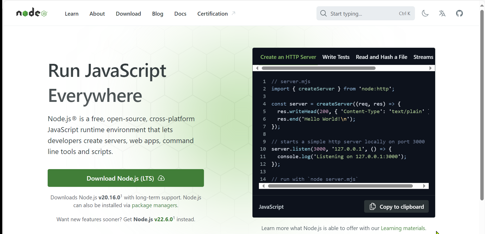
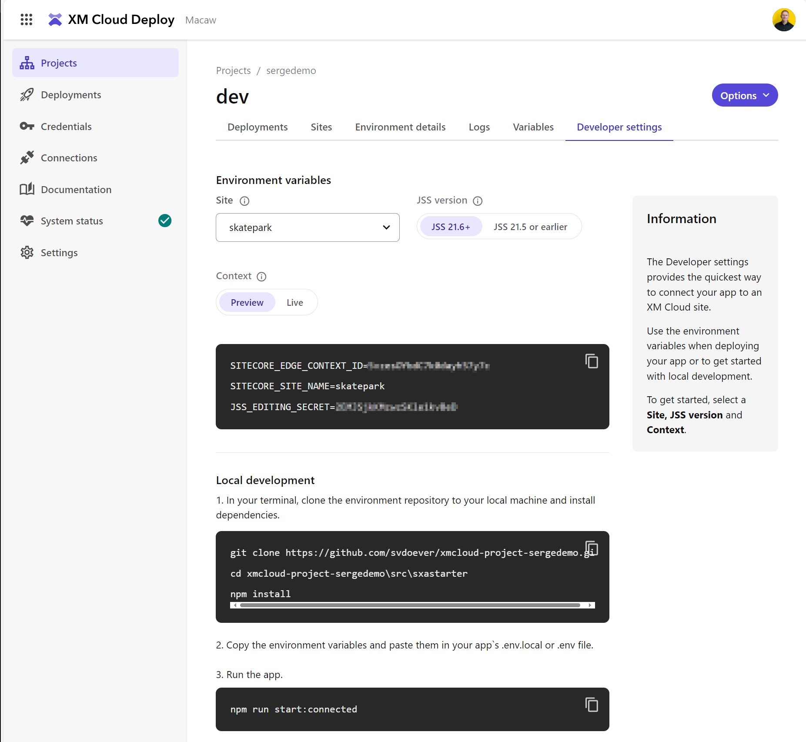

To get started with development we need to set up your local development environment for Sitecore XM Cloud, you clone the project repository from GitHub or Azure DevOps, install necessary packages, and connect to the XM Cloud preview endpoint. This involves creating a `.env.local` file with environment variables, running `npm install` to install dependencies, and starting the application locally with `npm run start:connected`. Finally, you can view your application at `http://localhost:3000/` to confirm the setup.

This is described in [Set up your local development environment | Sitecore Documentation](https://doc.sitecore.com/xmc/en/developers/xm-cloud/set-up-your-local-development-environment.html)
But along the way I would like to add some comments, and give some clarification.

## Using Node.js
Node.js is an essential part of our development setup. It's a JavaScript runtime that allows us to run JavaScript code on our local machine, outside of a browser. For our project, we'll be using Node.js to run scripts, manage dependencies, and start our local development server. To ensure compatibility, make sure you have the latest stable version of Node.js installed on your machine. You can download it from [Node.js official website](https://nodejs.org/). 

The installation of Node.js is a global installation, and if you work on multiple Node.js projects on the same computer I would advise to use a Node version manager. A Node version manager allows you to install and switch between multiple versions of Node.js, which can be very useful if different projects require different versions. the most well-known Node version manager is NVM. The documentation on NVM can be found at [nvm-sh/nvm: Node Version Manager - POSIX-compliant bash script to manage multiple active node.js versions (github.com)](https://github.com/nvm-sh/nvm?tab=readme-ov-file#readme). 

If you want to install Node Version Manager (NVM) on Windows:

1. **Download the NVM for Windows installer** from the [official GitHub repository](https://github.com/coreybutler/nvm-windows/releases).
2. **Run the installer** and follow the on-screen instructions. Choose the directory where you want to install NVM and Node.js.
3. Once installed, **open Command Prompt or PowerShell** and verify the installation by typing `nvm --version`.

Now, you can manage and switch between different versions of Node.js using NVM on Windows.

Note that the maintainer of NVM for Windows, Corey Butler, stopped development on NVM for Windows, and started work on [Runtime](https://github.com/coreybutler/nvm-windows/wiki/Runtime), the successor to NVM for Windows. I personally still worked with the "old" version and could not find any details on how to install this Runtime thing.

Another player in this field is [Schniz/fnm: 🚀 Fast and simple Node.js version manager, built in Rust (github.com)](https://github.com/Schniz/fnm). As colleagues work with this version I decided to try it out.

To prevent collision between Node version managers, I decided to first uninstall NVM and its installed Node versions.
### Uninstalling NVM for Windows
The first step is to delete the Node.js versions managed by NVM for Windows:

1. **Open Command Prompt** or PowerShell.
2. List all installed Node.js versions with the command: `nvm list`.
3. Remove a specific version by typing: `nvm uninstall <version_number>`. Replace `<version_number>` with the version you want to delete (e.g., `nvm uninstall 18.16.0`).

Repeat the uninstall command for each version you want to remove. This will delete the corresponding Node.js versions managed by NVM. As I installed some of my Node.js version with administrative rights, I needed to start my Command Prompt as administrator to uninstall them.

Next step is to uninstall NVM on Windows itself. To uninstall NVM on Windows:

1. **Open the Control Panel** and navigate to "Programs and Features."
2. Find "NVM for Windows" in the list of installed programs.
3. **Right-click and select "Uninstall."** Follow the prompts to complete the uninstallation.

Alternatively, you can manually delete the `nvm` folder (usually located in `C:\Program Files\nvm` or wherever you installed it) and remove the related environment variables.

### Installing FNM
Installation of FNM on Windows is simple:

```cmd
winget install Schniz.fnm
```

Don't forget to restart your shell after installation.

FNM needs some environment variables configured, as described in https://github.com/Schniz/fnm#shell-setup. 

In PowerShell you can use the following command:
```powershell
fnm env --use-on-cd --shell power-shell
```

Copy the output, execute `notepad $profile` (create if the file does not exist yet) and paste the output to the end of this file.

Next step (as documented in the Sitecore documentation) is to use the latest Node.js LTS version. On [Node.js — Run JavaScript Everywhere (nodejs.org)](https://nodejs.org/en) we can see this is version 20.16.0 at the time of writing.



We can now type the following command to install and use Node.js version 20.16.0:

```cmd
fnm use 20.16.0
```

Which asks you to install Node.js version 20.16.0 if not installed yet, and makes it the current version.

This all worked like a breeze, so my new Node version manager is from now on FNM!

For detailed documentation on how to use FNM have a look at [fnm/docs/commands.md at master · Schniz/fnm (github.com)](https://github.com/Schniz/fnm/blob/master/docs/commands.md).

## Get the next steps
Head over XM Cloud Deploy at https://deploy.sitecorecloud.io/. Under **Projects** select your project and environment, and select the **Developer settings** tab:



On this **Developer settings** tab we find all required information. 
## Check out the code
As XM Cloud Deploy creates a GitHub repository based on [sitecorelabs/xmcloud-foundation-head](https://github.com/sitecorelabs/xmcloud-foundation-head) it is now time to have a look at the scaffolded codebase.

Although I normally do my development under Windows with WSL2, for this post I checked out the code under Windows. Reason: working with the Docker container for local development only works under Windows.

The clone command can be found under the **Local development** section:
```cmd
C:\p> git clone https://github.com/svdoever/xmcloud-project-sergedemo
Cloning into 'xmcloud-project-sergedemo'...
remote: Enumerating objects: 338, done.
remote: Counting objects: 100% (338/338), done.
remote: Compressing objects: 100% (296/296), done.
remote: Total 338 (delta 8), reused 269 (delta 4), pack-reused 0 (from 0)
Receiving objects: 100% (338/338), 292.32 KiB | 893.00 KiB/s, done.
Resolving deltas: 100% (8/8), done.
C:\p>
```

After running these commands, you should have a local copy of the 'xmcloud-project-sergedemo' repository on your machine. You can now navigate into this directory to explore the codebase and start development.

I personally do all my development with Visual Studio Code, especially because I do most of my development in a front-end related stack using React, TypeScript, Next.js and other front-end related technology.
## Working from Visual Studio Code
Open VSCode op the root folder of the repository, and open an integrated terminal.
In the terminal window type:

```cmd
npm install
```

The next step is to configure the front-end project with the correct environment variables.

Because we are configuring for development, set the context switcher to **Preview**, and copy the environment variables. Next create a new file `src/sxastarter/.env.local`, and paste the environment variables in this file.

And finally execute:

```cmd
npm run start:connected
```

If you navigate to http://localhost:3000 you will now see:


## Editing Hosts and Rendering Hosts in Sitecore XM Cloud

Although we normally talk about the "rendering host" regarding the front-end application, in Sitecore XM Cloud, editing hosts and rendering hosts serve distinct yet complementary roles. The rendering host is the front-end application responsible for displaying content to end users. In contrast, the editing host is a similar application but tailored for content editing within tools like the Experience Editor. While both hosts share the same codebase, the editing host is not intended for live traffic. When setting up your environment, Sitecore provides a default editing host. It is not possible to only deploy the front-end application to this editing host.

For more technical details, visit the official [Sitecore documentation](https://doc.sitecore.com/xmc/en/developers/xm-cloud/editing-hosts-and-rendering-hosts.html).
## The front-end
We now have our site (front-end) running locally, using the content and pages as configured in XM Cloud. But if we create new components, we first need to deploy our complete solution to XM Cloud so the internal editing host is updated, and components become available within the Experience Editor, Pages, or for direct page composition in the Content Editor.

There are three ways to speed up this development cycle, so only the front-end solution needs to run, or needs to get deployed:
1. Run XM Cloud in a Docker container, so we can configure Pages to use our Docker-based editing host in Pages (a SaaS product) - See [Connect XM Cloud Pages to your local XM instance | Sitecore Documentation](https://doc.sitecore.com/xmc/en/developers/xm-cloud/connect-xm-cloud-pages-to-your-local-xm-instance.html) for more information.
2. Deploy an external editing and rendering host, for example hosted on Vercel ([Deploy your front-end application to Vercel | Sitecore Documentation](https://doc.sitecore.com/xmc/en/developers/xm-cloud/deploy-your-front-end-application-to-vercel.html)) or Netlify ([Deploy your front-end application to Netlify | Sitecore Documentation](https://doc.sitecore.com/xmc/en/developers/xm-cloud/deploy-your-front-end-application-to-netlify.html)). 
3. Expose the editing/rendering host running locally to the outside world, so it can be configured for usage by the Experience Editor and Pages, as described in [XM Cloud rendering host options and fast local development with Experience Editor & Pages - Serge van den Oever's weblog](https://www.sergevandenoever.nl/XM_Cloud_rendering_host_options_and_fast_local_development/) and [Sitecore Demo Portal - 10.3+ SXA headless development - Serge van den Oever's weblog](https://www.sergevandenoever.nl/Sitecore_Demo_Portal_headless_development/#editing-host-accessible-to-experience-editor).