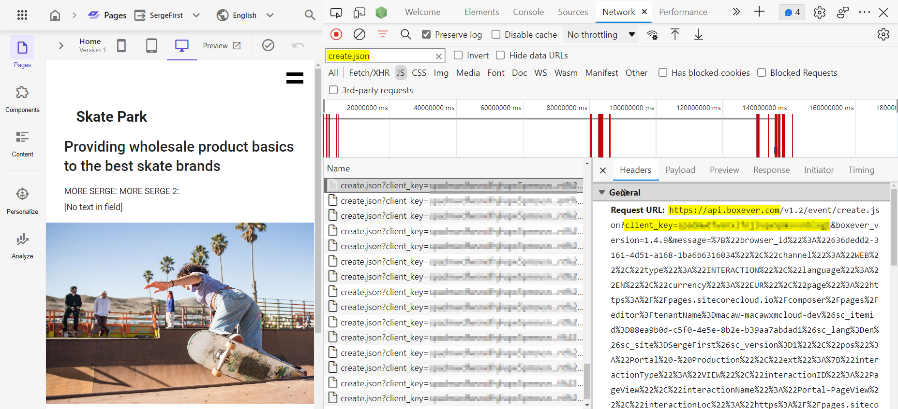

In the stream of information about Sitecore headless you probably heard the term *rendering host* more than once.

The rendering host is the front-end application that consumes headless Sitecore data. This can be a website, but also an app. It is the *head* on *headless Sitecore*.

There are is also a less heard term, *editing host*. The editing host enables the editing experience for Sitecore headless so that the content and layout of pages can be managed with components provided by the head. Currently, this must be a website because the content and layout editors **Experience Editor** and **Pages** are browser-based editors. **Components provided by the head** - this is key: you design your pages with components that are developed by the front-end team, and the rendering of the page during editing and preview is done by the website developed by the front-end team.

## Development with the out-of-the-box editing host

When you create a project using the XM Cloud Deploy App, the project is set up with a default editing host as described in my blog post [XM Cloud - first steps on building renderings with Next.js](https://www.sergevandenoever.nl/XM_Cloud_first_steps_on_building_rederings_with_Nextjs/). This internal editing host works out of the box on your remote XM Cloud instance.

The code for the editing host and the components are in the `sxastarter` folder of the XM Cloud scaffolded project - this is the front-end project. Changes to components can be deployed to the out-of-the-box internal editing host by a code commit, and a Build & Deploy of the XM Cloud environment:

Important to know is that this out-of-the-box editing host only works with a Sitecore JavaScript Services (JSS) based website, and not with an ASP.NET built with the [Sitecore ASP.NET Rendering SDK](https://doc.sitecore.com/xp/en/developers/hd/201/sitecore-headless-development/sitecore-asp-net-rendering-sdk.html).

This process of code-change, commit, push, build, deploy for using the internal out-of-the-box editing host is a lengthy process, and therefore not useful for a fast development cycle.

## Local development with Docker containers

An option for a fast front-end development cycle is to do local development with Docker containers as described in my blog post [Running the XM Cloud SXA Starter on your local machine](https://www.sergevandenoever.nl/XM_Cloud_SxaStarter/). This works perfectly fine, and with `npm run start:connected` where changes in the source code are watched, a compilation is done instantly, and the changes are directly reflected in the Experience Editor through a reload. But there are also some disadvantages to this approach:

- For developers working on the head and doing for example React development running Windows-based Docker containers is a lot of hassle, or maybe even impossible when you develop the front-end on a MacBook
- This does work with the Experience Editor, but not with Pages - Pages can't connect to a local environment running in Docker containers, as explained in my blog post [The XM Cloud container - don't fiddle (too much) with it...](https://www.sergevandenoever.nl/XM_Cloud_container_nofiddle/)

## Development with a custom external editing host

A custom external editing host is mandatory for a fast front-end development-cycle, or when a non-JSS-based editing host is used like for example ASP.NET.

How to configure this is described in the documentation: [Walkthrough: Configuring external editing hosts for XM Cloud instances](https://doc.sitecore.com/xmc/en/developers/xm-cloud/walkthrough--configuring-external-editing-hosts-for-xm-cloud-instances.html), where the XM Cloud CM configuration is modified with a patch file.

There is also a blog post [Setting up an external XM Cloud Rendering Host to work with Experience Editor and Pages](https://robearlam.com/blog/setting-up-an-external-xm-cloud-rendering-host-to-work-with-experience-editor-and-pages) by Rob Earlam, who uses an ASP.NET editing host with the [Sitecore ASP.NET Rendering SDK](https://doc.sitecore.com/xp/en/developers/hd/201/sitecore-headless-development/sitecore-asp-net-rendering-sdk.html).

Key of what they do is setting the site settings **Server side rendering engine endpoint URL** (field `serverSideRenderingEngineEndpointUrl`) and **ServerSideRenderingEngineApplicationUrl** (field `serverSideRenderingEngineApplicationUrl`). Default these values are empty:

And the configuration value in the item `/sitecore/system/Settings/Services/Rendering Hosts/xmcloudpreview` are used:

Both approaches need your editing host website to be deployed somewhere so it can be reached by the **Experience Editor** and **Pages**, and to configure the rendering host a full deployment to XM Cloud is required.

### Local rendering host against Experience Edge, internal editing host for editing

It is also possible to run your rendering host locally on http://localhost:3000, and use the out-of-the-box internal editing host OR an editing host deployed to Vercel for editing. This approach is explained is the video [Frontend Developer Setup for XM Cloud in 5 minutes](https://www.youtube.com/watch?v=Kig3kWZ8FuQ) by Sebastian Winter, who describes how to configure local "head" development against Experience Edge by doing the following actions in the folder `src/sxastarter`. To achieve this we need to 

1. Copy `.env` to `.env.local`
2. Set the following values:
    - `PUBLIC_URL=http://localhost:3000` - we run the Next.js site on this address using `npm run start:connected`
    - `SITECORE_API_KEY=xxxx` - where `xxxx` is the Edge token you can request with the script `New-EdgeToken.ps1`
    - `JSS_APP_NAME="SergeFirst"` - or your SXA site name
    - `GRAPH_QL_ENDPOINT=https://edge.sitecorecloud.io/api/graphql/v1` - this the Sitecore Experience Edge GraphQL endpoint
    - `FETCH_WITH=GraphQL` - we use GraphQL for fetching layout and dictionary data
    - `DEBUG=sitecore-jss:*,-sitecore-jss:layout` - to enable some debugging

3. Run `npm install`
4. Start the Next.js app in connected mode using `npm run start:connected`

Note that you first need to do a commit/push to GitHub, and run XM Cloud Deploy to deploy to the internal editing host OR deploy to Vercel, and have Vercel configured as the rendering host as Sebastian describes in his video [Deploy your first Headless SXA site to Vercel](https://www.youtube.com/watch?v=0UpihW2QxaQ). 

### Local editing host with direct connection to Experience Edge and Pages

But what I want to achieve is point to my locally running rendering host when I run `npm run start:connected`, which is running on http://localhost:3000.
Problem is that **Experience Editor** and **Pages** can't access this local server unless you use a reverse proxy to make your local site accessible to the outside world.
There are multiple reverse proxy tools to do this like [ngrok](https://ngrok.com/) and [localtunnel](https://localtunnel.me). We need to publish a local site with a port number to an external domain, with **ngrok** this is a paid feature, and with **localtunnel** this is free, so I will use **localtunnel** here.

We need some values for configuration, I will explain how to obtain them:

- `SITECORE_API_HOST` - open in XM Cloud the **Content Editor**, and take the base URL. In my case this is https://xmc-macaw-macawxmcloud-dev.sitecorecloud.io/
- `JSS_EDIT_SECRET` - open the `showconfig.aspx` page, in my case this is https://xmc-macaw-macawxmcloud-dev.sitecorecloud.io/sitecore/admin/showconfig.aspx, in the output search for `JavaScriptServices.ViewEngine.Http.JssEditingSecret` and take the value
- `SITECORE_API_KEY` - this is the **Item Id** of Sitecore item `/sitecore/system/Settings/Services/API Keys/xmcloudpreview` (use the **Content Editor**)

You can now execute the following steps:

1. Copy over the settings from the `xmcloudpreview` out of the box internal rendering host configuration over to your site settings, e.g. in my case:
  
2. Install **localtunnel** globally with `npm install -g localtunnel`
3. Create a `.env.local` file with the following settings:
    - `SITECORE_API_HOST=https://xmc-macaw-macawxmcloud-dev.sitecorecloud.io/` - URL of your CM
    - `JSS_APP_NAME="SergeFirst"` - Name of your app
    - `PUBLIC_URL=https://xmc-59qqzdup3uinohoazx4prn.loca.lt` - this is the external URL when we use **localtunnel**, your value will differ
    - `JSS_EDITING_SECRET=**********`
    - `SITECORE_API_KEY={********-****-****-****-********}`

4. Start your local rendering host in the folder `src/sxastarter`, e.g. `npm run start:connected`
5. To keep things simple run **localtunnel** with a subdomain that is the same name as your internal rendering host, in my case `lt --port 3000 --subdomain xmc-59qqzdup3uinohoazx4prn` - this results in an externally accessible site proxying to http://localhost:3000 with the URL https://xmc-59qqzdup3uinohoazx4prn.loca.lt
6. Open the site, in my case https://xmc-59qqzdup3uinohoazx4prn.loca.lt - it can be that there is a proceed button you need to click
7. Modify in the **Content Editor** the site settings to the **localtunnel** URLs, e.g. ending in `loca.lt`:
   
8. Save the settings item

Note that if **localtunnel** is not running anymore, an error is given in **Experience Editor** and **Pages**:

## Fixing the rootItemId error

When you open https://xmc-59qqzdup3uinohoazx4prn.loca.lt you will see the following error:

As described in my blog post [Running the XM Cloud SXA Starter on your local machine](https://www.sergevandenoever.nl/XM_Cloud_SxaStarter/) we need to make a change to the file `src\lib\dictionary-service-factory.ts` to use the GUID of the template ID of the home item of your JSS app:

So the code will look like:

## Fixing the missing CDP_CLIENT_KEY issue

NOTA BENE: See the UPDATE at the end of this section for retrieving the required settings.

Next you will be greeted with the following error:

This issue can be solved by setting the `NEXT_PUBLIC_CDP_TARGET_URL` and `NEXT_PUBLIC_CDP_CLIENT_KEY` environment variables as well, but as described in the Sitecore documentation [The Next.js Personalize add-on](https://doc.sitecore.com/xmc/en/developers/xm-cloud/the-next-js-personalize-add-on.html) you need to make a request to Sitecore Support for **XM Cloud Personalize Environment Variables**. Include the site name in your request.

In my blog post [Running the XM Cloud SXA Starter on your local machine](https://www.sergevandenoever.nl/XM_Cloud_SxaStarter/) I work arround this issue by changing the source code for the `CdpPageView` component in `src/Scripts.tsx` and commenting out the `CdpPageView` components (run `npm run lint` to see if code formatted correctly):

Commenting out the `CdpPageView` component is not a very sustainable solution, but good enough to get it working as long as the **XM Cloud Personalize Environment Variables** variables are not known yet.

UPDATE:

If you open **Pages**, press F-12 for the developer tools, and filter the network tab on `create.json` you will see:

In the screenshot you will see that the required client key is visible.

in `env.local` set:
- `NEXT_PUBLIC_CDP_TARGET_URL=https://api.boxever.com`
- `SITECORE_API_KEY=****************` - the value of `client_key` 

Now you can revert the changes to `src/Scripts.tsx`.

## Testing the local editing host

You can now open the **Experience Editor** or **Pages**, and you will see the locally running editing host in action! Note that changes to components are directly reflected in the **Experience Editor** and **Pages**, and that the rendered page is automatically reloaded.

NOTA BENE: It is unclear when the configuration of the editing host is picked up by **Experience Editor** or **Pages**. The setting must be read from the site settings in the Master database, and no publish is required. But sometimes the changes are not picked up correctly.

When the **localtunnel** is stopped you will see an error in the **Experience Editor** or **Pages**. Change back the URLs in the site settings from `*.loca.lt` to `*.sitecorecloud.io` and you will use the out-of-the-box internal editing host again.

