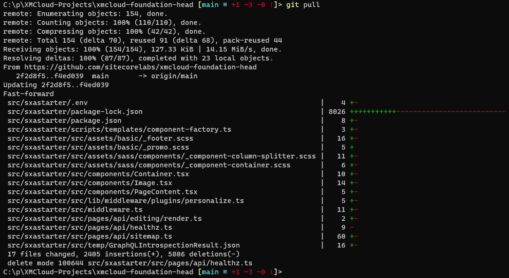
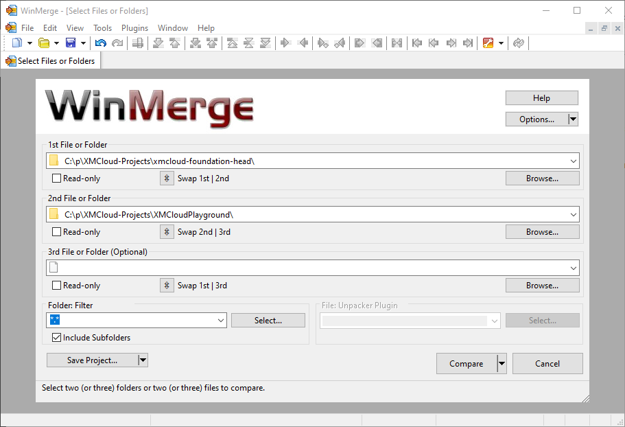
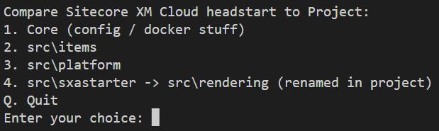
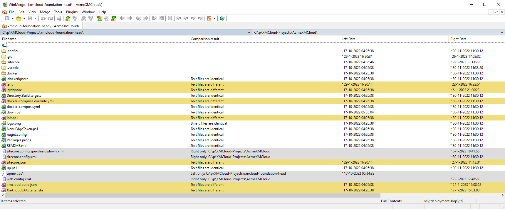
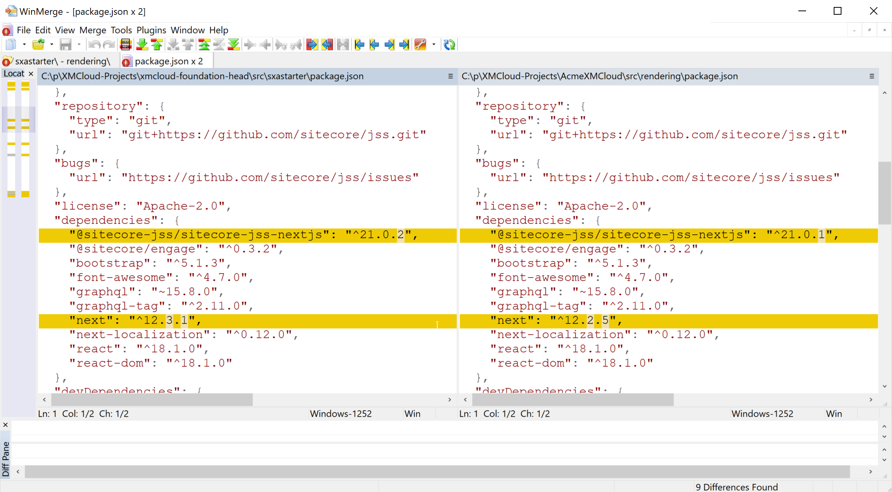

When we create a new project through the XM Cloud Deploy, we can either select "Start from starter template" or "Start from your existing XM Cloud code". The starter template is based on https://github.com/sitecorelabs/xmcloud-foundation-head - the headstart for scaffolding a new XM Cloud project. So XM Cloud Deploy "forks" this project to a fresh GitHub repository, but the connection to the upstream repository (the repository forked from) is lost. And that is good, because it functions as a headstart to be heavily modified, and changes should (generally) not be merged back to this headstart repository.

But losing this connection completely is also a pity because innovations and bugfixes in the headstart would be nice to bring to your own already scaffolded projects as well.

I take the following approach to handle this with XM Cloud, but also with our own headstarts that we use in projects:

1. Create a folder on your computer to manage your XM Cloud projects, e.g. `XMCloud-Projects`
2. In this folder clone the repository https://github.com/sitecorelabs/xmcloud-foundation-head
3. In this folder clone the repository scaffolded by XM Cloud Deploy, e.g. https://github.com/svdoever/AcmeXMCloud

So I have a folder structure as follows:

```
c:\p\XMCloud-Projects
- xmcloud-foundation-head
- AcmeXMCloud
```

I keep the `xmcloud-foundation-head` folder up-to-date by doing `git pull` before executing a comparison, so I'm sure that I use the latest code:



In the above screenshot, you can see that things are changing in the project template, and it should be changing so innovation keeps coming!

The next step is to set up a smart comparison between the `xmcloud-foundation-head` folder and one or more project folders. A great open-source merge tool do do this comparison, and merge where needed, is [WinMerge](https://winmerge.org/). The first naive approach is to compare the two folders would be:



A comparison can be improved by using filters to narrow the scope of the comparison, as described in the WinMerge documentation [Using Filters](https://manual.winmerge.org/en/Filters.html).

And then we come to another decision: shouldn't we have multiple comparisons? I think we should, especially because the first thing I do is rename the `sxastart`` project to `rendering`, which can't be handled in a single comparison.  

## The setup

I create the following setup for each XM Cloud project:

- In the project folder (e.g. `AcmeXMCloud`) create a folder `tools` to manage all tools for your project
- In that folder create a folder WinMerge, download your binaries version of WinMerge from the [Winmerge Downloads](https://winmerge.org/downloads). Unzip the downloaded zip file to the folder `tools\WinMerge` - this makes WinMerge part of your project repository and can be pushed
- Create a PowerShell script `tools\Compare-Headstart.ps1` that we will use to compare different elements of the project to the original headstart

The `Compare-Headstart.ps1` script could look like this:

```powershell
$VerbosePreference = 'SilentlyContinue' # change to Continue to see verbose output
$DebugPreference = 'SilentlyContinue' # change to Continue to see debug output
$ErrorActionPreference = 'Stop'

$coreFilter="!.vs\;!deployment-logs\;!tools\;!src\;"
$itemsFilter=".scindex"
$platformFilter="!bin\;!obj\;!Platform.csproj.user"
$renderingFilter="!.next\;!.next-container\;!node_modules\;"

$xmcloudFoundationHeadPath = "$PSScriptRoot\..\..\xmcloud-foundation-head" 
if (!(Test-Path $xmcloudFoundationHeadPath)) {
    Write-Error "xmcloud-foundation-head not found at $xmcloudFoundationHeadPath"
}

$h = (Resolve-Path -Path $xmcloudFoundationHeadPath).Path
$p = (Resolve-Path -Path "$PSScriptRoot\..").Path

while ($true) {
    Clear-Host

    Write-Host "Compare Sitecore XM Cloud headstart to Project:"
    Write-Host "1. Core (config / docker stuff)"
    Write-Host "2. src\items"
    Write-Host "3. src\platform"
    Write-Host "4. src\sxastarter -> src\rendering (renamed in project)"
    Write-Host "Q. Quit"

    $choice = Read-Host "Enter your choice"

    switch ($choice) {
        "1" { 
            . "$p\tools\WinMerge\WinMergeU.exe" $h $p /f $coreFilter
        }
        "2" { 
            . "$p\tools\WinMerge\WinMergeU.exe" $h\src\items $p\src\items /f $itemsFilter
        }
        "3" { 
            . "$p\tools\WinMerge\WinMergeU.exe" $h\src\platform $p\src\platform /f $platformFilter
        }
        "4" { 
            . "$p\tools\WinMerge\WinMergeU.exe" $h\src\sxastarter $p\src\rendering /f $renderingFilter
        }
        "Q" { exit }
        "q" { exit }
        default { Write-Host "Invalid choice. Try again." }
    }
}
```

Note that this code should be modified to your project needs.

In the above code, WinMerge CLI commands are made available through a menu, where each comparison uses filter settings configured at the top of the code.

When you execute the script `tools\Compare-Headstart.ps1` it shows a super simple UI to start a comparison with WinMerge:



Selecting a menu item starts WinMerge with the selected comparison:



Where needed changes can be brought from `xmcloud-foundation-head` to your project:



I hope that Sitecore will not hold back in improving and innovating on their XM Cloud project headstart, and using the above-described approach we can all benefit from this.
