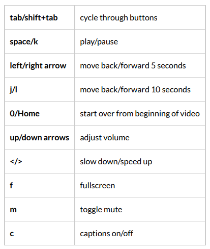

Sitecore, and probably many other companies, distribute their videos through https://box.com, one of the many file hosting companies. All Sitecore MVP videos are distributed through box.com as well, and I often go back through them to see what is exactly sain and announced. But those videos are mostly recordings of hour-long sessions, and I need to make some speed to find the right topic. Most of the time I increase the speed a bit, and when the relevant topic appears I want to slow down the speed again. Very annoying through the UI, but Box happens to have keyboard shortcuts as well!

Especially the move forward/backward (arrow keys) and the slow down/speed up button (< and >) are gold, speed play to the relevant section, then go to normal speed, and back to speed play again!